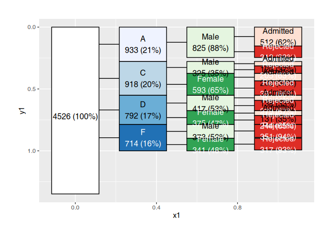
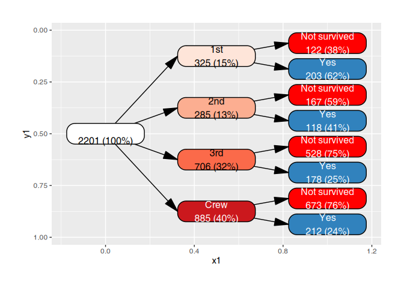
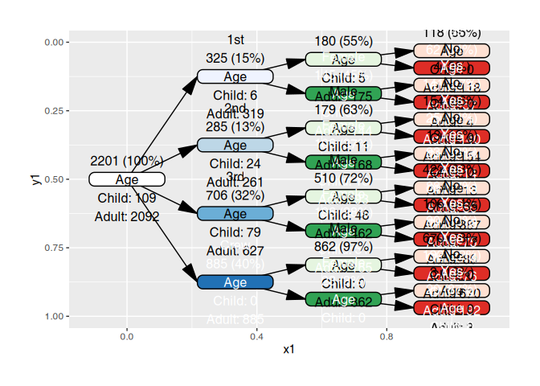

<!-- README.md is generated from README.Rmd. Please edit that file -->

# vtree2

<!-- badges: start -->

<!-- badges: end -->

Tree diagrams for categorical data, based on the [original vtree
package](https://github.com/nbarrowman/vtree) by Nick Barrowman.

## Installation

You can install the development version of vtree2 like so:

``` r
pak::pak("january3/vtree2")
```

## Quick start

### What is a vtree?

### Basic plots

You can construct a vtree roughly from two types of data:

- a data frame with one row per case (cases data frame)
- a data frame with one row per combination of factor levels, and a
  frequency column (frequency table)

While the former ones are common in the wild, the builtin R examples are
often the latter. The following example shows how to construct a vtree
from a frequency table and plot it with `vtree2`.

``` r
library(vtree2)
tdf <- cases_from_freqtable(Titanic)
vt <- vtree(tdf, Class, Sex, Survived)
vt
#> vtree object with 3 columns and 2201 observations
#> Columns: Class, Sex, Survived
```

`vt` is now an object of class `vtree`, which is basically `tidygraph`’s
`tbl_graph` with some extra attributes. You can plot it with `plot()`:

``` r
plot(vt)
#> Warning: There was 1 warning in `mutate()`.
#> ℹ In argument: `nleafs = map_bfs_back_int(...)`.
#> Caused by warning:
#> ! The `father` argument of `bfs()` is deprecated as of igraph 2.2.0.
#> ℹ Please use the `parent` argument instead.
#> ℹ The deprecated feature was likely used in the tidygraph package.
#>   Please report the issue at <https://github.com/thomasp85/tidygraph/issues>.
```


**There is more:** trees can be oriented vertically or horizontally, top
to bottom, bottom to top, left to right, right to left; labels and
colors can be freely customized, trees can be pruned for display.

### Vtree pruning

With the `prune()` function, you can find nodes which fullfill a certain
condition and remove them (along with their children) from the vtree:

``` r
ucb <- cases_from_freqtable(UCBAdmissions)
vt <- vtree(ucb, Dept, Gender, Admit) |>
  prune(n < 100 | freq < .15)
plot(vt, proportional = TRUE)
```



**There is more:** with `find_nodes()` you can find nodes which fullfill
a certain condition. The produced mask (a simple logical vector) can be
used to select nodes for changing labels or colors. With `keep()`, you
can select the nodes you want to keep and remove other nodes.

### Labelling and colors

While colors and labels can be generated automatically, it is possible
to customize them by modifying the `label` and `fill` columns of the
vtree object:

``` r
vt <- vtree(tdf, Class, Survived)
vt <- vt |> add_labels() |> # add default labels
  add_palette() |>
  mutate(label = gsub("No", "Not survived", label)) |>
  mutate(fill = ifelse(node_col == "Survived" &
                       node_val == "No", "red", fill))

plot(vt)
```



**There is more:** `add_labels()` is highly customizable and you can
produce complex labels with a simple R expression using `sprintf()` or
`glue()`.

### Summaries

The tree can be used to produce per-node summaries of any data. For
example, if you have an additional variable for your cases, you can add
summary of the values as labels to the nodes.

``` r
vt <- vtree(tdf, Class, Sex, Survived)
                                         
sm_txt <- summary_vt(tdf, vt, Age)
vt |> 
  add_labels() |>
  mutate(label = paste0(label, "\n", sm_txt)) |> plot()
```



**There is more:** `summary_vt()` can be used to calculate any summary
of categorical or continuous variables as a character vector which can
be then used as labels for the nodes. `summary_vt_df()` produces a data
frame with per-node summary statistics (different for categorical and
continuous variables) which can be used for further analysis.

### Vtree patterns

## Differences between vtree2 and the original vtree

### Motivation

The original vtree package implements most of its functionality in a
single function `vtree()` producing a plot. The function implements its
own mini-language for specifying formats of labels, variables,
conditions to select nodes and so on. This allows for simple and terse
function calls.

However, this limits the flexibility of the package. It is not possible
to fully customize the labels, inspect the interim data, use the various
summaries for other purposes (e.g. to produce simple tables). `vtree2`
separates data preparation, label construction, node selection and
plotting into four separate steps. This comes at the cost of more
verbose function calls.

### Design principles for vtree2

- separate frequency calculations, summary calculations, node selection
  and plotting
- use graphical objects for plotting which are flexible
- use tidyverse principles for data manipulation
- use tidyverse syntax for specifying variables
- vtree object inherits from tidygraph’s tbl_graph, so it can be used
  with a wide variety of plotting tools, including ggraph, ggplot2, and
  plotly

### Practical differences

- In vtree2, you first prepare the data with `vtree()` and then plot it
  with `plot()`. This means one more function call, but a much more
  flexible plotting system.
- Given that a vtree object is a tbl_graph, you are not limited to the
  built-in plotting functions. You can use ggraph, ggplot2, or plotly to
  create your own plots.
- There are some automatic summary and plotting functions, but you can
  also have a very tight control about the labels by modifying the
  `label` column in the vtree object.
- The summary_vt function can be used to calculate summary statistics
  for each node based on any additional data. It is not limited to using
  the data from which the vtree was constructed, and you can use the
  exposed statistics to shape any label you would like.
- Same goes for colors: instead of using automatic color assignments
  that mimick these of the original vtree, you can use any color scheme
  you like by assigning values to the `color` column in the vtree
  object.
- The downside of this setup is that the original vtree allows you to
  generate a beautiful plot with a single terse function call, whereas
  vtree2 is much more explicit and requires several steps. The upside is
  that you have more flexibility and more control over the final plot.
- Using ggplot2 unfortunately means that you might need to adapt the
  node sizes and label font sizes manually. ggplot2 is not aware of the
  size of the text and plot when constructed.
- Similarly, the geometry of the plot is chosen by the original vtree
  plotting function, whereas in vtree2 the geometry of the plot is
  chosen by the user, and plotting function tries to fit the graph
  inside it, possibly requiring the user to adapt the font and label
  sizes or the geometry.
- The mini-language implemented in vtree is now replaced by explicit
  operations: finding nodes, labelling, selecting colors for plotting
  etc.

## AI disclosure

I have not used LLMs directly in writing the code or documentation.
However, I did use an LLM based chat to discuss some of the design
issues (e.g. to compare existing packages for graph representation).
Also, for code review / bug finding.

## TODO

- plotting function for patterns
- should the vtree() function take cases or samples?
