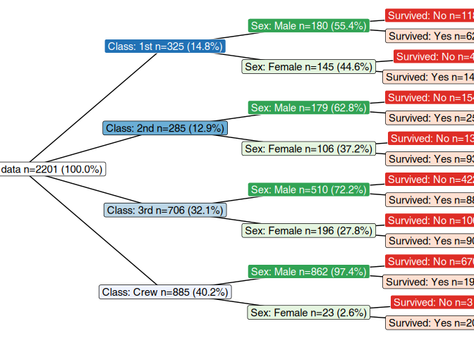
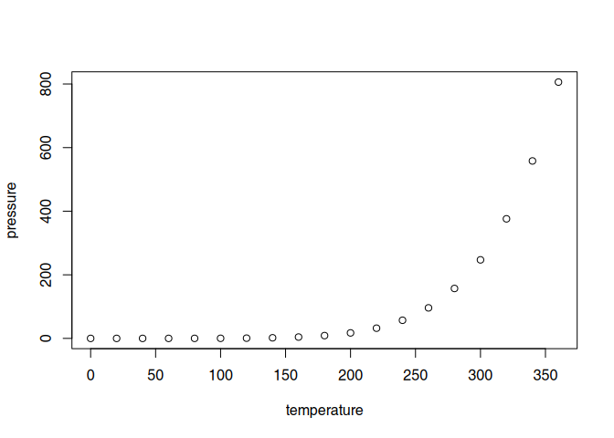

<!-- README.md is generated from README.Rmd. Please edit that file -->

# vtree2

<!-- badges: start -->

<!-- badges: end -->

The goal of vtree2 is to …

## Installation

You can install the development version of vtree2 like so:

``` r
pak::pak("january3/vtree2")
```

## Quick start

You can construct a vtree roughly from two types of data:

- a data frame with one row per case (cases data frame)
- a data frame with one row per combination of factor levels, and a
  frequency column (frequency table)

While the former ones are common in the wild, the builtin R examples are
often the latter. The following example shows how to construct a vtree
from a frequency table and plot it with `vtree2`.

``` r
library(vtree2)
tdf <- cases_from_freqtable(Titanic)
vt <- vtree(tdf, Class, Sex, Survived)
vt
#> vtree object with 3 columns and 2201 observations
#> Columns: Class, Sex, Survived
```

`vt` is now an object of class `vtree`, which is basically `tidygraph`’s
`tbl_graph` with some extra attributes. You can plot it with `plot()`:

``` r
plot(vt)
#> Warning: There was 1 warning in `mutate()`.
#> ℹ In argument: `nleafs = map_bfs_back_int(...)`.
#> Caused by warning:
#> ! The `father` argument of `bfs()` is deprecated as of igraph 2.2.0.
#> ℹ Please use the `parent` argument instead.
#> ℹ The deprecated feature was likely used in the tidygraph package.
#>   Please report the issue at <https://github.com/thomasp85/tidygraph/issues>.
```



What is special about using `README.Rmd` instead of just `README.md`?
You can include R chunks like so:

``` r
summary(cars)
#>      speed           dist       
#>  Min.   : 4.0   Min.   :  2.00  
#>  1st Qu.:12.0   1st Qu.: 26.00  
#>  Median :15.0   Median : 36.00  
#>  Mean   :15.4   Mean   : 42.98  
#>  3rd Qu.:19.0   3rd Qu.: 56.00  
#>  Max.   :25.0   Max.   :120.00
```

You’ll still need to render `README.Rmd` regularly, to keep `README.md`
up-to-date. `devtools::build_readme()` is handy for this.

You can also embed plots, for example:



In that case, don’t forget to commit and push the resulting figure
files, so they display on GitHub and CRAN.
