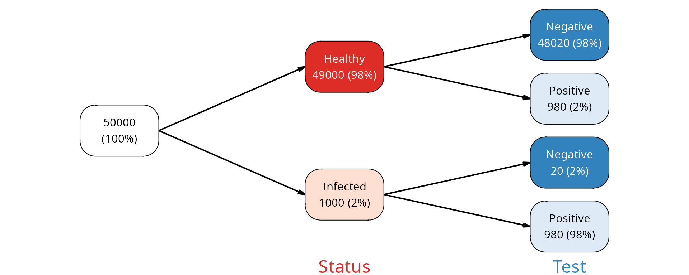
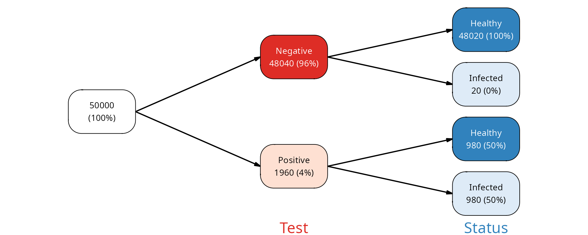
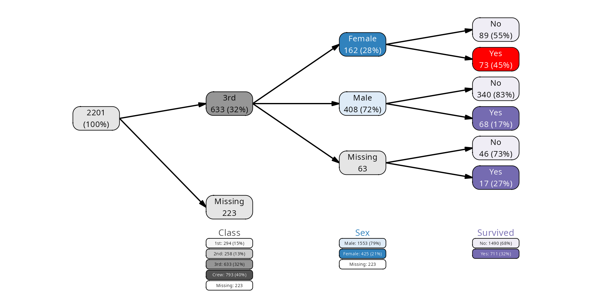
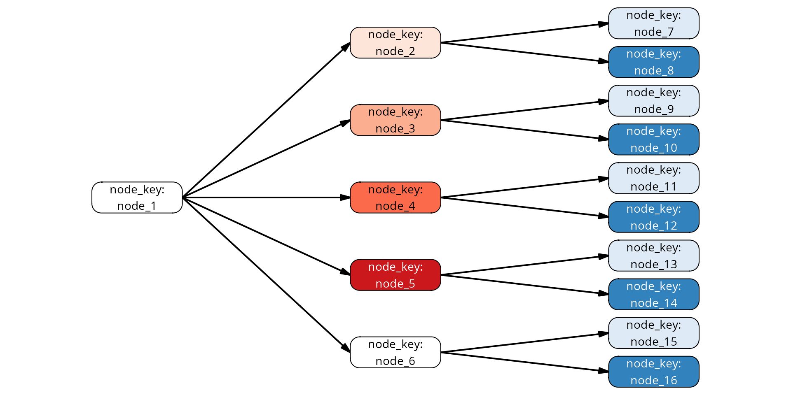
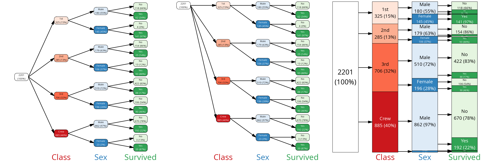
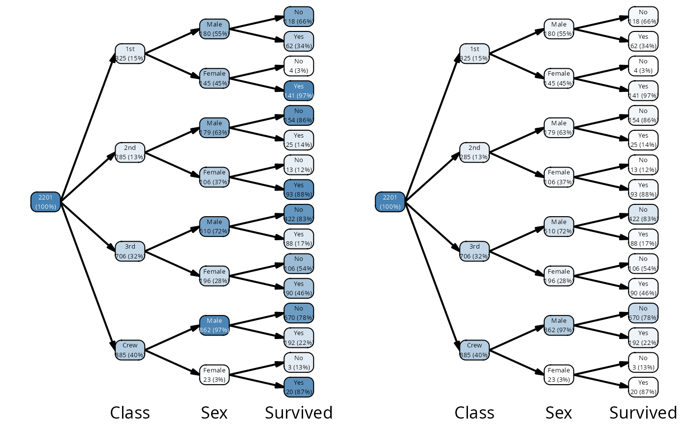
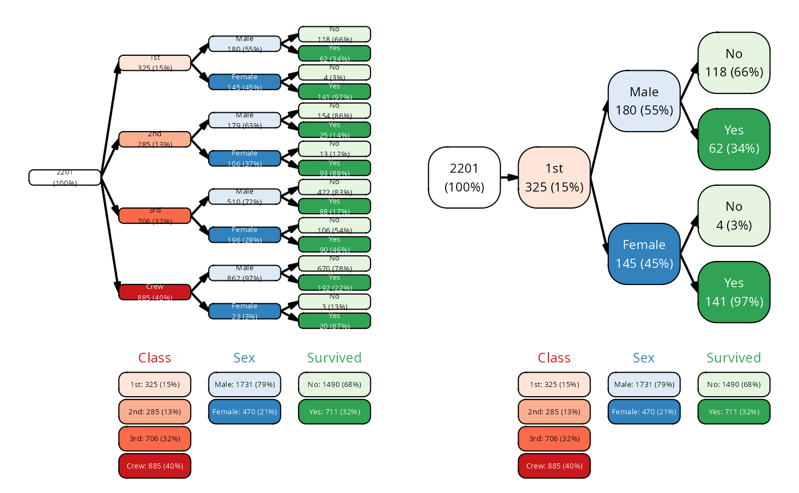
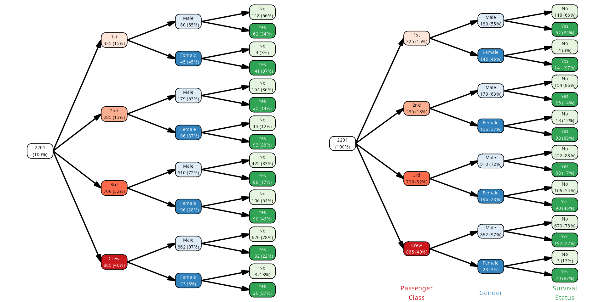
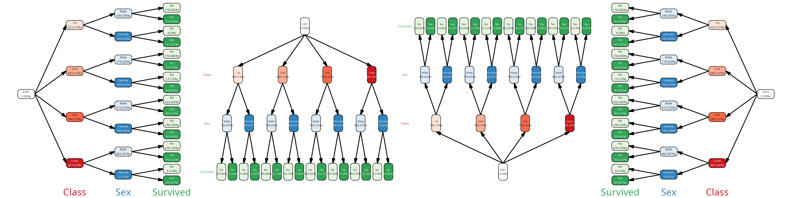

# vtree2

## Introduction

### Quick start

Build a tree and plot it!

``` r
library(vtree2)

# example data set - same as Titanic, but with NAs
data(titanicNA)

# variables to show: Class and Survived
vt <- vtree(titanicNA, Class, Survived)

plot(vt, legend = TRUE)
plot(vt, layout = "proportional")
```


### What are vtrees?

#### FP / NPV example

Imagine a disease and a test that we have for that disease. How good is
the test?

We can consider how often the test makes an error for an infected
subject, incorrectly giving the negative result. This is called a false
negative (FN). The probability of this error is called false negative
rate (FNR), and its compliment the sensitivity: the more sensitive our
test is, the less likely that a test result will be negative if the
person is sick. Let’s assume that our test is highly sensitive, for
example that the FNR is 2% (making sensitivity 98%).

Another type of the error is if we have a healthy subject, but the test
is showing as positive. This value is the number of false positives (FP)
divided by the total number of healthy people, also known as FPR - false
positive rate. The complement of this value ($`1 - FPR`$) is called
specificity. Say, we have an outstanding test and the specificity is
98%, so the false positive rate is 2%.

OK, but there is more to the story. Whether a positive test result
corresponds to a real patient or a false positive depends on how likely
is that the person is actually healthy in reality. This is disease
prevalence, how often the disease is encountered when people are tested.
Say, that the disease is quite common, and the prevalence is 2%.

From this, assuming we performed screening tests on 5^{4} persons in a
population, we get the following table:

| Status   | Test     |     N |
|:---------|:---------|------:|
| Infected | Positive |   980 |
| Infected | Negative |    20 |
| Healthy  | Positive |   980 |
| Healthy  | Negative | 48020 |

Here is how we can build our data:

``` r
FPR <- .02 # p that healthy is positive
FNR <- .02 # p that infected is negative
prevalence <- 1/50 
N <- 50000

data <- tribble(
 ~ Status, ~ Test, ~ N,
 "Infected", "Positive", round(prevalence * N * (1-FNR)),
 "Infected", "Negative", round(prevalence * N * FNR),
 "Healthy",  "Positive", round((1 - prevalence) * N * FNR), 
 "Healthy",  "Negative", round((1 - prevalence) * N * (1 - FNR))
 )
```

We can visualize this table as a vtree. Since it is a frequency table,
we need to use the
[`vtree_from_freqtable()`](https://january3.github.io/vtree2/reference/vtree.md)
function[^1]. For starters, we will show the Status first, and then the
Test result. This will show us how many of the healthy persons were
incorrectly classified as positive, and how many of the infected persons
were incorrectly classified as negative.

``` r
vt <- vtree_from_freqtable(data,
                           Status, Test,
                           .freq_col = "N")
plot(vt)
```



As you can see, the percentages on the leaf nodes (right side of the
plot) correspond to our FPR and FNR values. The percentages on the
internal nodes correspond to the disease prevalence.

What if we were to inverse this question? What is the fraction of
healthy people among those who tested positive, and vice versa - what is
the fraction of infected people among those who tested negative?

``` r
vt2 <- vtree_from_freqtable(data,
                           Test, Status,
                           .freq_col = "N")
plot(vt2)
```



We see that among those who were tested negative, the large majority
(practically 100%) were indeed healthy. This is the negative predictive
value (NPV) of the test.

However, among those who were tested positive, only 50% were actually
infected. This is the positive predictive value (PPV) of the test and it
shows that despite the test being very specific and sensitive, when a
person has a positive test result, there is more than a 50% chance that
the person is actually healthy.

### Vtree workflow

In `vtree2`, the workflow is split into several steps:

- Prepare the data (outside of `vtree2`)
- Build the vtree object with
  [`vtree()`](https://january3.github.io/vtree2/reference/vtree.md) or
  [`vtree_from_freqtable()`](https://january3.github.io/vtree2/reference/vtree.md)
- (Optional) Prune, keep or select nodes with
  [`prune()`](https://january3.github.io/vtree2/reference/prune.md),
  [`keep()`](https://january3.github.io/vtree2/reference/prune.md) and
  friends.
- (Optional) Create summaries with
  [`summary_vt()`](https://january3.github.io/vtree2/reference/summary_vt.md).
- (Optional) Add or modify labels with
  [`add_labels()`](https://january3.github.io/vtree2/reference/add_labels.md)
  and [`mutate()`](https://dplyr.tidyverse.org/reference/mutate.html).
- (Optional) Add or modify colors with
  [`add_palette()`](https://january3.github.io/vtree2/reference/vtree_palette.md)
  and [`mutate()`](https://dplyr.tidyverse.org/reference/mutate.html).
- Plot the vtree with
  [`plot()`](https://rdrr.io/r/graphics/plot.default.html).

Here is an example demonstrating all these steps based on the
`titanicNA` data set. This data set is the same as the Titanic data set,
but with some missing values randomly added for demonstration purposes.

``` r
data(titanicNA)

vtree(titanicNA, Class, Sex, Survived) |>
  # only keep the third class passengers
  keep(path == "Class:3rd") |>
  # add default labels
  add_labels() |>
  # change the labels for the missing values
  mutate(label = gsub("NA", "Missing", label)) |>
  # add colors
  add_palette(palettes = c("Greys", "Blues", "Purples"),
              na_fill = "grey90") |>
  # change the color for Females who survived
  # mark() is a helper function that returns TRUE for the nodes that
  # match the given condition
  mark(path == "Class:3rd/Sex:Female/Survived:Yes") |>
  mutate(fill = ifelse(mark, "red", fill)) |>
  mutate(color = ifelse(mark, "white", color)) |>
  # plotting with legend and custom margins
  plot(legend = TRUE,
       margins = c(0.05, 0.05, 0.25, 0.05))
```



## Manual

### Building vtrees

#### Vtree objects

### Pruning, keeping and selecting

### Creating summaries

### Adding and modifying labels

Labels to be plotted are taken from the `label` column of the vtree
object. If this column is missing,
[`plot()`](https://rdrr.io/r/graphics/plot.default.html) calls
[`add_labels()`](https://january3.github.io/vtree2/reference/add_labels.md)
to add default labels. For custom labels there are three routes:

- directly add a label column to the vtree object with
  [`mutate()`](https://dplyr.tidyverse.org/reference/mutate.html)
- use
  [`add_labels()`](https://january3.github.io/vtree2/reference/add_labels.md)
  with a custom format
- first use
  [`add_labels()`](https://january3.github.io/vtree2/reference/add_labels.md),
  then modify the label column with
  [`mutate()`](https://dplyr.tidyverse.org/reference/mutate.html)

#### Directly creating a label column with `mutate()`

Since the
[`mutate()`](https://dplyr.tidyverse.org/reference/mutate.html) function
is called in the context of the vtree node data frame, you can use any
of the columns of the vtree object directly. For example, you can show
the `node_key` column, a unique identifier for each node.

``` r
vtree(titanicNA, Class, Survived) |>
  mutate(label = paste0("node_key:\n", node_key)) |>
  plot(var_labels = FALSE)
```



#### Using `add_labels()` to add default or custom labels

The
[`add_labels()`](https://january3.github.io/vtree2/reference/add_labels.md)
function can produce two types of default labels: “simple” and “long”,
chosen through the `template` argument:

``` r
vt <- vtree(titanicNA, Class)
p1 <- add_labels(vt) |> plot() # template = "simple"
p2 <- add_labels(vt, template = "long") |> plot()
plot_grid(p1, p2, nrow = 1)
```


These labels are derived directly from columns of the vtree object:
`node_name`, `node_val`, `freq` and `n`. When vtree object is created,
the `node_name` and `node_col` are identical. However, the latter may
not be changed because it is important for operations such as pruning.
However, you can freely modify `node_name`, for example specifying a
more user-friendly variable name to be used by
[`add_labels()`](https://january3.github.io/vtree2/reference/add_labels.md).

#### Using custom formatting

Formatting can also be done with the `fmt`/`fmt_na` parameters, which
are R expressions. You can use sprintf, glue, paste or whichever
expressions you like to construct a label from the following variables:

- `freq`, the frequency for a node
- `n`, number of samples of a node
- `node_col`, name of the variable associated with a node
- `node_name`, display name of the variable associated with a node
- `node_val`, value of the variable associated with a node
- `node_cv`, same as `paste0(node_col, ':', node_val)`
- plus whatever new columns you have added to the vtree with mutate().

You can list the columns in the node data frame of a vtree object with
`nodecols(vt)` (or simply `colnames(as_tibble(vt))`).

If provided, `fmt_na` is used to format the NA nodes.

Here is simple example using
[`glue()`](https://glue.tidyverse.org/reference/glue.html):

``` r
library(glue)
vt <- vtree(titanicNA, Class, Sex) |>
  add_labels(fmt =
    glue("{node_name}: {node_val}\nfreq={format(freq, digits=2)}"),
             fmt_na =
    glue("{node_name}: Missing\nfreq={format(freq, digits=2)}"))
plot(vt, var_labels = FALSE)
```


Note that the root node also got a label, but since `node_name` and
`node_val` are both “” for the root, the label is not very informative.
We can change it:

``` r
library(glue)
vt <- vtree(titanicNA, Class, Sex) |>
  add_labels(fmt =
    glue("{node_name}: {node_val}\nfreq={format(freq, digits=2)}\nn={n}"),
             fmt_na =
    glue("{node_name}: Missing\nfreq={format(freq, digits=2)}\nn={n}")) |>
  mutate(label = ifelse(path == "root",
                        glue("All passengers\nn={n}"),
                        label))
plot(vt, var_labels = FALSE, dir="tb")
```


#### Using a mask

You can specify a mask with
[`add_labels()`](https://january3.github.io/vtree2/reference/add_labels.md) -
a logical vector with the same length as the number of nodes - to
indicate which nodes should have their labels modified. For example, you
may want a different information for the leaf nodes as for other nodes:

``` r
vt <- vtree_from_freqtable(Titanic, Class, Sex, Survived) |>
  keep(path == "Class:1st") # only keep the first class passengers
mask <- find_nodes(vt, leaf) # leaf is a logical vector
add_labels(vt, mask = mask, template = "long") |>
  add_labels(mask = !mask, fmt = glue("{node_val}")) |>
  plot(var_labels = FALSE, dir="tb", show_root = FALSE,
       lwidth = 0.5, lheight = 0.5)
```


### Adding and modifying colors

### Plotting

Objects of type vtree can be directly plotted with the
[`plot()`](https://rdrr.io/r/graphics/plot.default.html) method. If the
labels, colors and layouts are missing, then plot adds some automatic
defaults by running
`vtree |> add_labels() |> add_colors() |> add_layout()` before plotting.
Some of the arguments for these functions can be passed directly to the
[`plot()`](https://rdrr.io/r/graphics/plot.default.html) function.

#### Layouts

Currently, there are three layouts implemented: “regular”, “flushed” and
“proportional”. The default layout is “regular”, which simply shows the
tree structure with all nodes having the same sizes. The “flushed”
layout is similar, but the nodes are always flushed to one side of the
plot.

The proportional layout shows the nodes with sizes proportional to the
number of observations in that node.

``` r
# the default column name for .freq_col is "Freq", same as in Titanic,
# so no need to specify it here
vt <- vtree_from_freqtable(Titanic, Class, Sex, Survived)
p1 <- plot(vt) # layout regular
p2 <- plot(vt, layout = "flushed")
p3 <- plot(vt, layout = "proportional")
plot_grid(p1, p2, p3, nrow = 1)
```



Layouts are added with the
[`add_layout()`](https://january3.github.io/vtree2/reference/add_layout.md)
function, which you can call directly on the vtree object, resulting in
a new vtree object with additional columns for the layout.

With the `layout_func` argument, you can specify a custom function to
calculate the layout yourself. For example, this function might call
[`add_layout()`](https://january3.github.io/vtree2/reference/add_layout.md)
first and then adjust the calculated positions of the nodes in some way.
See the documentation for
[`add_layout()`](https://january3.github.io/vtree2/reference/add_layout.md)
for details.

#### Colors, fill colors and labels

Colors can be added with the
[`add_palette()`](https://january3.github.io/vtree2/reference/vtree_palette.md)
function and then modified by directly manipulating the vtree object
with [`mutate()`](https://dplyr.tidyverse.org/reference/mutate.html).
Each node can have the `fill` and `color` columns, corresponding to the
fill color of the node and the text color of the node label.

If `fill` is missing from the vtree object,
[`plot()`](https://rdrr.io/r/graphics/plot.default.html) will call
[`add_palette()`](https://january3.github.io/vtree2/reference/vtree_palette.md)
to assign fill colors automatically. If `color` is missing, but `fill`
is present, then white or black will be chosen automatically depending
on the contrast with the fill color.

``` r
pal <- colorRampPalette(c("white", "steelblue"))(101)

p1 <- vt |>
  mutate(fill = pal[round(freq * 100) + 1]) |>
  plot()

p2 <- vt |>
  mutate(abs_freq = n / max(n)) |>
  mutate(fill = pal[round(abs_freq * 100) + 1]) |>
 plot()

cowplot::plot_grid(p1, p2)
```



Colors can be also assigned automatically based on names of RColorBrewer
palettes. There is a default order of palettes for the variables, but
you can override it with the `palettes` argument of
[`plot()`](https://rdrr.io/r/graphics/plot.default.html) or
[`add_palette()`](https://january3.github.io/vtree2/reference/vtree_palette.md).

Similarly, if the `label` column is missing from the vtree object,
[`plot()`](https://rdrr.io/r/graphics/plot.default.html) will call
[`add_labels()`](https://january3.github.io/vtree2/reference/add_labels.md)
(see above) to assign labels automatically.

#### Legends with summaries

The legend shows a summary for each variable underneath or next to the
part of the tree which corresponds to this variable. Variable summaries
are calculated when vtree is constructed and stored in the `summary`
attribute of the vtree object. You can print them with
`summary(vtree_object)`:

``` r
vt <- vtree_from_freqtable(Titanic, Class, Sex, Survived)
summary(vt)
#> # A tibble: 11 × 6
#>    node_col node_val count  freq denom label            
#>    <chr>    <chr>    <int> <dbl> <int> <chr>            
#>  1 Class    1st        325 0.148  2201 1st: 325 (15%)   
#>  2 Class    2nd        285 0.129  2201 2nd: 285 (13%)   
#>  3 Class    3rd        706 0.321  2201 3rd: 706 (32%)   
#>  4 Class    Crew       885 0.402  2201 Crew: 885 (40%)  
#>  5 Class    NA           0 0      2201 Missing: 0       
#>  6 Sex      Male      1731 0.786  2201 Male: 1731 (79%) 
#>  7 Sex      Female     470 0.214  2201 Female: 470 (21%)
#>  8 Sex      NA           0 0      2201 Missing: 0       
#>  9 Survived No        1490 0.677  2201 No: 1490 (68%)   
#> 10 Survived Yes        711 0.323  2201 Yes: 711 (32%)   
#> 11 Survived NA           0 0      2201 Missing: 0
```

The summaries will not change if you prune the tree, since they are tied
to the data and not the tree structure:

``` r
mar <- c(0.05, 0.05, 0.33, 0.05)
p1 <- plot(vt, legend = TRUE, lwidth=.8, margins = mar)
p2 <- keep(vt, path == "Class:1st") |>
  plot(legend = TRUE, lwidth=.8, margins = mar)
plot_grid(p1, p2, nrow = 1)
```



#### Other `plot()` arguments

**`lwidth`, `lheight`** - label width and height relative to available
space. The layout functions calculate the available space for each node,
and then these parameters determine how much of that space is used for
the label.

For the proportional layout, `lheight` is ignored, since the height of
the node is determined by the number of observations in that node.

**`margins`** - a numeric vector of length 4, specifying the top, right,
bottom and left margins as fractions of the total device space. So, for
example, for 10% margins on all sides, use
`margins = c(0.1, 0.1, 0.1, 0.1)`.

**`show_root`** - if TRUE (default), show the root node (total
population).

**`var_labels`** - if FALSE or NULL, no variable legend is shown on the
plot. If TRUE (default), the variable names are shown. Alternatively, it
can be used to specify custom variable labels. In this case, it should
be a named character vector, where the names are the variable names and
the values are the labels to be displayed for those variables.

``` r
vt <- vtree_from_freqtable(Titanic, Class, Sex, Survived)
p1 <- plot(vt, var_labels = FALSE)
p2 <- plot(vt, var_labels = c(Class="Passenger\nClass", Sex="Gender",
                              Survived="Survival\nStatus"))
plot_grid(p1, p2)
```



**`dir`** direction of the tree. One of “lr” (left to right), “rl”
(right to left), “tb” (top to bottom), “bt” (bottom to top). Default is
“lr”.

``` r
p1 <- plot(vt) # same as dir = "lr"
p2 <- plot(vt, dir = "tb")
p3 <- plot(vt, dir = "bt")
p4 <- plot(vt, dir = "rl")
plot_grid(p1, p2, p3, p4, nrow = 1)
```



**`fontsizes`** Font sizes for the various labels are automatically fit
to the available space, but sometimes you might manually adjust them.
The `fontsizes` is a named list with the following optional fields: \*
`nodes`: node labels (default: “fixed” for regular layout, “adaptive”
for proportional layout) \* `var_labels`: variable labels (default:
“fixed”) \* `legend_labels`: for variable levels when `legend=TRUE`
(default: “fixed”)

Each element can be either a number, in which case the given font size
is directly used, or either “fixed” or “adaptive”. When “fixed” is used,
then optimal font size is calculated for all objects within the group,
and then the minimal font size is used for all objects. When “adaptive”
is used, then each object is fit separately, and the font sizes can be
different for each object.

**`lwd`** line width for use with plotting. Unfortunately, the default
line width is not relative to the device size, but is fixed to an
absolute value; therefore, for small devices the lines may appeary too
thick.

[^1]: [`vtree()`](https://january3.github.io/vtree2/reference/vtree.md)
    works with cases data frames, where each row is a single
    observation. Here we have a frequency table, in which each row is a
    group of observations with the same levels of variables.
