# Vtree2 User Guide

## Quick start

``` r
library(vtree2)

# example data set - same as Titanic, but with NAs
data(titanicNA)

# variables to show: Class and Survived
vt <- vtree(titanicNA, Class, Survived)

plot(vt, legend = TRUE)
plot(vt, layout = "proportional")
```

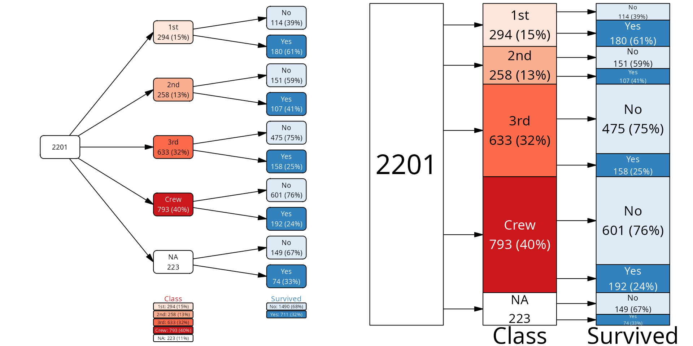

For more information what the vtrees are and how to use them, see the
[What are
Vtrees?](https://january3.github.io/vtree2/articles/what_are_vtrees.md)
vignette. Read on for the full user manual.

## Vtree workflow

In `vtree2`, the workflow is split into several steps:

- Prepare the data (outside of `vtree2`)
- Build the vtree object with
  [`vtree()`](https://january3.github.io/vtree2/reference/vtree.md) or
  [`vtree_from_freqtable()`](https://january3.github.io/vtree2/reference/vtree.md)
- (Optional) Prune, retain or select nodes with
  [`prune()`](https://january3.github.io/vtree2/reference/prune.md),
  [`retain()`](https://january3.github.io/vtree2/reference/prune.md) and
  friends.
- (Optional) Create summaries with
  [`summarize_by_node()`](https://january3.github.io/vtree2/reference/summarize_by_node.md)
  and
  [`fmt_label()`](https://january3.github.io/vtree2/reference/summarize_by_node.md).
- (Optional) Add aliases for variable names and values with
  [`add_aliases()`](https://january3.github.io/vtree2/reference/add_aliases.md).
- (Optional) Add or modify labels with
  [`add_labels()`](https://january3.github.io/vtree2/reference/add_labels.md)
  and [`mutate()`](https://dplyr.tidyverse.org/reference/mutate.html).
- (Optional) Add or modify colors with
  [`add_palette()`](https://january3.github.io/vtree2/reference/vtree_palette.md)
  and [`mutate()`](https://dplyr.tidyverse.org/reference/mutate.html).
- Plot the vtree with
  [`plot()`](https://rdrr.io/r/graphics/plot.default.html).

Here is an example demonstrating all these steps based on the
`titanicNA` data set. This data set is the same as the Titanic data set,
but with some missing values randomly added for demonstration purposes.

``` r
data(titanicNA)

vtree(titanicNA, Class, Sex, Survived) |>
  # only retain the third class passengers
  retain(path == "Class:3rd") |>
  # change how variables are displayed
  add_aliases(val_alias = list(Class = c("1st" = "First",
                                    "2nd" = "Second",
                                    "3rd" = "Third"))) |>
  # add default labels, built from aliases
  add_labels() |>
  # change the labels for the missing values
  mutate(label = gsub("NA", "Missing", label)) |>
  # add colors
  add_palette(palettes = c("Greys", "Blues", "Purples"),
              na = "grey90") |>
  # change the color for Females who survived
  # mark() adds a column `mark` to the vtree object, which is TRUE for
  # nodes that match the given condition
  mark(path == "Class:3rd/Sex:Female/Survived:Yes") |>
  mutate(fill = ifelse(mark, "red", fill)) |>
  mutate(color = ifelse(mark, "white", color)) |>
  mutate(label = ifelse(mark, sprintf("**%s**", label), label)) |>
  # plotting with legend and custom margins
  plot(legend = TRUE,
       richtext = TRUE,
       margins = c(0.05, 0.05, 0.25, 0.05))
```

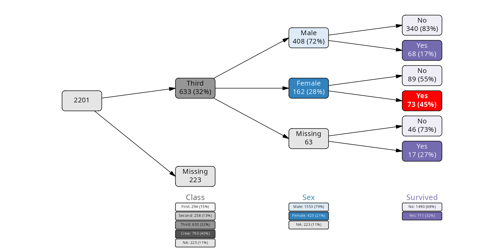

## Building vtree objects

### Case data

Vtrees are primarly built from *case data*: matrices or data frames in
which each row corresponds to a single sample. Each column is a data
variable and can be selected to be used and displayed on a vtree. For
example, consider the built-in data set `titanicNA`. This is the same
data set as `Titanic` from the `datasets` package, except that it is a
cases data frame and some of the values were replaced by NAs to simulate
missing data:

``` r
data(titanicNA)
head(titanicNA)
#> # A tibble: 6 × 4
#>   Class Sex   Age   Survived
#>   <fct> <fct> <fct> <fct>   
#> 1 3rd   Male  Child No      
#> 2 3rd   Male  Child No      
#> 3 3rd   NA    Child No      
#> 4 3rd   Male  Child No      
#> 5 3rd   Male  Child No      
#> 6 NA    NA    Child No
```

As you can see, we have four variables: `Class`, `Sex`, `Age` and
`Survived`. Each of the 2201 rows corresponds to a single passenger.

The [`vtree()`](https://january3.github.io/vtree2/reference/vtree.md)
function then collects the levels of each selected variable and counts
the number of samples for each combination of levels:

``` r
vt <- vtree(titanicNA, Class, Survived)
vt
#> vtree object with 2 variables and 2201 observations
#> Variables: Class, Survived 
#> Frequencies computed as valid percentages (vp == TRUE)
#> Overview:
#> # Tibble (class tbl_df) 6 x 16:
#>   │path                   │n    │freq │tot_n│missing│denom
#>  1│root                   │ 2201│ 1.00│ 2201│     NA│ 2201
#>  2│Class:1st              │  294│ 0.15│ 2201│    223│ 1978
#>  3│Class:2nd              │  258│ 0.13│ 2201│    223│ 1978
#>  4│Class:3rd              │  633│ 0.32│ 2201│    223│ 1978
#>  5│Class:Crew             │  793│ 0.40│ 2201│    223│ 1978
#>  6│Class:NA               │  223│ 0.11│ 2201│    223│ 1978
#>  7│Class:1st/Survived:No  │  114│ 0.39│  294│      0│  294
#>  8│Class:1st/Survived:Yes │  180│ 0.61│  294│      0│  294
#>  9│Class:2nd/Survived:No  │  151│ 0.59│  258│      0│  258
#> 10│Class:2nd/Survived:Yes │  107│ 0.41│  258│      0│  258
#> 11│Class:3rd/Survived:No  │  475│ 0.75│  633│      0│  633
#> 12│Class:3rd/Survived:Yes │  158│ 0.25│  633│      0│  633
#> 13│Class:Crew/Survived:No │  601│ 0.76│  793│      0│  793
#> 14│Class:Crew/Survived:Yes│  192│ 0.24│  793│      0│  793
#> 15│Class:NA/Survived:No   │  149│ 0.67│  223│      0│  223
#> 16│Class:NA/Survived:Yes  │   74│ 0.33│  223│      0│  223
```

Note that you select the variables that you want to consider in your
vtree - in the above example, we do not care about Sex or Age. Also note
that the variables follow the tidyverse logic - they are *data vars*,
and do not need to be quoted. If you need to use a variable name that is
stored in another variable, or if the variable names are not valid R
identifiers, you can use
[`tidyselect::all_of()`](https://tidyselect.r-lib.org/reference/all_of.html)
to select the variables.

``` r
vars <- c("Class", "Survived")
vt <- vtree(titanicNA, all_of(vars))
```

That is one way to construct vtrees. The other is to use frequency
tables.

### Frequency data

Often the data is already summarized in a frequency table, where each
row corresponds to a combination of levels of the selected variables,
and there is a column with the number of samples in which this
combination occurs.

There are two functions to construct vtrees from frequency tables:
[`vtree_from_freqtable()`](https://january3.github.io/vtree2/reference/vtree.md)
and
[`cases_from_freqtable()`](https://january3.github.io/vtree2/reference/cases_from_freqtable.md).
The first one constructs the vtree directly from the frequency table,
while the second one first expands the frequency table into a cases data
frame which you can use to construct the vtree with
[`vtree()`](https://january3.github.io/vtree2/reference/vtree.md).

The original Titanic data set is a cross-tabulation of the four
variables. When converted to a data frame, it becomes a frequency table,
with the column `Freq` containing the number of passengers for each
combination of levels of the four variables:

``` r
head(as.data.frame(Titanic))
#>   Class    Sex   Age Survived Freq
#> 1   1st   Male Child       No    0
#> 2   2nd   Male Child       No    0
#> 3   3rd   Male Child       No   35
#> 4  Crew   Male Child       No    0
#> 5   1st Female Child       No    0
#> 6   2nd Female Child       No    0
cases <- cases_from_freqtable(Titanic)
vt <- vtree(cases, Class, Survived)

# or do it directly:
vt <- vtree_from_freqtable(Titanic, Class, Survived)
```

### Data preparation

The vtree object constructors
([`vtree()`](https://january3.github.io/vtree2/reference/vtree.md) and
[`vtree_from_freqtable()`](https://january3.github.io/vtree2/reference/vtree.md))
can only use factors and character values. They flatly refuse to process
numeric or logical columns. This is by design: numeric and logical
values are not categorical, and vtrees are meant to visualize
categorical data.

Also, converting numerical or logical values to factors or character
vectors is easy. It is best done with regular R code.

### Valid percentages

One of the important concepts to know about are the *valid percentages*.
In short, a valid percentage is the number of samples with a given value
of a variable divided by the total number of samples *for which this
variable is not missing*.

If you have 50 males, 50 females and 100 samples for which the sex is
unknown, then the number of males divided by the total number of samples
may be misleading (25%); valid percentages are calculated only from the
100 samples for which the sex is known and the proportion of males and
females is 50% each.

The [`vtree()`](https://january3.github.io/vtree2/reference/vtree.md)
and
[`vtree_from_freqtable()`](https://january3.github.io/vtree2/reference/vtree.md)
functions by default calculate valid percentages; if you want to
calculate the absoluet frequencies, use the `.vp=FALSE`argument to these
functions.

Once the vtree has been constructed, this cannot change. Any operations
downstream (like selecting and pruning nodes and modifying their labels)
will not change the calculated percentages.

### Vtree objects

You can inspect the vtree object with a number of methods.

``` r
# names of the column variables associated with the nodes
names(vt)
#> [1] "Class"    "Survived"

# available levels of the different column variables:
levels(vt)
#> $Class
#> [1] "1st"  "2nd"  "3rd"  "Crew"
#> 
#> $Survived
#> [1] "No"  "Yes"

# summary frequency data for each node variable
summary(vt)
#> # A tibble: 8 × 6
#>   node_col node_val count  freq denom label          
#>   <chr>    <chr>    <int> <dbl> <int> <chr>          
#> 1 Class    1st        325 0.148  2201 1st: 325 (15%) 
#> 2 Class    2nd        285 0.129  2201 2nd: 285 (13%) 
#> 3 Class    3rd        706 0.321  2201 3rd: 706 (32%) 
#> 4 Class    Crew       885 0.402  2201 Crew: 885 (40%)
#> 5 Class    NA           0 0      2201 Missing: 0     
#> 6 Survived No        1490 0.677  2201 No: 1490 (68%) 
#> 7 Survived Yes        711 0.323  2201 Yes: 711 (32%) 
#> 8 Survived NA           0 0      2201 Missing: 0

# check whether the vtree is calculated using valid
# percentages or absolute frequencies
is_vp(vt)
#> [1] TRUE
```

The vtree objects contain a data frame of nodes with a number of
associated columns, which include:

- `node_key` - a unique identifier for each node
- `node_id` - a unique integer identifier for each node
- `node_col` - the name of the column variable associated with the node
- `node_val` - the value of the variable associated with the node
- `freq` - the percentage of samples within the node that have the given
  `node_val`
- `n` - the number of samples in the current node
- `missing` - the number of missing samples in the current node
- `tot_n` - the number of samples in the parent node
- `denom` - the number of samples within the node that have a
  non-missing value for the variable associated with the node. This is
  equal to `tot_n` only if the tree was not constructed with valid
  percentages. Otherwise, it is equal to the number of samples in the
  parent node that have a non-missing value for variable `node_col`.

Some other columns may be added later with
[`mutate()`](https://dplyr.tidyverse.org/reference/mutate.html) or with
the various `add_*()` functions, for example:

- `label` - the label to be displayed on the node
- `fill` - the fill color of the node
- `color` - the text color of the label
- `x`, `y`, `width`, `height` - layout information for the node

You can inspect the columns of the vtree object with
[`nodecols()`](https://january3.github.io/vtree2/reference/nodecols.md),
which is just a wrapper around `colnames(as_tibble(vt))`:

``` r
nodecols(vt)
#>  [1] "path"      "node_id"   "node_key"  "parent"    "parent_id" "path_l"   
#>  [7] "level"     "node_col"  "node_val"  "n"         "tot_n"     "missing"  
#> [13] "freq"      "denom"     "leaf"
```

You can convert the vtree object to a data frame with `as_tibble`:

``` r
as_tibble(vt)
#> # A tibble: 13 × 15
#>    path   node_id node_key parent parent_id path_l       level node_col node_val
#>    <chr>    <int> <chr>    <chr>      <int> <list>       <dbl> <chr>    <chr>   
#>  1 root         1 node_1   NA            NA <lgl [1]>        0 root     ""      
#>  2 Class…       2 node_2   root           1 <named list>     1 Class    "1st"   
#>  3 Class…       3 node_3   root           1 <named list>     1 Class    "2nd"   
#>  4 Class…       4 node_4   root           1 <named list>     1 Class    "3rd"   
#>  5 Class…       5 node_5   root           1 <named list>     1 Class    "Crew"  
#>  6 Class…       6 node_6   Class…         2 <named list>     2 Survived "No"    
#>  7 Class…       7 node_7   Class…         2 <named list>     2 Survived "Yes"   
#>  8 Class…       8 node_8   Class…         3 <named list>     2 Survived "No"    
#>  9 Class…       9 node_9   Class…         3 <named list>     2 Survived "Yes"   
#> 10 Class…      10 node_10  Class…         4 <named list>     2 Survived "No"    
#> 11 Class…      11 node_11  Class…         4 <named list>     2 Survived "Yes"   
#> 12 Class…      12 node_12  Class…         5 <named list>     2 Survived "No"    
#> 13 Class…      13 node_13  Class…         5 <named list>     2 Survived "Yes"   
#> # ℹ 6 more variables: n <int>, tot_n <int>, missing <int>, freq <dbl>,
#> #   denom <int>, leaf <lgl>
```

### Vtree objects as graphs

The `vtree` class is a wrapper around the `tbl_graph` class from package
`tidygraph`. It is a directed graph, where each node corresponds to a
combination of levels of the selected variables. The `tbl_graph` class
itself inherits from `igraph`, which means that you can use all of the
`igraph` functions on `vtree` objects:

``` r
igraph::degree(vt)
#>  [1] 4 3 3 3 3 1 1 1 1 1 1 1 1
```

Since the default plotting function for `igraph` objects is replaced by
`vtree2`’s own
[`plot.vtree()`](https://january3.github.io/vtree2/reference/plot.vtree.md),
if you want to use `igraph`’s plotting function, you need to convert the
vtree object to a `tbl_graph` object first:

``` r
vt_tbl <- as_tbl_graph(vt)
plot(vt_tbl)
```

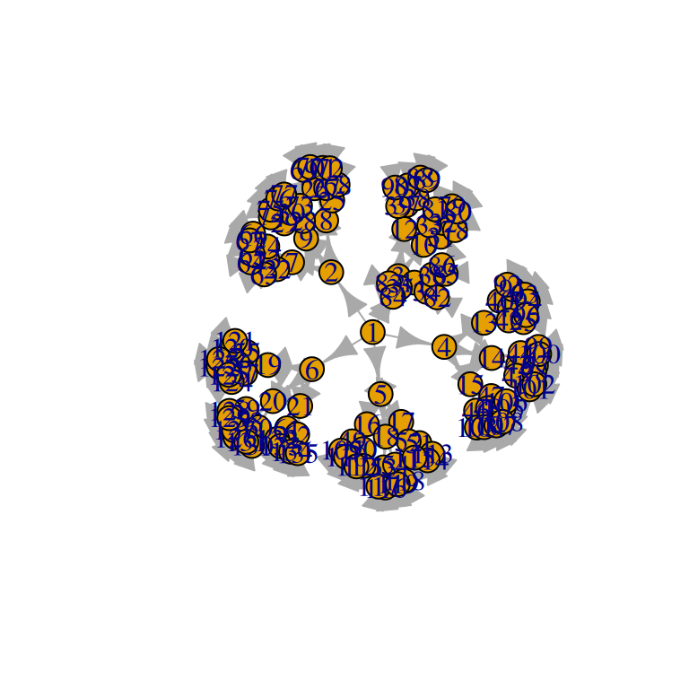

### Tidy selection of variables

The selection of columns in
[`vtree()`](https://january3.github.io/vtree2/reference/vtree.md) and
related functions follows the `tidyselect` rules. You don’t quote the
data var names, you can use `:` to select a range or `-` to exclude a
variable. For programmatic selection, use a character vector and
[`tidyselect::all_of()`](https://tidyselect.r-lib.org/reference/all_of.html)
to select the variables. The following are equivalent:

``` r
vtree(titanicNA, Class, Sex, Age)
vtree(titanicNA, -Survived)
vtree(titanicNA, Class:Age)
vtree(titanicNA, all_of(c("Class", "Sex", "Age")))
```

## Pruning, retain and selecting

### Pruning and keeping

Quite often, we don’t want to show the whole tree, but only selected
nodes. For this, you can use the functions
[`prune()`](https://january3.github.io/vtree2/reference/prune.md) and
[`retain()`](https://january3.github.io/vtree2/reference/prune.md). Each
has a few pecularities and defaults.

**Pruning** a node means: remove the node from the tree, along all the
nodes that follow it. However, with the parameter `follow_only=TRUE`,
all the following nodes will be pruned, but the given node will be kept.

**Retaining** means that you indicate which nodes you would like to
keep, and prune all other nodes.

Both pruning and retaining take a logical expression as an argument. The
expression is evaluated in a particular context: you can use both all
the node data frame columns (i.e., data vars such as `freq`, `n` or
`path`), as well as the node variables (like `Class` or `Survived`). All
this works naturally: you can specify that you want only to see the node
where `Class == "1st"` or all nodes where `freq > 0.5`.

``` r
# all variables except for Age
vt <- vtree_from_freqtable(Titanic, -Age)
p1 <- plot(vt)
# show only 1st class passengers
p2 <- vt |>
  retain(Class == "1st") |>
  plot(legend = FALSE, lwidth =.8)
# remove nodes with low frequency or number
p3 <- vt |>
  prune(freq < .2 | n < 20) |>
  plot(legend = FALSE, lwidth =.8)
# show only combinations of factors where more than a quarter of passengers
# survived
p4 <- vt |>
  retain(Survived == "Yes" & freq > .25) |>
  plot(legend = FALSE, lwidth =.8)
plot_grid(p1, p2, p3, p4, nrow = 2,
          labels=c("Original", "Retained Class:1st",
         "Pruned freq < .2 | n < 20",
         "Retained freq > .25 & Survived:Yes"),
         label_size = 10)
```

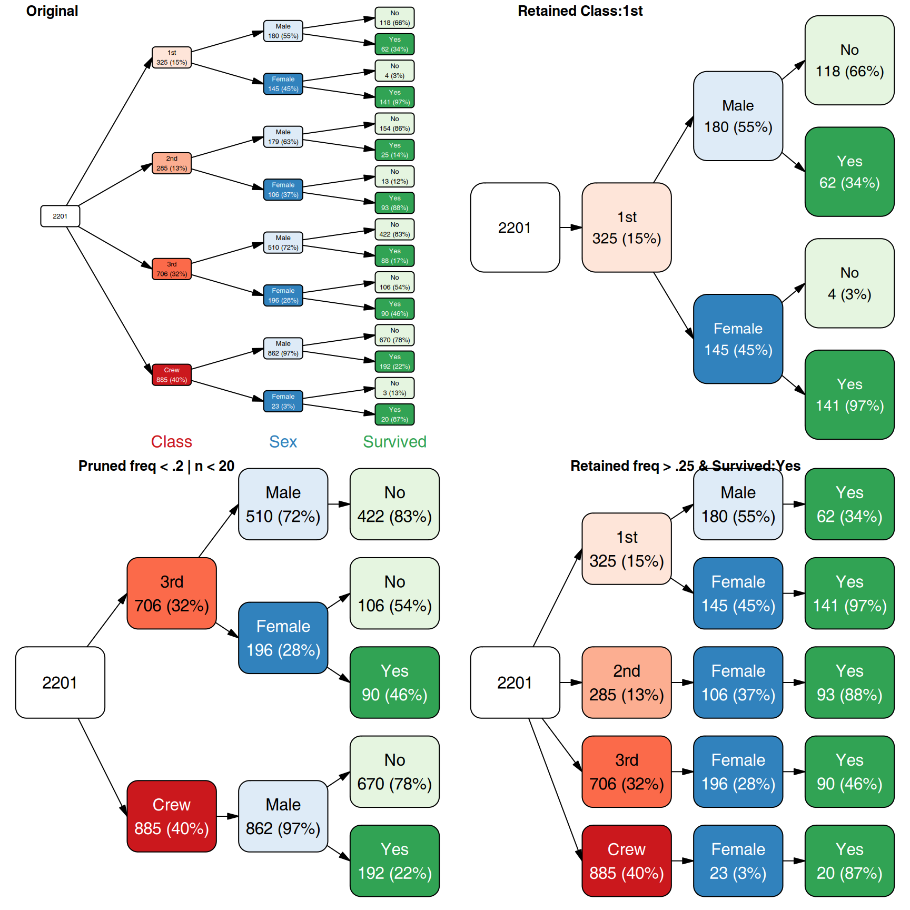

**Valid percentages and NA nodes.** There is one pecularity about how
the NA nodes are shown. If you try to prune a node corresponding to a
missing value, it will still be shown - if the tree was constructed with
the so-called “valid percentages” (`.vp=TRUE`, default). VP means that
the denominator used to calculate frequencies on the tree was the number
of *valid* samples, i.e. excluding the missing values. Therefore,
without the NA node shown for a VP-based tree, you lack information
necessary to understand the percentages shown.

``` r
# all variables except for Age
vt <- vtree(titanicNA, -Age)
p1 <- vt |>
  # this should prune the NA nodes, but doesn't
  retain(Class %in% c("1st", "2nd")) |>
  prune(is.na(Sex)) |>
  plot(legend = FALSE, lwidth=.8)
vt_novp <- vtree(titanicNA, -Age, .vp = FALSE)
p2 <- vt_novp |>
  # this one prunes the NA nodes, b/c the tree 
  # is created with .vp = FALSE
  retain(Class %in% c("1st", "2nd")) |>
  prune(is.na(Sex)) |>
  plot(legend = FALSE, lwidth=.8)
plot_grid(p1, p2, nrow = 1,
          labels = c("VP",
                     "No VP"))
```

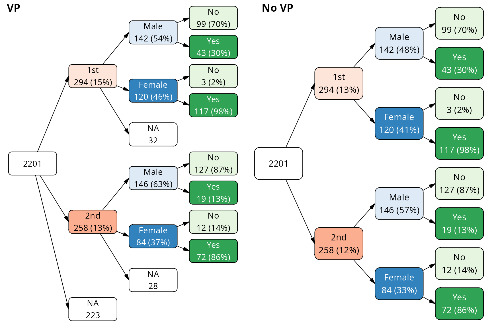

**Targetting nodes.** Quite often, you want to pick one particular node
and either prune it or select only that node for plotting. The `path`
column contains a human-readable specification of the node which makes
picking a certain node easy. For example, if you want to keep only the
node corresponding to males from 3rd class (and the following nodes),
you can ask for nodes where path is equal to `"Class:3rd/Sex:Male"`:

``` r
vt <- vtree_from_freqtable(Titanic)
p1 <- plot(vt, legend = FALSE, dir="tb", show_root = FALSE)
p2 <- vt |>
  retain(path == "Class:3rd/Sex:Male") |>
  plot(legend = TRUE, dir="tb", show_root = FALSE)
plot_grid(p1, p2, nrow = 1, labels = c("Original tree", "Retained node"))
```

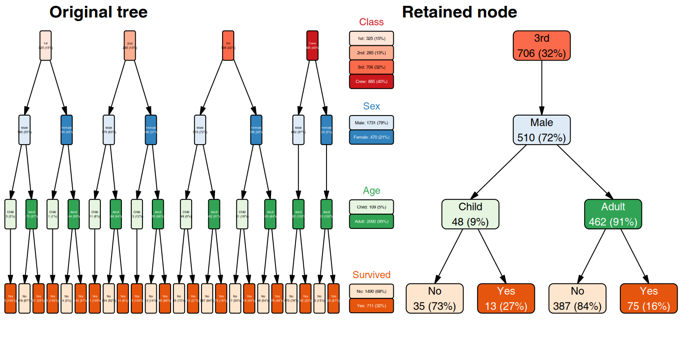

Note that the legend shown on the left in the above plot still contains
all the other variable levels, even if you can’t see them on the tree.
This is on purpose: the stat summaries in the legend correspond to the
whole data set on which the tree was built, and not only the portion
that is shown in the tree.

### Finding and marking

Sometimes rather than change the visibility of selected nodes by pruning
or retaining, you might want to change their color or label instead. For
this, you can use
[`find_nodes()`](https://january3.github.io/vtree2/reference/prune.md)
to get a logical vector indicating which nodes match a certain condition
or [`mark()`](https://january3.github.io/vtree2/reference/prune.md) to
produce a vtree object with a new column, `mark`, holding that logical
vector.

``` r
vt <- vtree(titanicNA, Class, Survived)

# which nodes have a low frequency?
mask <- find_nodes(vt, freq < 0.2)
as_tibble(vt) |> filter(mask)
#> # A tibble: 3 × 15
#>   path    node_id node_key parent parent_id path_l       level node_col node_val
#>   <chr>     <int> <chr>    <chr>      <int> <list>       <dbl> <chr>    <chr>   
#> 1 Class:…       2 node_2   root           1 <named list>     1 Class    1st     
#> 2 Class:…       3 node_3   root           1 <named list>     1 Class    2nd     
#> 3 Class:…       6 node_6   root           1 <named list>     1 Class    NA      
#> # ℹ 6 more variables: n <int>, tot_n <int>, missing <int>, freq <dbl>,
#> #   denom <int>, leaf <lgl>

# mark nodes with low frequency with pink
# all other nodes will be white
vt |> mark(freq < .2) |>
  mutate(fill = ifelse(mark, "pink", "white")) |>
  plot()
#> ℹ palette attribute is NULL
#> legend will be black and white
```

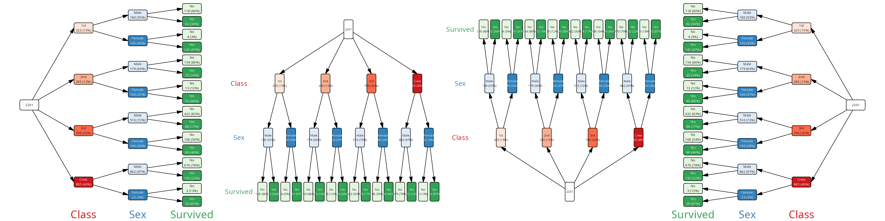

## Adding column and value aliases

If you prefer to see a different name for the variable or its values on
the plot, there are basically two approaches.

First, you can just recode or rename the variables in the data from
which you build the vtree. This has an advantage: you ensure that the
labels you see on the plot are the same as in the original data. For
example, you can do the following:

``` r
cases <- as_tibble(Titanic) |>
  mutate(Class = recode(Class, "1st" = "First", "2nd" = "Second",
                        "3rd" = "Third")) |>
  cases_from_freqtable(.freq_col = "n")

vtree(cases, Class, Survived) |> plot()
```

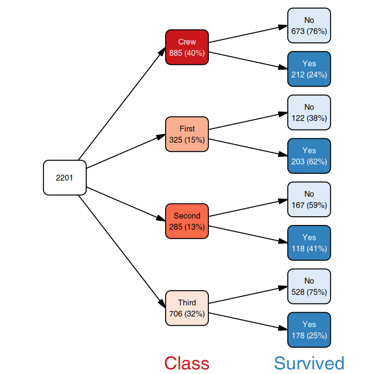

However, some times what you want to see on the plot is not convenient
to work with in the data, for example if you want to show a longer
description of the possible values, add Unicode characters or markdown /
HTML formatting for rich text labels. In this case, you can specify an
alias for either using the `col_alias` and `val_alias` arguments of
[`add_aliases()`](https://january3.github.io/vtree2/reference/add_aliases.md).
Not all variables or all levels (values) need to be specified, only
those you want to change:

``` r
col_alias <- list(Class = "Passenger\nClass",
                  Sex = "Gender",
                  Age = "Age\nGroup",
                  Survived = "Survival\nStatus")

val_alias <- list(NAs = "Missing",
                  Class = c("1st" = "First",
                             "2nd" = "Second",
                             "3rd" = "Third"))

vtree(titanicNA, Class, Survived) |>
  add_aliases(col_alias = col_alias,
             val_alias = val_alias) |>
  plot(legend = TRUE, dir="tb", show_root = FALSE,
       margins = c(0.05, 0.05, 0.05, 0.10))
```

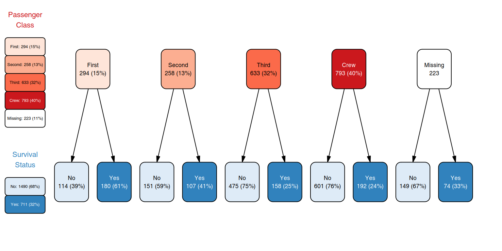

The special `NAs` name is used for all missing values, regardless of the
variable.

Unnecessary gory details:

- [`add_aliases()`](https://january3.github.io/vtree2/reference/add_aliases.md)
  and
  [`add_labels()`](https://january3.github.io/vtree2/reference/add_labels.md)
  always ensure that columns `col_alias` and `val_alias` are present in
  the vtree object.
- If no custom format is specified, these two columns will be identical
  to the `node_col` and `node_val` columns, respectively.
- In addition, the alias information is stored in the `alias` attribute
  of the vtree object, which is subsequently used by
  [`plot()`](https://rdrr.io/r/graphics/plot.default.html) to create the
  legend.

## Adding and modifying labels

Labels to be plotted are taken from the `label` column of the vtree
object. If this column is missing,
[`plot()`](https://rdrr.io/r/graphics/plot.default.html) calls
[`add_labels()`](https://january3.github.io/vtree2/reference/add_labels.md)
to add default labels. For custom labels there are three routes:

- directly add a label column to the vtree object with
  [`mutate()`](https://dplyr.tidyverse.org/reference/mutate.html)
- use
  [`add_labels()`](https://january3.github.io/vtree2/reference/add_labels.md)
  with a custom format
- first use
  [`add_labels()`](https://january3.github.io/vtree2/reference/add_labels.md),
  then modify the label column with
  [`mutate()`](https://dplyr.tidyverse.org/reference/mutate.html)

### Directly creating a label column with `mutate()`

Since the
[`mutate()`](https://dplyr.tidyverse.org/reference/mutate.html) function
is called in the context of the vtree node data frame, you can use any
of the columns of the vtree object directly. For example, you can show
the `node_key` column, a unique identifier for each node.

``` r
vtree(titanicNA, Class, Survived) |>
  mutate(label = paste0("node_key:\n", node_key)) |>
  plot(legend = FALSE)
```

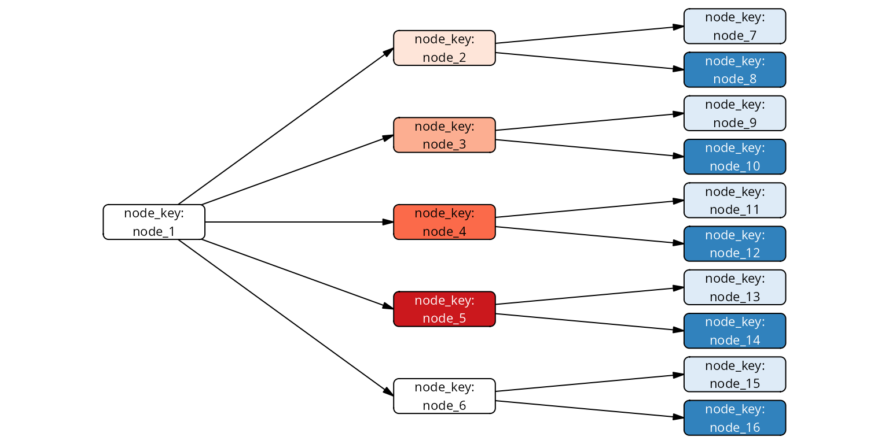

#### Using `add_labels()` to add default or custom labels

The
[`add_labels()`](https://january3.github.io/vtree2/reference/add_labels.md)
function can produce two types of default labels: “simple” and “long”,
chosen through the `template` argument:

``` r
vt <- vtree(titanicNA, Class)
p1 <- add_labels(vt) |> plot() # template = "simple"
p2 <- add_labels(vt, template = "long") |> plot()
plot_grid(p1, p2, nrow = 1)
```


These labels are derived directly from columns of the vtree object:
`col_alias`, `val_alias`, `freq` and `n`. If no aliases are set, then
`col_alias` is the same as `node_col`, and `val_alias` is the same as
`node_val`.

It is quite normal to call
[`add_labels()`](https://january3.github.io/vtree2/reference/add_labels.md)
multiple times, for example to conditionally add labels. The following
makes simple default labels and adds a more informative label only to
the leafs on the tree:

``` r
vt <- vtree(titanicNA, Class, Survived)
mask <- pull(vt, leaf) # leaf is a logical vector
                       # indicating whether a node is a leaf node
vt |>
  add_labels(template = "sameline") |>
  add_labels(mask = mask, template = "long") |>
  plot()
```

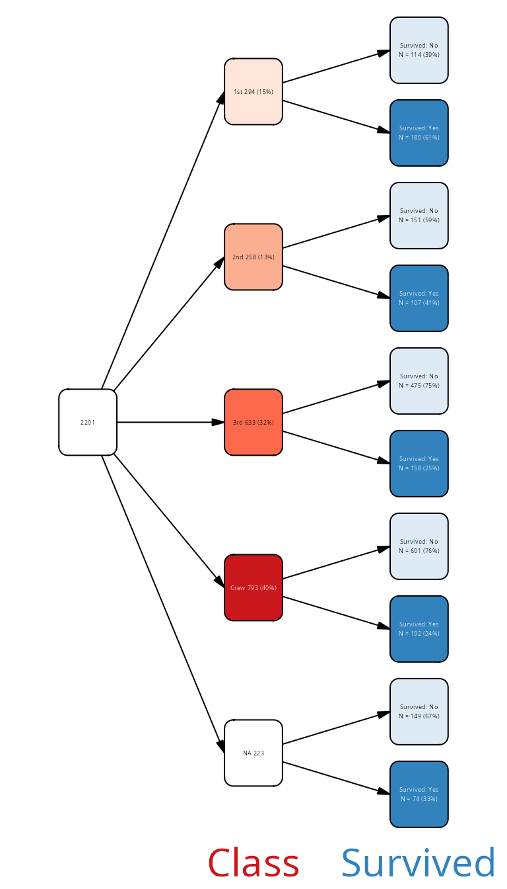

### Using custom formatting

By default,
[`add_labels()`](https://january3.github.io/vtree2/reference/add_labels.md)
produces simple node labels containing the associated variable value,
number of cases and percentage within the parent node. This can be
customized by one of the following:

- choose a different `template` parameter: `short` (default), `sameline`
  (same as short, but on one line) or `long` (with variable names). The
  templates all reasonably handle NA nodes and root node.
- use a \[glue::glue()\] syntax for the parameters `fmt`, `fmt_na` and
  `fmt_root`, where variable names are put in curly braces. The variable
  names are the same as column names of the node data frame of the vtree
  object, plus `pct` and `f` (see below). The three parameters will be
  used to generate regular, NA-nodes or root node labels, respectively.
- use an arbitrary R expression (parameter `expr`) which is evaluated
  with \[rlang::eval_tidy()\] in the context of the nodes data frame of
  the vtree object.

Both the glue format syntax and the arbitrary expression syntax can use
any column name which is already present in the nodes data frame,
including:

- `freq`, the frequency for a node
- `n`, number of samples of a node
- `col_alias`, the alias for the column/variable associated with a node
  (default same as node_col, but can be modified by providing a
  `var_alias` column in the vtree)
- `val_alias`, the alias for the value of the variable associated with a
  node (default same as node_val, but can be modified by providing a
  `val_alias` column in the vtree)
- `node_col`, name of the variable associated with a node
- `node_val`, value of the variable associated with a node
- plus whatever new columns you have added to the vtree with mutate().

You can list the columns in the node data frame of a vtree object with
`nodecols(vt)` (or simply `colnames(as_tibble(vt))`).

In addition,
[`add_labels()`](https://january3.github.io/vtree2/reference/add_labels.md)
provides two additional, preformatted values:

- `pct`, percentage rounded to the specified number of digits (the
  `digits` parameter)
- `f`, equal to pct / 100 (so if the percentage is rounded with 0 digits
  after decimal point, `f` will have two digits after decimal point).

Here is a formatting example with the `fmt_*` parameters.

``` r
vt <- vtree(titanicNA, Class, Sex) |>
  add_labels(fmt = "{node_col}: {node_val}\nfreq={f} ({pct}%)\nN={n}",
             fmt_na = "{node_col}: Missing\nN={n}",
             fmt_root = "All data:\nN = {n}")
plot(vt, legend = FALSE)
```

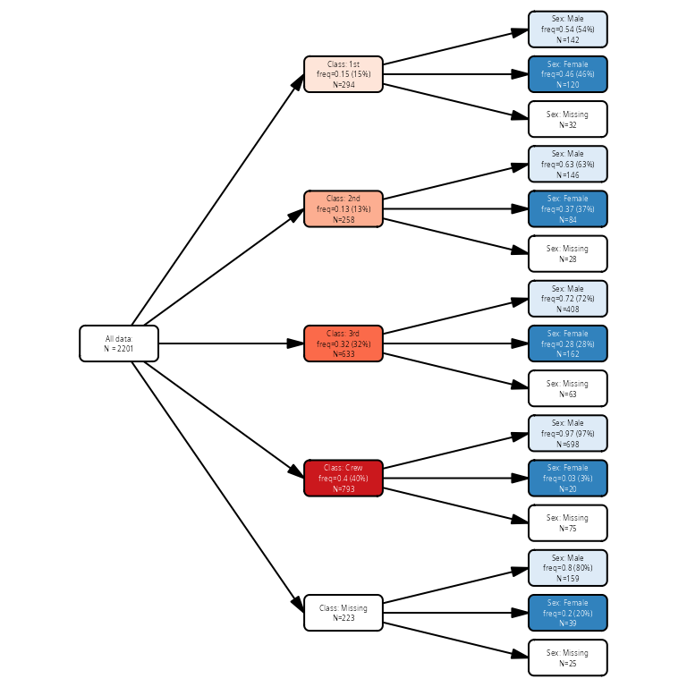

### Using the `expr` parameter

If you need even finer control, you can use the `expr` parameter which
takes any R expression and evaluates it with `[rlang::eval_tidy()]` in
the context of the nodes data frame of the vtree object (plus the
variables `pct` and `f`).

``` r
vt <- vtree(titanicNA, Class, Survived) |>
  add_labels() |> # add default labels
  add_labels(expr =
             ifelse(node_col != "Survived",
               label,
               paste0(
                 ifelse(freq > .5, "Many ", "Few "),
                 ifelse(node_val == "Yes", "survived", "perished"),
                 "\n",
                 label
                 )
               ))
             
             
plot(vt, legend = FALSE)
```

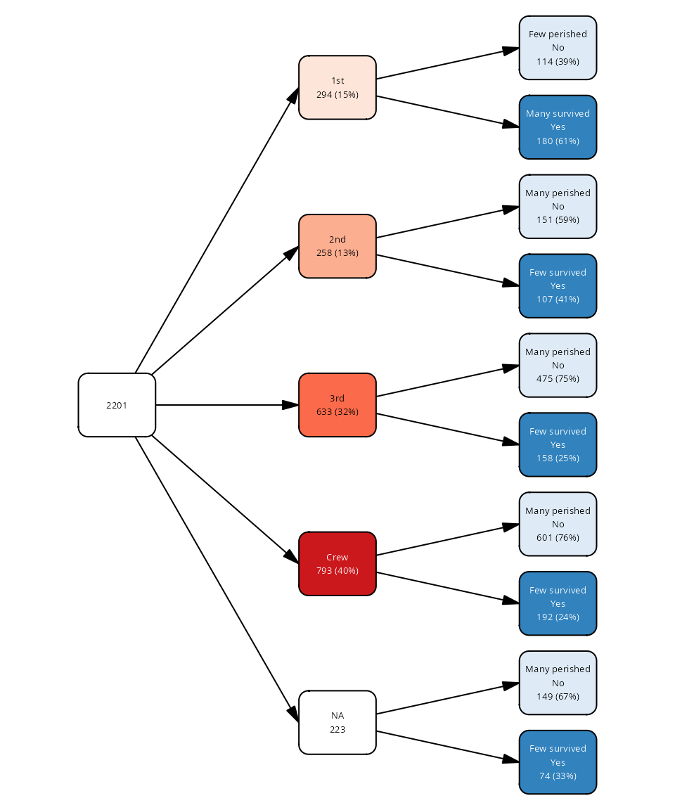

### Using a mask

You can specify a mask with
[`add_labels()`](https://january3.github.io/vtree2/reference/add_labels.md) -
a logical vector with the same length as the number of nodes - to
indicate which nodes should have their labels modified. For example, you
may want a different information for the leaf nodes as for other nodes:

``` r
vt <- vtree_from_freqtable(Titanic, Class, Sex, Survived) |>
  retain(path == "Class:1st") # only keep the first class passengers
mask <- find_nodes(vt, leaf) # leaf is a logical vector
add_labels(vt, mask = mask, template = "long") |>
  add_labels(mask = !mask, fmt = "{node_val}") |>
  plot(legend = FALSE, dir="tb", show_root = FALSE,
       lwidth = 0.7, lheight = 0.5)
```

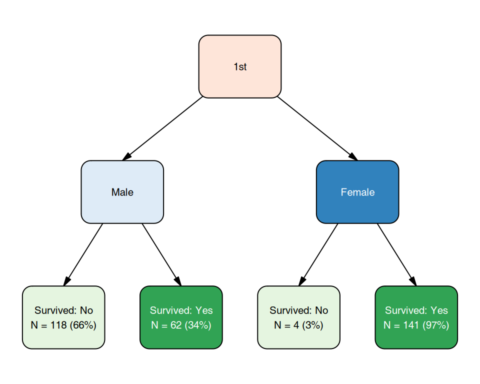

### Parameter precedence with `add_labels()`

If `expr` is not NULL, it will be used for all labels chosen by the
mask.

If `fmt` is NULL, the selected template will be used. If `fmt_na` is
NULL and `fmt` is not NULL, then `fmt_na` will be `fmt`, otherwise the
selected template will be used. Same for `fmt_root`: first `fmt`, if
defined, otherwise the template.

`fmt_na` is used for NA values only if `is_vp(vtree)` is `TRUE`; this is
because for a vp tree the NA value percentages are meaningless.

## Creating summaries

One of the more useful aspects of using vtrees is that you can partition
the data using a set of variables and then show summary information *for
another variable*. For example, consider the ToothGrowth data set,
containing two categorical variables – dose and type of supplement – as
well as numeric result. We can use the categorical variables for data
splits and ask what the average tooth growth is at the different nodes.

``` r
# make sure that dose is a factor
tg <- ToothGrowth |>
  mutate(dose = factor(paste("Dose", dose)))

vt <- vtree(tg, supp, dose)

library(glue)
sm <- summarize_by_node(tg, vt, len) |>
  fmt_label()

vt |>
  add_aliases(col_alias = c(supp = "Supplement",
                            dose = "Dose (mg/day)")) |>
  add_labels(template = "sameline") |>
  add_labels(fmt = "{label}\n{sm}") |>
  plot(lwidth=.75)
```

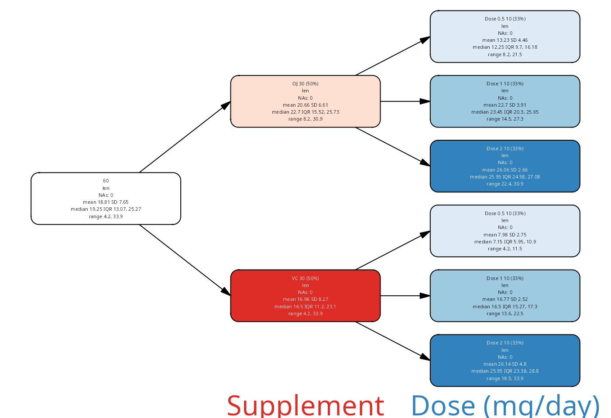

The above example demonstrates the main workflow of generating
summaries:

- you need a cases data frame to generate summaries
- generate summaries in a separate step
- use
  [`summarize_by_node()`](https://january3.github.io/vtree2/reference/summarize_by_node.md)
  to compute,
  [`fmt_label()`](https://january3.github.io/vtree2/reference/summarize_by_node.md)
  to format

It is also possible to include graphical summaries; see the section
“Inset plots” for more details.

### Summaries with `summarize_by_node()`

Each row of the data frame returned by `summarize_by_node` corresponds
to one row of the nodes data frame in the vtree, hence the name of the
function.

The columns in the data frame returned by `summarize_by_node` depend on
whether the data is categorical or numeric. For numeric data, as above,
the columns include mean, sd, n, quantiles 1, 3, and median, iqr, as
well as the number of valid and missing samples.

``` r
# numerical data
sm <- summarize_by_node(tg, vt, len)
head(sm)
#> # A tibble: 6 × 15
#>   node_id path      col   type      n  mean    sd   min   max median    q1    q3
#>     <int> <chr>     <chr> <chr> <int> <dbl> <dbl> <dbl> <dbl>  <dbl> <dbl> <dbl>
#> 1       1 root      len   nume…    60  18.8  7.65   4.2  33.9   19.2  13.1  25.3
#> 2       2 supp:OJ   len   nume…    30  20.7  6.61   8.2  30.9   22.7  15.5  25.7
#> 3       3 supp:VC   len   nume…    30  17.0  8.27   4.2  33.9   16.5  11.2  23.1
#> 4       4 supp:OJ/… len   nume…    10  13.2  4.46   8.2  21.5   12.2   9.7  16.2
#> 5       5 supp:OJ/… len   nume…    10  22.7  3.91  14.5  27.3   23.5  20.3  25.6
#> 6       6 supp:OJ/… len   nume…    10  26.1  2.66  22.4  30.9   26.0  24.6  27.1
#> # ℹ 3 more variables: iqr <dbl>, valid <int>, missing <int>
```

For categorical data, the function returns a data frame including total
number of observations, number of valid, missing and unique
observations, a list column containing the counts for each level of the
variable chosen, as well `denom` (denominator) and the calculated
frequencies of individual levels.

Here we return to the Titanic example and ask, what was the fraction of
women who survived or not for the different Classes. We use the
`titanicNA` data set, which contains some randomly introduced missing
data.

``` r
# categorical data
vt <- vtree(titanicNA, Class, Survived)

sm <- summarize_by_node(titanicNA, vt, Sex)
head(sm)
#>   node_id       path col        type    n valid missing unique         levels
#> 1       1       root Sex categorical 2201  1978     223      3 1553, 425, 223
#> 2       2  Class:1st Sex categorical  294   262      32      3   142, 120, 32
#> 3       3  Class:2nd Sex categorical  258   230      28      3    146, 84, 28
#> 4       4  Class:3rd Sex categorical  633   570      63      3   408, 162, 63
#> 5       5 Class:Crew Sex categorical  793   718      75      3    698, 20, 75
#> 6       6   Class:NA Sex categorical  223   198      25      3    159, 39, 25
#>   denom Male Male_freq Female Female_freq
#> 1  1978 1553 0.7851365    425  0.21486350
#> 2   262  142 0.5419847    120  0.45801527
#> 3   230  146 0.6347826     84  0.36521739
#> 4   570  408 0.7157895    162  0.28421053
#> 5   718  698 0.9721448     20  0.02785515
#> 6   198  159 0.8030303     39  0.19696970
```

As when calculating the vtree, for calculating a frequency of a level
for a variable in the above summary (e.g. the frequency of females among
1st Class passengers), we can choose whether we use valid percentages or
not. That is, we have to decide whether we calculate the fraction as the
fraction of *valid* samples, or the fraction of *total* samples at this
node. In the above, the total fraction is $`0.458 = 120/262`$ - we see
that by looking at the `denom` (denominator) column of the table above.

By default,
[`summarize_by_node()`](https://january3.github.io/vtree2/reference/summarize_by_node.md)
uses the same procedure as was used for the vtree provided as parameter.
However, you may choose to control this behavior with the `vp`
parameter:

``` r
# categorical data
vt <- vtree(titanicNA, Class, Survived)

sm <- summarize_by_node(titanicNA, vt, Sex, vp=FALSE)
head(sm)
#>   node_id       path col        type    n valid missing unique         levels
#> 1       1       root Sex categorical 2201  1978     223      3 1553, 425, 223
#> 2       2  Class:1st Sex categorical  294   262      32      3   142, 120, 32
#> 3       3  Class:2nd Sex categorical  258   230      28      3    146, 84, 28
#> 4       4  Class:3rd Sex categorical  633   570      63      3   408, 162, 63
#> 5       5 Class:Crew Sex categorical  793   718      75      3    698, 20, 75
#> 6       6   Class:NA Sex categorical  223   198      25      3    159, 39, 25
#>   denom Male Male_freq Female Female_freq NAs   NAs_freq
#> 1  2201 1553 0.7055884    425  0.19309405 223 0.10131758
#> 2   294  142 0.4829932    120  0.40816327  32 0.10884354
#> 3   258  146 0.5658915     84  0.32558140  28 0.10852713
#> 4   633  408 0.6445498    162  0.25592417  63 0.09952607
#> 5   793  698 0.8802018     20  0.02522068  75 0.09457755
#> 6   223  159 0.7130045     39  0.17488789  25 0.11210762
```

The denominator above is equal to column `n`, total number of cases per
node.

### Formatting statistics with `fmt_label()`

The function takes the output from
[`summarize_by_node()`](https://january3.github.io/vtree2/reference/summarize_by_node.md)
and converts it to a character vector of labels. By default, the
function looks into the `type` column of the data frame to determine
whether the summarized variable is categorical or numeric, and serves
either a categorical or numerical summary of the data.

The output can be customized either with glue format strings (argument
`fmt`) or R expressions (argument `expr`). The following are equivalent:

``` r
vt <- vtree(titanicNA, Class, Survived)

sm <- summarize_by_node(titanicNA, vt, Sex, vp=FALSE)

txt1 <- fmt_label(sm, fmt="{missing} {n} {Male_freq}", digits=2)
txt2 <- fmt_label(sm, expr=glue("{missing} {n} {round(Male_freq, digits=2)}"))

all(txt1 == txt2)
#> [1] TRUE
```

There are two differences between `fmt` and `expr`:

- `fmt` uses rounded versions of numeric columns. Each numeric column is
  rounded with the specified number of digits (argument `digits`).
- `expr` allows any kind of R expression, including conditional
  expressions with `ifelse`, `if_else` and `case_when`, and string
  formatting with `sprintf`, `glue` etc.

### Custom statistics with `vtree_apply()`

Sometimes you need to calculate some per-node statistics which goes
beyond simple descriptive statistics.

[`vtree_apply()`](https://january3.github.io/vtree2/reference/vtree_apply.md)
goes through nodes in the vtree object, and for each object, finds the
matching rows in the `cases` data frame. Then it calls the user-provided
function and calls it with some arguments.

The arguments are also configurable. By default, the function is called
with the subset of the original `cases` data frame which corresponds to
the given node. For example, we can calculate how many samples there are
for a node:

``` r
cases <- cases_from_freqtable(Titanic)
vt <- vtree(cases, Class, Survived)

vtree_apply(cases, vt, nrow) |> unlist()
#>  node_1  node_2  node_3  node_4  node_5  node_6  node_7  node_8  node_9 node_10 
#>    2201     325     285     706     885     122     203     167     118     528 
#> node_11 node_12 node_13 
#>     178     673     212

# same as:
vt |> pull(n)
#>  [1] 2201  325  285  706  885  122  203  167  118  528  178  673  212
```

However, you can configure that also to provide e.g. the logical
selection vector. Say, we want, for each node, determine whether the
male:female ratio in that node is significantly different from the rest
of the data.

``` r

test_func <- function(sel) {
  # root node includes all samples
  if(sum(sel) == length(sel)) {
    return(NA)
  }

  chisq.test(table(cases$Sex, sel))$p.value
}

pvals <- vtree_apply(cases, vt, test_func, .args="sel") |> unlist()
pvals_l <- format.pval(pvals, digits=2)

# color the nodes by p-value
logp <- floor(-log10(pvals))
pal <- colorRampPalette(c("white", "red"))(101)

# use simpler summaries 
sm <- summarize_by_node(cases, vt, Sex) |>
  fmt_label(fmt = "Females: {Female_freq * 100}", digits=2)

vt |> add_labels(suffix = sm) |>
  add_labels(fmt = "{label}\n{pvals_l}",
             fmt_root = "{label}") |>
  mutate(fill = pal[logp + 1]) |>
  plot()
#> ℹ palette attribute is NULL
#> legend will be black and white
```

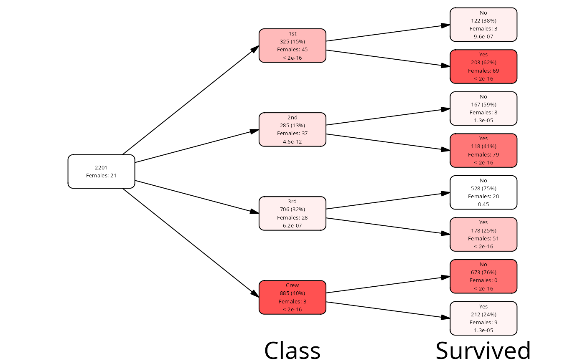

## Adding and modifying colors

There are basically three ways of modifying colors shown on the plot and
ont the legend:

- use
  [`add_palette()`](https://january3.github.io/vtree2/reference/vtree_palette.md)
  with `palette` argument to assign a palette to each variable. You can
  use the `RColorBrewer` palettes for that. This will change the colors
  both on the plot and on the legend.
- use
  [`add_palette()`](https://january3.github.io/vtree2/reference/vtree_palette.md)
  with `var_levels` and `var_colors` arguments to assign colors directly
  to each variable and variable level. This will change the colors both
  on the plot and on the legend.
- change the columns `fill` and `color` in the nodes data frame directly
  with [`mutate()`](https://dplyr.tidyverse.org/reference/mutate.html)
  (possibly after generating some defaults with
  [`add_palette()`](https://january3.github.io/vtree2/reference/vtree_palette.md)).
  This will change the colors only on the plot, but not on the legend.

On the plot, the `fill` and `color` columns determine how each node is
colored; the palettes stored in the `palette` attribute of the vtree
object determine how the legend is colored.

If the `fill` column is missing from the vtree object,
[`plot()`](https://rdrr.io/r/graphics/plot.default.html) will call
[`add_palette()`](https://january3.github.io/vtree2/reference/vtree_palette.md)
to assign fill colors automatically. If `color` is missing, but `fill`
is present, then white or black will be chosen automatically depending
on the contrast with the fill color.

### Modifying colors with `mutate()`

It is not necessary to call
[`add_palette()`](https://january3.github.io/vtree2/reference/vtree_palette.md)
if you just want to change the color of the text and fill on the nodes,
without changing the legend:

``` r
pal <- colorRampPalette(c("white", "steelblue"))(101)

p1 <- vt |>
  mutate(fill = pal[round(freq * 100) + 1]) |>
  plot(lwidth=.6)
#> ℹ palette attribute is NULL
#> legend will be black and white

p2 <- vt |>
  mutate(abs_freq = n / max(n)) |>
  mutate(fill = pal[round(abs_freq * 100) + 1]) |>
 plot(legend = TRUE, lwidth=.6)
#> ℹ palette attribute is NULL
#> legend will be black and white

plot_grid(p1, p2)
```

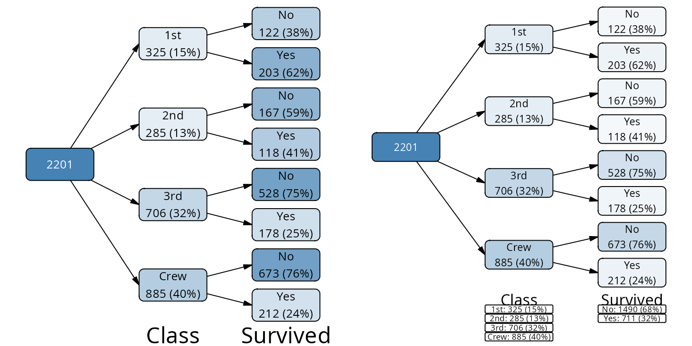

Colors can be also assigned automatically based on names of RColorBrewer
palettes. There is a default order of palettes for the variables, but
you can override it with the `palettes` argument of
[`plot()`](https://rdrr.io/r/graphics/plot.default.html) or
[`add_palette()`](https://january3.github.io/vtree2/reference/vtree_palette.md).

### Adding palettes with `add_palette()`

The
[`add_palette()`](https://january3.github.io/vtree2/reference/vtree_palette.md)
function not only sets the `fill` and `color` columns, but also stores
the palette in the attribute `palette` of the vtree object. This palette
in turn is used to create color keys on the legend. If that attribute is
missing, the legend will be black and white.

## Adding layout with `add_layout()`

### Basic layout configuration with `plot()`

Layouts are added with the
[`add_layout()`](https://january3.github.io/vtree2/reference/add_layout.md)
function, which you can call directly on the vtree object, resulting in
a new vtree object with additional columns for the layout. However, if a
vtree without a layout is passed to
[`plot()`](https://rdrr.io/r/graphics/plot.default.html), then
[`plot()`](https://rdrr.io/r/graphics/plot.default.html) will call
[`add_layout()`](https://january3.github.io/vtree2/reference/add_layout.md)
automatically.

Currently, there are four layouts implemented: “regular”,
“flushed_left”, “flushed_right” and “proportional”. The default layout
is “regular”, which simply shows the tree structure with all nodes
having the same sizes. The “flushed\_\*” layouts are similar, but the
nodes are always flushed to one side of the plot.

The proportional layout shows the nodes with sizes proportional to the
number of observations in that node.

``` r
# the default column name for .freq_col is "Freq", same as in Titanic,
# so no need to specify it here
vt <- vtree_from_freqtable(Titanic, Class, Sex, Survived)
p1 <- plot(vt) # layout regular
p2 <- plot(vt, layout = "proportional")
p3 <- plot(vt, layout = "flushed_left", dir="tb")
p4 <- plot(vt, layout = "flushed_right", dir="tb")
plot_grid(p1, p2, p3, p4, nrow = 2)
```

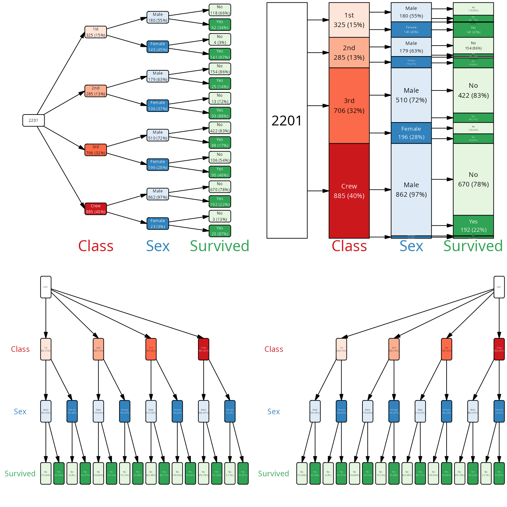

With the `layout_func` argument, you can specify a custom function to
calculate the layout yourself. For example, this function might call
[`add_layout()`](https://january3.github.io/vtree2/reference/add_layout.md)
first and then adjust the calculated positions of the nodes in some way.
See the documentation for
[`add_layout()`](https://january3.github.io/vtree2/reference/add_layout.md)
for details.

Layouts will be automatically created by
[`plot()`](https://rdrr.io/r/graphics/plot.default.html) if they are
missing. The parameters passed to the plot give some basic control over
the layout: `dir` determines the direction of the tree, `show_root`
determines whether the root node is shown, and `lwidth`/`lheight`
determine the width and height of the nodes relative to the available
space.

``` r
vt <- vtree_from_freqtable(Titanic, Class, Survived)
p1 <- plot(vt)
p2 <- plot(vt, dir = "tb", show_root = FALSE, lwidth = 0.8, lheight = 0.3)
plot_grid(p1, p2, nrow = 1)
```


The [`plot()`](https://rdrr.io/r/graphics/plot.default.html) function
simply calls
[`add_layout()`](https://january3.github.io/vtree2/reference/add_layout.md)
to add the layout to the vtree object with the specified parameters.
Alternatively, you can call the function
[`add_layout()`](https://january3.github.io/vtree2/reference/add_layout.md)
directly on the vtree object. The resulting vtree contains the
additional columns `x`, `y`, `width` and `height` for the nodes and
`x1`, `y1`, `x2`, `y2` for the edges. You can then modify these columns
directly.

### Directly modifying the layout

In the following example we will modify a layout with pruned nodes. We
will move the nodes on the right (leafs) hand up a bit upwards.

``` r
vt <- vtree_from_freqtable(Titanic, Class, Survived) |>
  prune(Class %in% c("1st", "2nd"), follow_only = TRUE) |>
  add_layout() |>
  mutate(y = ifelse(leaf, y + height/2, y))

# we need to modify the edges as well, but for that we need information
# from the nodes
nodes <- as_tibble(vt)

vt <- mutate(vt, x1 = nodes$x[from], y1 = nodes$y[from],
                 x2 = nodes$x[to] - nodes$width[to]/2, y2 = nodes$y[to],
             .edges = TRUE)

plot(vt)
```

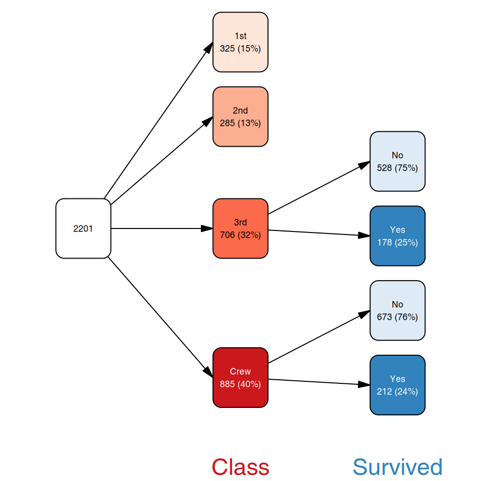

Note how we mutate the edges with the `.edge = TRUE` argument. This is
different from `tidygraph`, where the object (tree) can either be in
activated “node” or “edge” mode. In `vtree2`, the object is always in
“node” mode (because it is more practical), but on the rare occassion
that you need to access the edges, you can.

### Fine control with `add_layout(varspace = ..., varsize = ...)`

The
[`add_layout()`](https://january3.github.io/vtree2/reference/add_layout.md)
function has additional parameters: `varspace` and `varsize`. These can
assign the amount of relative space available to the node depending on
the variable it is associated with. For example, we might want to show a
long summary which takes a lot of space for the leafs, but only short
labels for the internal nodes. You can tune the relative node sizes with
these two parameters.

``` r
cases <- cases_from_freqtable(Titanic)
vt <- vtree(cases, Class, Sex, Survived) |>
  prune(Class == "Crew")

sm <- summarize_by_node(cases, vt, Age) |>
  fmt_label()

# get the logical vector indicating whether the node is a leaf
mask <- pull(vt, leaf)

vt |>
  add_labels() |>
  add_labels(mask = mask, fmt = "{label}\n{sm}") |>
  add_layout(dir="tb", lheight=.8,
             varspace=c(root=1, Class=1,Sex=1,Survived=4)) |>
  # legend = FALSE: not even column names on the margin
  plot(legend = FALSE)
```

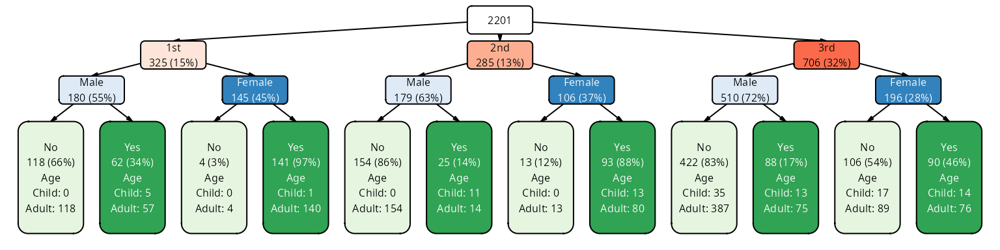

Note that both `varspace` and `varsize` describe the node sizes along
the axis of the plot. That is, for horizontal layouts, they control the
width of the nodes; for vertical layouts, they control the height of the
nodes.

## Plotting

Objects of type vtree can be directly plotted with the
[`plot()`](https://rdrr.io/r/graphics/plot.default.html) method. If the
labels, colors and layouts are missing, then plot adds some automatic
defaults by running (essentially)
`vtree |> add_labels() |> add_colors() |> add_layout()` before plotting.
Some of the arguments for these functions can be passed directly to the
[`plot()`](https://rdrr.io/r/graphics/plot.default.html) function.

### Layouts

Parameters `layout`, `dir`, `show_root`, `lwidth`, `lheight` are passed
to
[`add_layout()`](https://january3.github.io/vtree2/reference/add_layout.md)
to control the layout of the tree. See above for details.

### Colors, fill colors and labels

### Legends with summaries

The legend shows a summary for each variable underneath or next to the
part of the tree which corresponds to this variable. Variable summaries
are calculated when vtree is constructed and stored in the `summary`
attribute of the vtree object. You can print them with
`summary(vtree_object)`:

``` r
vt <- vtree_from_freqtable(Titanic, Class, Sex, Survived)
summary(vt)
#> # A tibble: 11 × 6
#>    node_col node_val count  freq denom label            
#>    <chr>    <chr>    <int> <dbl> <int> <chr>            
#>  1 Class    1st        325 0.148  2201 1st: 325 (15%)   
#>  2 Class    2nd        285 0.129  2201 2nd: 285 (13%)   
#>  3 Class    3rd        706 0.321  2201 3rd: 706 (32%)   
#>  4 Class    Crew       885 0.402  2201 Crew: 885 (40%)  
#>  5 Class    NA           0 0      2201 Missing: 0       
#>  6 Sex      Male      1731 0.786  2201 Male: 1731 (79%) 
#>  7 Sex      Female     470 0.214  2201 Female: 470 (21%)
#>  8 Sex      NA           0 0      2201 Missing: 0       
#>  9 Survived No        1490 0.677  2201 No: 1490 (68%)   
#> 10 Survived Yes        711 0.323  2201 Yes: 711 (32%)   
#> 11 Survived NA           0 0      2201 Missing: 0
```

The summaries will not change if you prune the tree, since they are tied
to the data and not the tree structure:

``` r
mar <- c(0.05, 0.05, 0.33, 0.05)
p1 <- plot(vt, legend = TRUE, lwidth=.8, margins = mar)
p2 <- retain(vt, path == "Class:1st") |>
  plot(legend = TRUE, lwidth=.8, margins = mar)
plot_grid(p1, p2, nrow = 1)
```

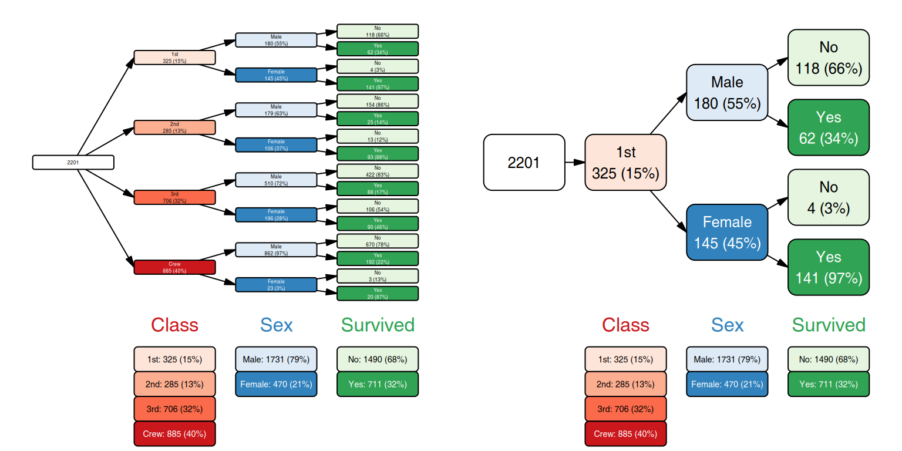

### Other `plot()` arguments

**`lwidth`, `lheight`** - label width and height relative to available
space. The layout functions calculate the available space for each node,
and then these parameters determine how much of that space is used for
the label.

For the proportional layout, `lheight` is ignored, since the height of
the node is determined by the number of observations in that node.

**`margins`** - a numeric vector of length 4, specifying the top, right,
bottom and left margins as fractions of the total device space. So, for
example, for 10% margins on all sides, use
`margins = c(0.1, 0.1, 0.1, 0.1)`.

**`show_root`** - if TRUE (default), show the root node (total
population).

**`legend`** - if FALSE or “none”, not even minimal variable legend is
shown on the plot. If “tiny” (default), the variable (column) names are
shown on the margin. If “full” or TRUE, the variable names and the
summaries are shown on the margin.

``` r
vt <- vtree_from_freqtable(Titanic, Class, Survived)
p1 <- plot(vt, legend = FALSE)
p2 <- plot(vt) # or legend = "tiny"
p3 <- plot(vt, legend = TRUE) # or legend = "full"
plot_grid(p1, p2, p3, nrow = 1)
```

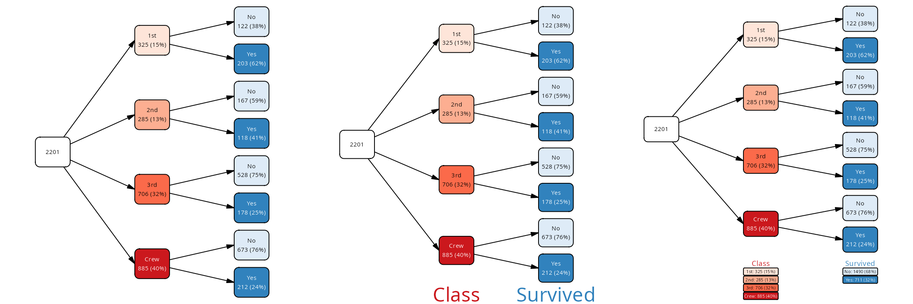

**`dir`** direction of the tree. One of “lr” (left to right), “rl”
(right to left), “tb” (top to bottom), “bt” (bottom to top). Default is
“lr”.

``` r
p1 <- plot(vt) # same as dir = "lr"
p2 <- plot(vt, dir = "tb")
p3 <- plot(vt, dir = "bt")
p4 <- plot(vt, dir = "rl")
plot_grid(p1, p2, p3, p4, nrow = 1)
```

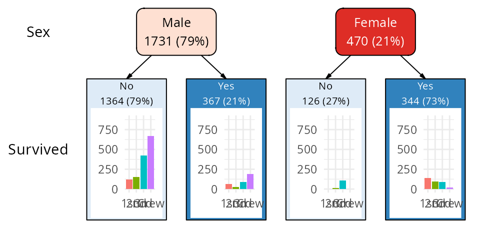

**`fontsizes`** Font sizes for the various labels are automatically fit
to the available space, but sometimes you might manually adjust them.
The `fontsizes` is a named list with the following optional fields: \*
`nodes`: node labels (default: “fixed” for regular layout, “adaptive”
for proportional layout) \* `var_labels`: variable labels (default:
“fixed”) \* `legend_labels`: for variable levels when `legend=TRUE`
(default: “fixed”)

Each element can be either a number, in which case the given font size
is directly used, or either “fixed” or “adaptive”. When “fixed” is used,
then optimal font size is calculated for all objects within the group,
and then the minimal font size is used for all objects. When “adaptive”
is used, then each object is fit separately, and the font sizes can be
different for each object.

**`lwd`** line width for use with plotting. Unfortunately, the default
line width is not relative to the device size, but is fixed to an
absolute value; therefore, for small devices the lines may appeary too
thick.

### Rich text labels

It is possible to use simple HTML or markdown formatting in the labels
and then use `richtext=TRUE` in the
[`plot()`](https://rdrr.io/r/graphics/plot.default.html) function to
render the labels with the formatting. The plot rendering is noticably
slower, but it allows for more flexibility in the label formatting.

``` r
vt <- vtree_from_freqtable(Titanic, Class, Survived) |>
  add_labels() |>
  mark(path == "Class:1st/Survived:No") |>
  mutate(label = ifelse(mark, paste0('**', label, '**'), label)) |>
  mark(path == "Class:2nd/Survived:No") |>
  mutate(label = ifelse(mark,
                        paste0('<span style="color:red">', label, '</span>'),
                        label))

plot(vt, richtext = TRUE, legend = TRUE)
```

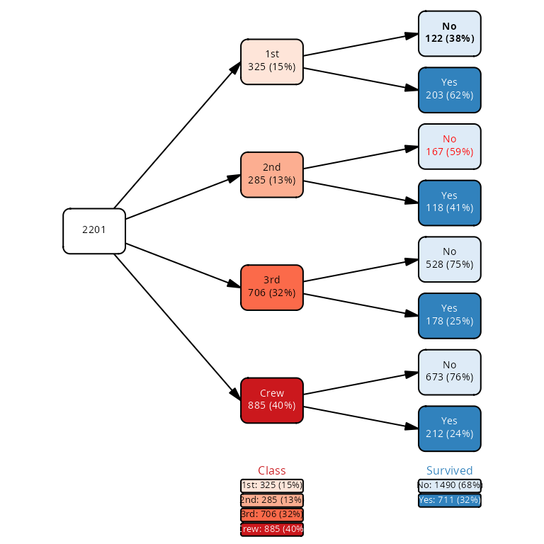

You can also include the rich text formatting in the aliases for the
variable names and values, which will then be used both in the labels
and in the legend.

``` r
vt <- vtree_from_freqtable(Titanic, Class, Sex, Survived)

# we can use aliases through add_labels() to change the formatting of the
# variable names and values
cols <- list(Class = "**Class**", Sex = "**Sex**",
             Age = "**Age**", Survived = "**Lived**")
vals <- list(Class = c("1st" = "1<sup>st</sup>", "2nd" = "2<sup>nd</sup>",
                  "3rd" = "3<sup>rd</sup>"),
            Sex = c("Male" = "**<span style='color:blue'>Male</span>**",
                    "Female" = "**<span style='color:lightblue'>Female</span>**"))
vt <- add_aliases(vt, col_alias = cols, val_alias = vals)

plot(vt, richtext = TRUE, legend = TRUE)
```

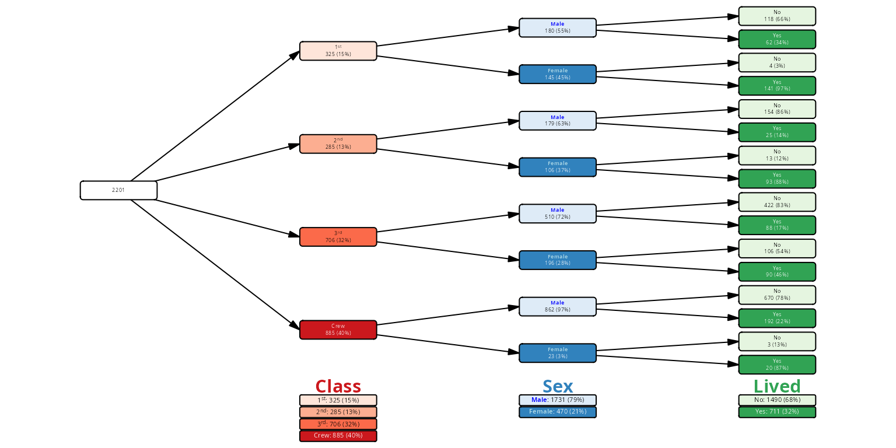

## Patterns

## Inset plots

### Images and other graphical objects

It is possible to add any kind of “grob” - graphical object - to the
nodes description. This includes not only bitmap images, but also
`ggplot2` plots, which can be easily converted to a grob with the
function
[`ggplot2::ggplotGrob()`](https://ggplot2.tidyverse.org/reference/ggplotGrob.html).

The important thing to remember is that the inset graphics (1) must be a
grob and (2) must be stored in a list-column of the vtree object called
“grob”.

In the following example, we will download three images from Wikipedia
corresponding to the three species of iris flowers from the famous
Fisher data set. We will show on the vtree how many of each of the
species have long petals, and we will illustrate the Species nodes with
the corresponding images.

``` r
library(dplyr)
library(purrr)

# images are included with the package
iris_imgs <- list(
versicolor="images/500px-Blue_Flag,_Ottawa.jpg",
setosa="images/500px-Irissetosa1.jpg",
virginica="images/500px-Iris_virginica_2.jpg")

get_grob <- function(img) {
  print(img)
  tf <- system.file(img, package="vtree2")
  print(tf)
  img <- jpeg::readJPEG(tf)
  grid::rasterGrob(img)
}

iris_grobs <- lapply(iris_imgs, get_grob)
#> [1] "images/500px-Blue_Flag,_Ottawa.jpg"
#> [1] "/tmp/Rtmpomm4by/temp_libpath1e87737fa7fe80/vtree2/images/500px-Blue_Flag,_Ottawa.jpg"
#> [1] "images/500px-Irissetosa1.jpg"
#> [1] "/tmp/Rtmpomm4by/temp_libpath1e87737fa7fe80/vtree2/images/500px-Irissetosa1.jpg"
#> [1] "images/500px-Iris_virginica_2.jpg"
#> [1] "/tmp/Rtmpomm4by/temp_libpath1e87737fa7fe80/vtree2/images/500px-Iris_virginica_2.jpg"

vt <- iris |>
  mutate(Long_Petals = as.character(Petal.Length > 4)) |>
  vtree(Species, Long_Petals) |>
  add_labels() |>
  mutate(label = ifelse(leaf, label, paste0("Iris\n", node_val)))
vt <- vt |>
  mutate(grob = map(pull(vt, "node_val"), ~ iris_grobs[[.x]]))

layout <- vt |>
  add_palette(palettes = c("Greens", "Blues")) |>
  add_layout(dir="tb", show_root=FALSE, lwidth=.9, lheight=.8,
             varspace=c(Species=4,Long_Petals=1))
layout |>
  plot(margins=c(.05, .05, .05, .2))
```

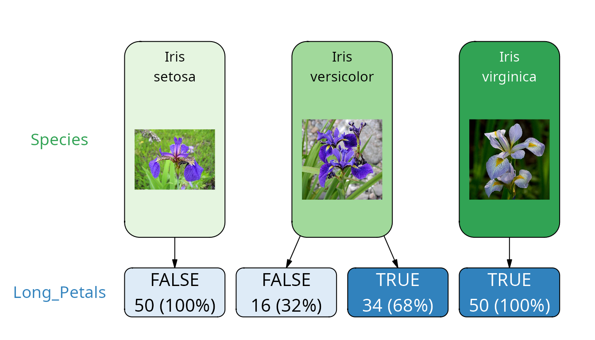

### Inserting ggplot2 objects

Here, we choose only the “Sex” and “Survived” nodes for the construction
of the vtree. However, we make a ggplot object for each of the leaf
nodes (“Survived:Yes” and “Survived:No”) and insert the resulting
graphics object into the node.

For this, we create the `grob` column and convert the ggplot2 to a grob
with
[`ggplot2::ggplotGrob()`](https://ggplot2.tidyverse.org/reference/ggplotGrob.html).
The `grob` column is a list-column, so we need to manipulate it
carefully. Also, we need to set an NA value for the non-leaf nodes.

``` r
# first, a tree with simplified labels on the leaf nodes
cases <- cases_from_freqtable(Titanic)
vt <- vtree(cases, Sex, Survived)

library(ggplot2)

# minimalistic ggplot showing how many passengers were in each class
# of the data frame df.
clasplot <- function(df) {
  ggplot(df, aes(x = Class, fill = Class)) +
    geom_bar() +
    scale_fill_discrete(drop=FALSE) +
    scale_x_discrete(drop=FALSE) +
    ylim(0, max(table(cases$Class))) +
    theme_minimal() +
    # remove labels, legend and axes
    theme(legend.position = "none",
          axis.title = element_blank(),
          axis.ticks = element_blank())
}

# use vtree_apply to produce plots
plots <- vtree_apply(cases, vt, FUN = clasplot)
grobs <- lapply(plots, ggplot2::ggplotGrob)
grobs[!pull(vt, leaf)] <- NA # plots only for the leaf nodes

# we add layout manually, so we can control it better
# this varspace arg means: reserve 4x as much space for the Survived nodes
# as for the Sex nodes
vt <- vt |> 
  add_layout(dir="tb", show_root=FALSE, lheight=.8,
             varspace=c(Sex=1,Survived=3)) |>
  mutate(shape = ifelse(leaf, "rectangle", "roundrectangle")) |>
  mutate(grob = grobs)
plot(vt)
```

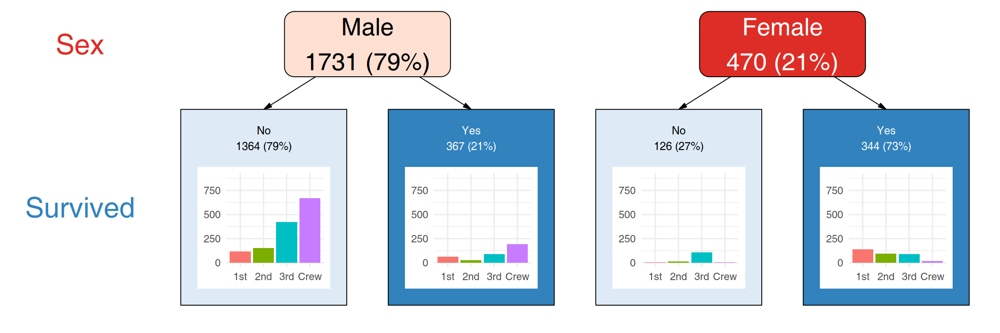

There is one issue with such plots: unlike `vtree2`, `ggplot2` does not
fit font sizes automatically to the available space. If your image is
too small, bad things will happen:

``` r
plot(vt)
```

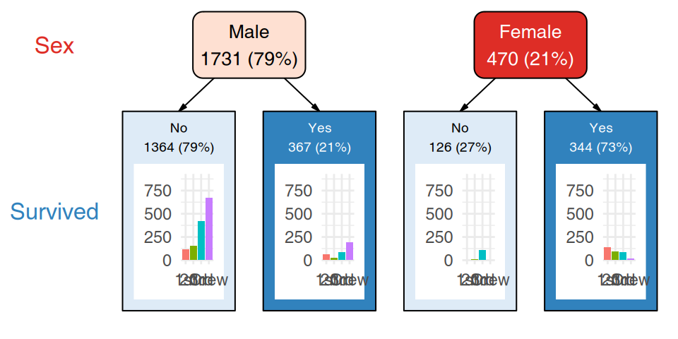

### Graphical summary example

Below, we will create a graphical summary for a data set. We will use
the `ToothGrowth` data set, which contains two categorical variables
(supplement type and dosage) and the resulting length of odontoblasts in
guinea pigs. The vtree will be created using the supplement type and
dosage as variables, and we will make a graphical summary for the third
variable, length.

``` r
# first, some recoding
tg <- ToothGrowth |>
  mutate(dose = paste("Dose", dose))

vt <- vtree(tg, supp, dose) |>
  add_aliases(col_alias = c(supp = "Supplement type",
                            dose = "Dosage"))
plot(vt)
```

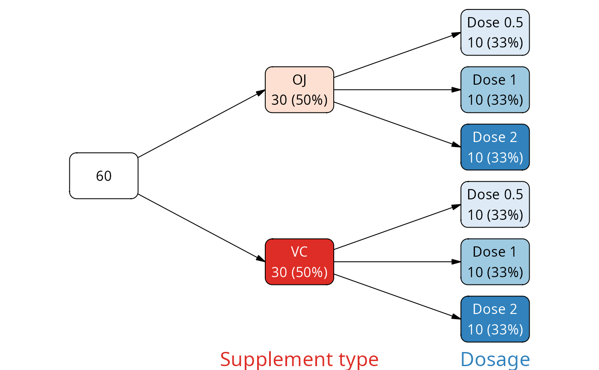

The graphical summary should be on leaf nodes only. It should show how
the data in that particular node compares to the remaining nodes.

For this, we need a modified `tg` data frame - one which assigns a leaf
node id to each of the samples. We can do that with the `vtree_apply`,
combined with `purrr`’s `imap_dfr` (you could also use `Reduce` and
friends). `vtree_apply` calls the provided function once per node with
the subset of the data frame that corresponds to that node; we will use
it to partition the data.

In addition, we will call vtree_apply only for the leaf nodes. That will
ensure that each sample is shown only once in the resulting data set.

``` r
mask <- find_nodes(vt, leaf)
chunks <- vtree_apply(tg, vt, \(x) x, .mask = mask)

# the chunks correspond to the nodes
names(chunks)
#> [1] "node_4" "node_5" "node_6" "node_7" "node_8" "node_9"
as_tibble(vt)$node_key[mask] # same!
#> [1] "node_4" "node_5" "node_6" "node_7" "node_8" "node_9"

# the modified tg data frame
tg_mod <- imap_dfr(chunks, \(ch, nm) {
                     ch[["node_key"]] <- nm
                     ch })
```

Now that we have the input data frame for ggplot2, we can proceed with
constructing the plots. First draft shows how the plot should look like:

``` r
library(ggplot2)
# let us select one node to mark on the plot
df <- tg_mod |>
  mutate(selected = ifelse(node_key == "node_4", "yes", "no"))

ggplot(df, aes(x = node_key, y = len, fill=selected)) +
  geom_violin() +
  geom_boxplot(width=.1, fill="white") +
  scale_fill_manual(values = c(yes="red", no="grey")) +
  theme_void() +
  theme(legend.position = "none")
```

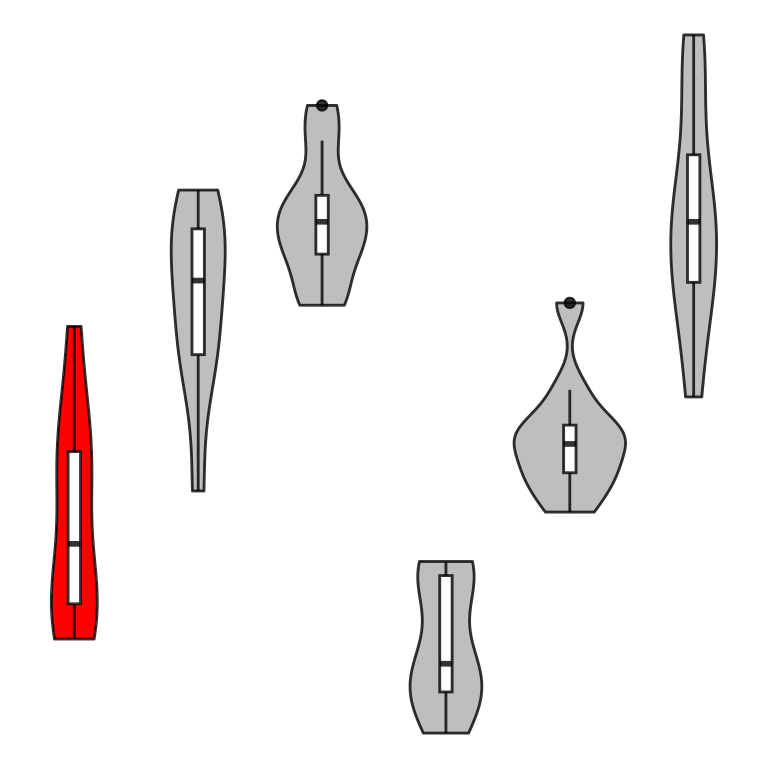

The void theme and removing the legend make the graphic better readable
when it is squeezed into a tree node.

We just need to generate this plot for each leaf node, converting it to
a grob.

``` r
plotfunc <- function(node, tg_mod) {
  df <- tg_mod |>
    mutate(node_key = factor(node_key, levels = names(chunks))) |>
    mutate(selected = ifelse(node_key == node, "yes", "no"))

  p <- ggplot(df, aes(x = node_key, y = len, fill=selected)) +
    geom_violin() +
    geom_boxplot(width=.1, fill="white") +
    scale_fill_manual(values = c(yes="red", no="grey")) +
    theme_void() +
    theme(legend.position = "none")
  ggplotGrob(p)
}

grobs <- map(names(chunks), plotfunc, tg_mod)
names(grobs) <- names(chunks)
```

All that remains to do is 1) assign the grobs to the vtree object, 2)
figure out how to best configure the layout.

``` r
vt |>
  add_palette(palettes = c("Purples", "Blues")) |>
  add_labels(fmt = "{node_val}", fmt_root = "{n}") |>
  add_layout(dir = "tb", varspace = c(root = 1, supp=1, dose=2),
             varsize = c(root = .4, supp=.4, dose=.9),
             lwidth = 1,
             lheight=.9) |>
  mutate(grob = ifelse(leaf, grobs[node_key], NA)) |>
  plot(legend=FALSE)
```

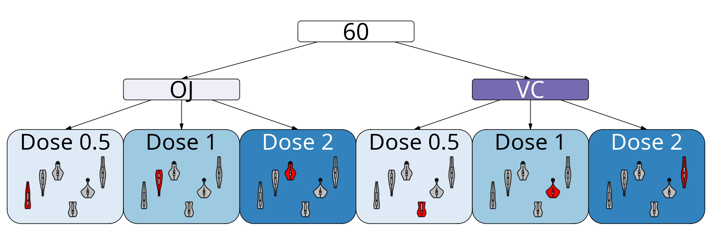

An alternative representation where we first split the tree by dosage
and then by supplement type allows to better compare the effects of the
supplement types:

``` r
vt <- vtree(tg, dose, supp) |>
  add_aliases(col_alias = c(supp = "Supplement type",
                            dose = "Dosage"))
mask <- find_nodes(vt, leaf)
chunks <- vtree_apply(tg, vt, \(x) x, .mask = mask)

# the chunks correspond to the nodes
names(chunks)
#> [1] "node_5"  "node_6"  "node_7"  "node_8"  "node_9"  "node_10"
as_tibble(vt)$node_key[mask] # same!
#> [1] "node_5"  "node_6"  "node_7"  "node_8"  "node_9"  "node_10"

# the modified tg data frame
tg_mod <- imap_dfr(chunks, \(ch, nm) {
                     ch[["node_key"]] <- nm
                     ch })
grobs <- map(names(chunks), plotfunc, tg_mod)
names(grobs) <- names(chunks)

vt |>
  add_palette(palettes = c("Purples", "Blues")) |>
  add_labels(fmt = "{node_val}", fmt_root = "{n}") |>
  add_layout(dir = "tb", varspace = c(root = 1, supp=2, dose=1),
             varsize = c(root = .4, supp=.9, dose=.4),
             lwidth = 1,
             lheight=.9) |>
  mutate(grob = ifelse(leaf, grobs[node_key], NA)) |>
  plot(legend=FALSE)
```

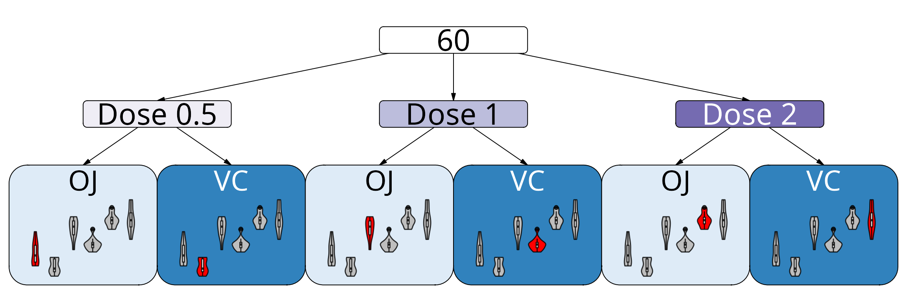
