# vtree2 for vtree users

``` r
library(vtree2)
```

## Differences between vtree2 and the original vtree

### Motivation

The original vtree package implements most of its functionality in a
single function
[`vtree()`](https://january3.github.io/vtree2/reference/vtree.md) with
more than a hundred options and producing a plot. The function
implements its own mini-language for specifying formats of labels,
variables, conditions to select nodes and so on. This allows for simple
and terse function calls.

However, this limits the flexibility of the package. It is not possible
to fully customize the labels, inspect the interim data, use the various
summaries for other purposes (e.g. to produce simple tables). `vtree2`
separates data preparation, label construction, node selection and
plotting into four separate steps. This comes at the cost of more
verbose function calls.

Some other advantages of vtree2:

- plotting produces a grid graphics object - that means it works out of
  the box for most devices and can be used in connection with packages
  like `cowplot` or `patchwork` to produce complex figures.
- proportional plots allow to graphically represent the number of
  samples in the different levels.

Disadvantages of vtree2:

- No HTML-like formatting of the labels
- no RedCap integration
- several of the straightforward vtree options require some thinking in
  vtree2

### Quick HOWTO for vtree users

vtree2 is meant to be natural for tidyverse users. You split the
operations by their domain - i.e, you don’t mix calculations, topology
manipulation and plotting, but build the plot in stages: first prepare
the data, then pass it on to prune / find / select nodes, then you add
labels and colors, add a layout and finally you plot it.

However, to make it more concise, if you do not add labels / colors /
layouts yourself, the plot function will do it for you. The important
part is that you can manipulate them in stages. The following two plots
are based on the same data set - titanicNA, which is the same as the
Titanic data set, but with some values in the columns Class, Age and Sex
replaced by NAs.

``` r
library(vtree2)

# minimal code
vtree(titanicNA) |> plot()

vt <- vtree(titanicNA) 

# extra statistics
stats <- summarize_by_node(titanicNA, vt, Age) |>
  fmt_label()

vt |>
  # prune returns a pruned vtree which we
  # then pass down the pipeline
  prune(freq < .2) |>
  # adds labels, returns a vtree
  add_labels(template = "long") |>
  # leaf is a column in the node data frame
  # TRUE for a leaf node
  mutate(label = ifelse(leaf,
                        paste0(label, "\n",
                               stats),
                        label)) |>
  # adds palettes, returns a vtree
  add_palette(palettes = c("Oranges", "Greys", "BuGn", "Purples")) |>
  # and, finally, a plot
  plot(lwidth = .7)
```

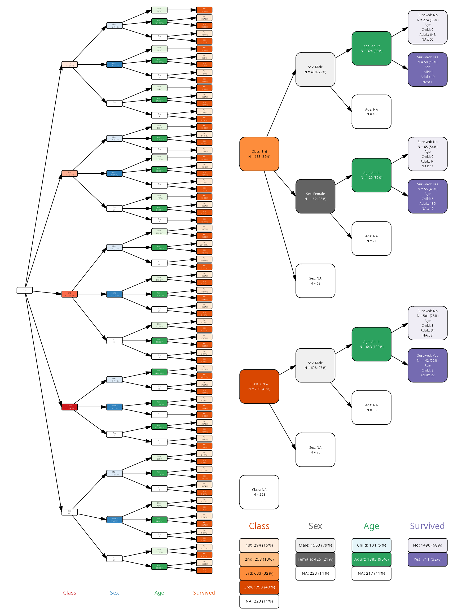

### How do you…

#### Data pre-processing

Several options of the original vtree are actually for pre-processing of
the data. For example, the variable specification ‘variable\>value’ in
the vtree mini-language is used to split a numeric variable into two
levels.

I think that explicing splitting of the data before constructing the
vtree is more fittin. It is easy, and for complex cases there are many
specialized tools and packages dealing with that. For most cases, a
simple [`cut()`](https://rdrr.io/r/base/cut.html) or
[`ifelse()`](https://rdrr.io/r/base/ifelse.html) is enough.

``` r
iris |>
  mutate(Sepal.Length = ifelse(Sepal.Length > 5.5, "long", "short")) |>
  mutate(Sepal.Width = cut(Sepal.Width, breaks = c(2, 3, 4, 5))) |>
  vtree(Sepal.Length, Sepal.Width, Species) |>
  plot()
```

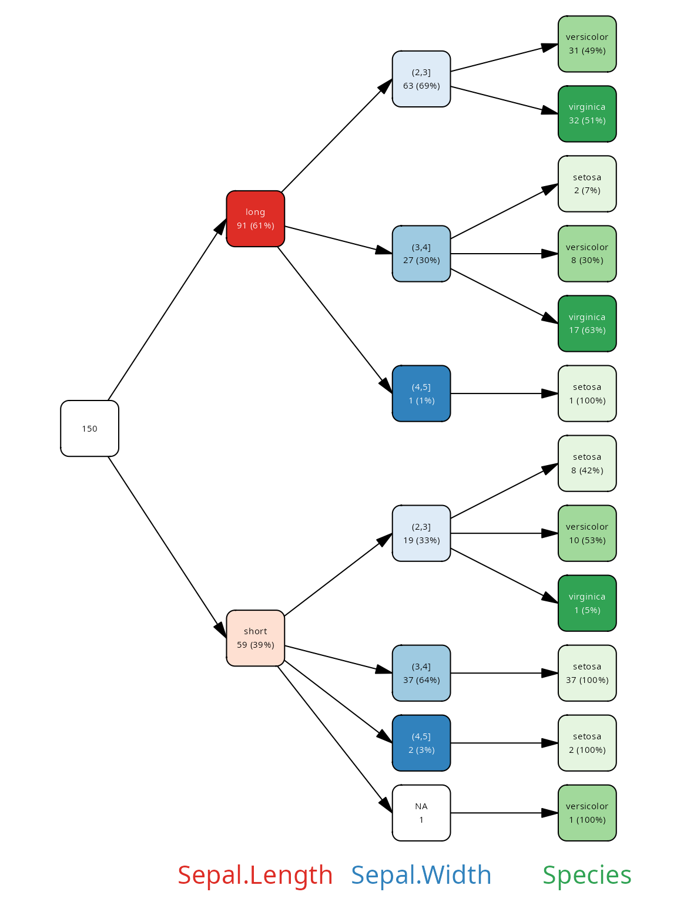

**crosstabToCases**. This `vtree` function converts frequency tables to
cases tables. The relevant `vtree2` function is `cases_from_freqtable`.
Compare:

``` r
# this is frequency table; the Freq column informs how many samples
# correspond to the given combination of levels
head(data.frame(Titanic))
#>   Class    Sex   Age Survived Freq
#> 1   1st   Male Child       No    0
#> 2   2nd   Male Child       No    0
#> 3   3rd   Male Child       No   35
#> 4  Crew   Male Child       No    0
#> 5   1st Female Child       No    0
#> 6   2nd Female Child       No    0
nrow(data.frame(Titanic))
#> [1] 32

# this is cases: one row per sample
head(cases_from_freqtable(Titanic))
#> # A tibble: 6 × 4
#>   Class Sex   Age   Survived
#>   <fct> <fct> <fct> <fct>   
#> 1 3rd   Male  Child No      
#> 2 3rd   Male  Child No      
#> 3 3rd   Male  Child No      
#> 4 3rd   Male  Child No      
#> 5 3rd   Male  Child No      
#> 6 3rd   Male  Child No
nrow(cases_from_freqtable(Titanic))
#> [1] 2201

vt <- cases_from_freqtable(Titanic) |>
        vtree(Class, Sex, Survived)
```

There is a second function that combines `cases_from_freqtable` and
`vtree`:

``` r
vtree_from_freqtable(Titanic, Class, Sex, Survived) |>
  plot()
```

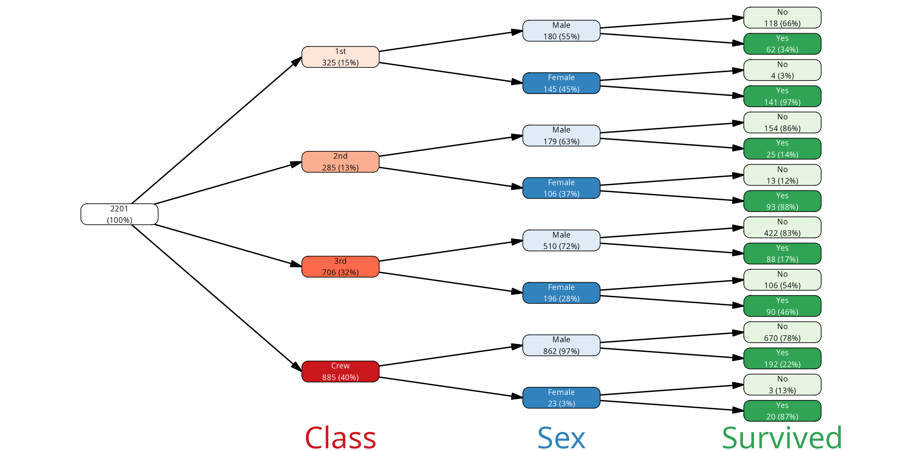

#### Pruning, keeping, finding, conditional operations

**Pruning.** In vtree2, you can prune the tree with the
[`prune()`](https://january3.github.io/vtree2/reference/prune.md)
function. It takes a logical vector of length equal to the number of
nodes in the vtree object. You can use the variables in from the vtree
node data frame to construct the logical vector. For example, to prune
all nodes with frequency less than 0.15 or number of cases less than
150, you can do `prune(vt, n < 150 | freq < .15)`. The result is always
a vtree which you can then plot.

The expression you pass to the prune() function, like
`n < 150 | freq < .15`, is evaluated in the context of the vtree node
data frame with added virtual columns for each of the variables in the
vtree. Each row of the context data frame corresponds to a node in the
vtree, so you can select all nodes which fullfill a certain condition.

``` r
data(FakeData, package="vtree")
library(cowplot)

# vtree::vtree(FakeData, "Severity Sex")
p1 <- vtree(FakeData, Severity, Sex) |> plot()

#vtree::vtree(FakeData,"Severity Sex",
#      prune=list(Severity=c("Mild","Moderate")))
p2 <- vtree(FakeData, Severity, Sex) |>
  prune(Severity %in% c("Mild", "Moderate")) |>
  plot()
plot_grid(p1, p2)
```

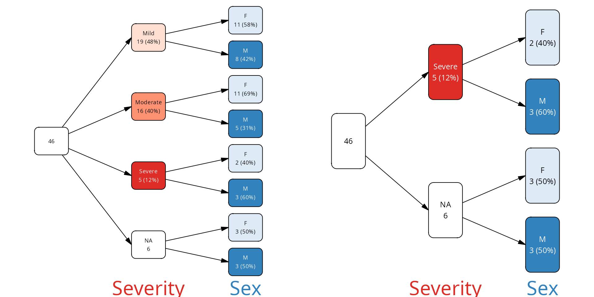

**`prunebelow`**

``` r
#vtree::vtree(FakeData, "Severity Sex",
#        prunebelow=list(Severity=c("Mild","Moderate")))
vtree(FakeData, Severity, Sex) |>
  prune(Severity %in% c("Mild", "Moderate"),
        follow_only=TRUE) |>
  plot()
```

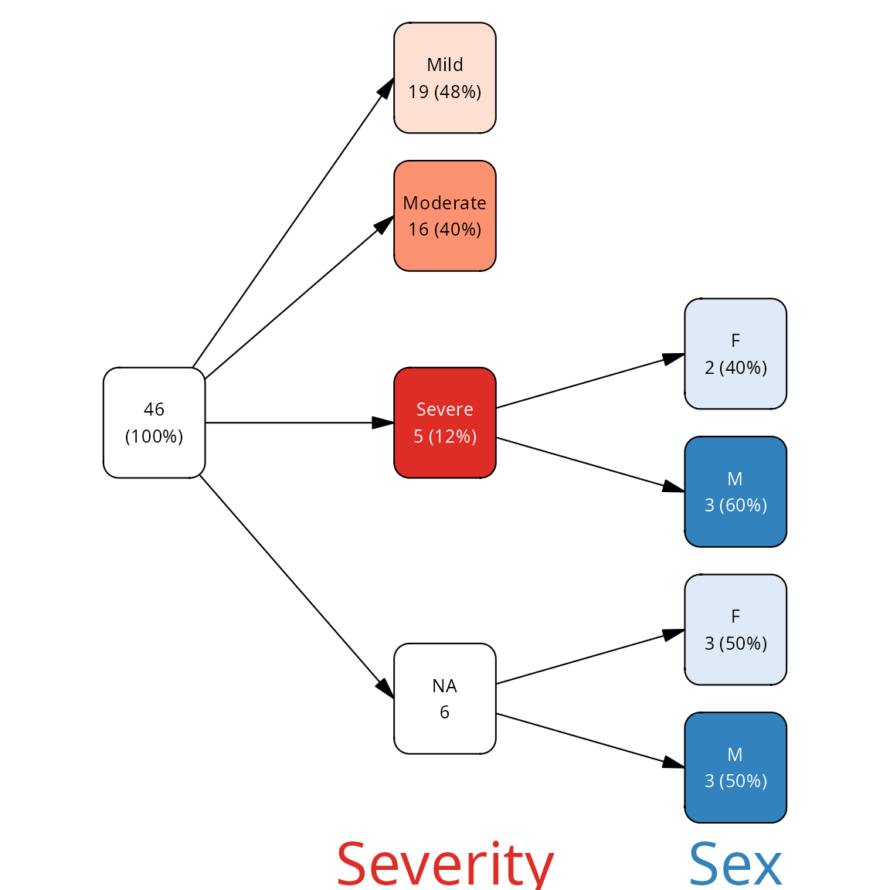

**`follow`**

The `follow` argument in the original `vtree` means: prune all the nodes
which *follow* nodes that *do not match* a certain condition. So
`follow=list(Severity=c("Mild","Moderate"))` means: prune all nodes
below the nodes where Severity is not Mild or Moderate.

This is also done with the `follow_only=TRUE` argument in
[`prune()`](https://january3.github.io/vtree2/reference/prune.md),
except that we inverse the condition.

``` r
#vtree::vtree(FakeData, "Severity Sex",
#        follow=list(Severity=c("Mild","Moderate")))

vtree(FakeData, Severity, Sex) |>
  prune(!Severity %in% c("Mild", "Moderate"), follow_only = TRUE) |>
  plot()
```

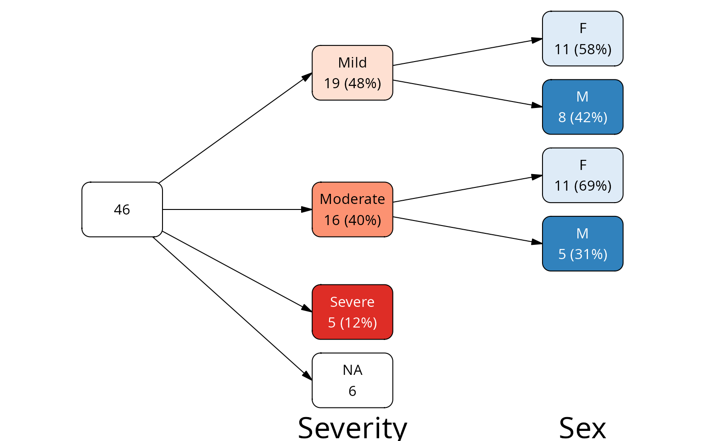

**Targetted pruning.** Since vtree2 accepts any expression creating a
logical vector for pruning, specifying a targetted pruning is easy.
Also, each node is associated with a path which is constructed from the
path to the node, so this works:

``` r
vtree(FakeData, Severity, Sex) |>
  prune(path == "Severity:Moderate/Sex:F") |>
  plot()
```

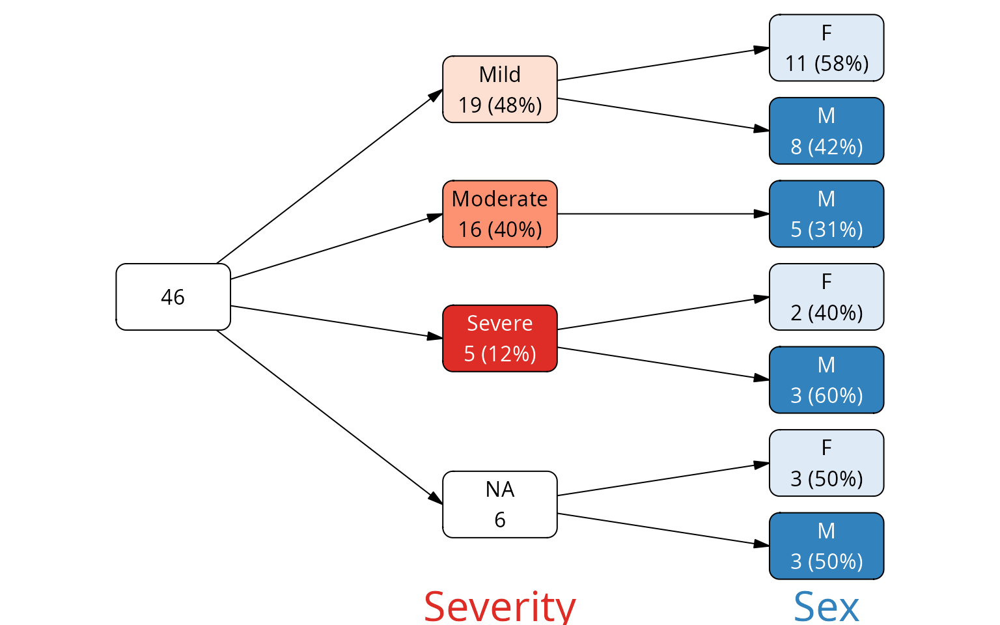

**Keeping.** The keep parameter in vtree is a bit peculiar, because it
silently keeps also the nodes which are NA *if* the valid percentages
are used. The rationale is this: without the NA node visible, you cannot
know how many total samples were there, since frequencies are calculated
from a denominator that excludes NA values.

Also, both the *children* and the *parents* of the selected nodes are
kept. In vtree2, the function is called
[`retain()`](https://january3.github.io/vtree2/reference/prune.md) to
avoid clashes with
[`purrr::keep()`](https://purrr.tidyverse.org/reference/keep.html).

``` r
#vtree::vtree(FakeData, "Severity Sex",
#             keep=list(Severity=c("Moderate")))

p1 <- vtree(FakeData, Severity, Sex) |>
  retain(Severity == "Moderate") |>
  plot(lheight=.2, lwidth=.4)
p2 <- vtree(FakeData, Severity, Sex) |>
  retain(Severity == "Moderate", keep_follow = FALSE) |>
  plot(lheight=.2, lwidth=.4)
plot_grid(p1, p2)
```

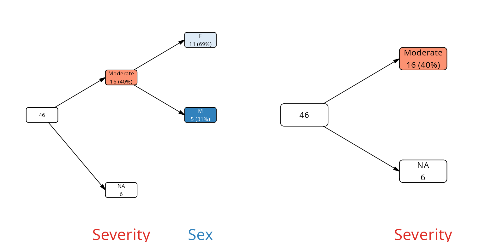

The behavior to keep the NA nodes is by default the same, i.e. keep them
if the vtree was constructed with valid percentages. You can directly
control this with the `keep_na_sisters` argument to
[`retain()`](https://january3.github.io/vtree2/reference/prune.md) or
[`prune()`](https://january3.github.io/vtree2/reference/prune.md).

``` r
p1 <- vtree(FakeData, Severity, Sex) |>
  retain(Severity == "Moderate") |>
  plot(lheight=.2, lwidth=.4)
p2 <- vtree(FakeData, Severity, Sex) |>
  retain(Severity == "Moderate", keep_na_sisters = FALSE) |>
  plot(lheight=.2, lwidth=.4)
plot_grid(p1, p2)
```

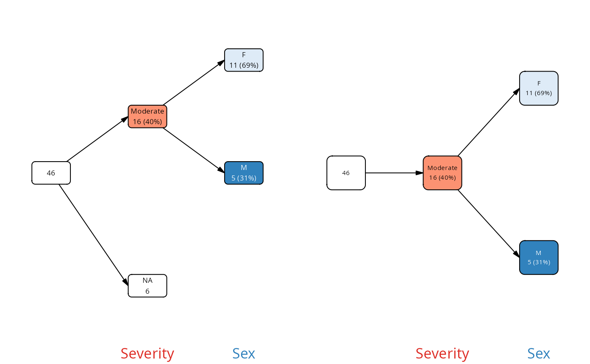

**`prunesmaller`** This is for selecting nodes based on the number of
observations. In vtree2, you can use any column from the node data
frame - including `n`, the number of observations in the node, `freq`,
the calculated proportion, `denominator` etc etc.

``` r
#vtree::vtree(FakeData, "Severity Sex Age Category", prunesmaller = 3)
p1 <- FakeData |> mutate(Age = as.character(Age)) |>
  vtree(Severity, Sex, Age, Category) |>
  plot()
p2 <- FakeData |> mutate(Age = as.character(Age)) |>
  vtree(Severity, Sex, Age, Category) |>
  prune(n < 3) |>
  plot()
plot_grid(p1, p2)
```

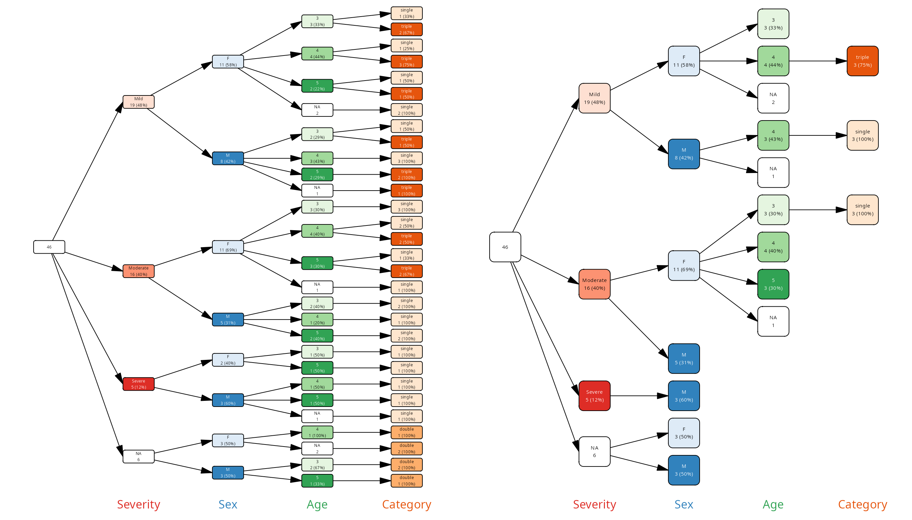

#### Formatting labels

In vtree2, there are some functions that construct automatic labels, but
for any more complex case you can use standard R functions to construct
your own labels.

By default,
[`add_labels()`](https://january3.github.io/vtree2/reference/add_labels.md)
construct the labels implicitly when you call plot() on a vtree object.
However, you can add the labels yourself either with
[`add_labels()`](https://january3.github.io/vtree2/reference/add_labels.md)
(which is quite flexible), modify them (also with
[`add_labels()`](https://january3.github.io/vtree2/reference/add_labels.md))
or by directly modifying the `label` column in the vtree.
[`plot.vtree()`](https://january3.github.io/vtree2/reference/plot.vtree.md)
will not overwrite labels if they already exist.

For example, to mimick the `sameline` option in vtree, you can first
generate the standard automatic labels and then replace the newline
character with a space:

``` r
## vtree::vtree(FakeData, "Severity Sex", sameline = TRUE)
vtree(FakeData, Severity, Sex) |>
  # add default labels
  add_labels() |>
  # apply the expression to the labels
  add_labels(expr = gsub("\n", " ", label)) |>
  plot(lwidth = .9)
```

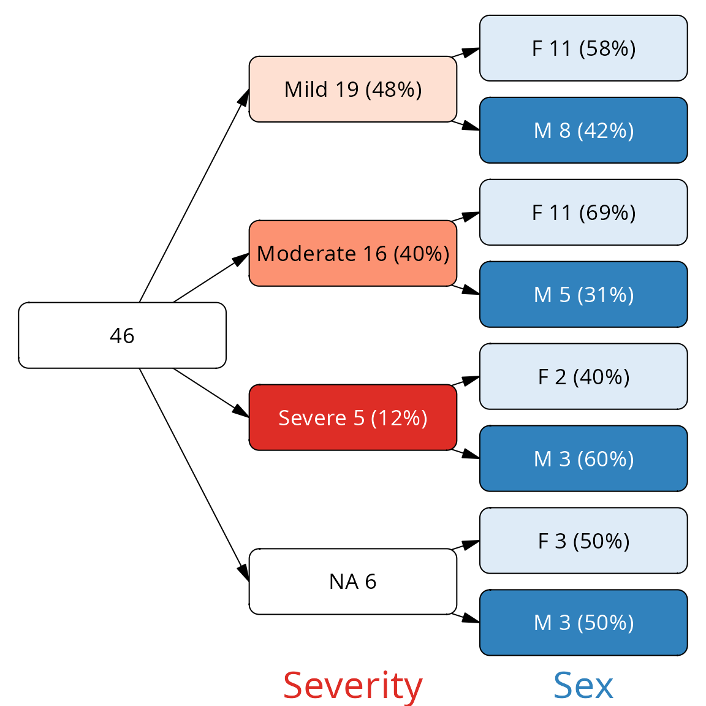

Arguably, that is way more code than just adding `sameline = TRUE` to
the vtree() call, but it is also way more flexible.

However, in this particular case there is an easier way:
[`add_labels()`](https://january3.github.io/vtree2/reference/add_labels.md)
has a template called “sameline”:

``` r
vtree(FakeData, Severity, Sex) |>
  add_labels(template="sameline") |>
  plot(lwidth = .9)
```

**`labelnode`**. This is used in vtree to replace a variable level with
a custom label. In vtree2, the simplest solution is to replace the
variable levels *in the data* before constructing the vtree.

``` r
## vtree::vtree(FakeData,"Group Sex",horiz=FALSE,
##        labelnode=list(Sex=c(Male="M",Female="F")))
vt <- FakeData |>
  mutate(Sex = dplyr::recode(Sex, M = "Male", F = "Female")) |>
  vtree(Group, Sex)
```

This has the advantage that your variable names are what you see on the
plot. Sometimes, however, we want to display something that is
cumbersome to work with code, e.g. a label containing Unicode
characters, formatting for `richtext=TRUE` or special characters. For
this, there is a function,
[`add_aliases()`](https://january3.github.io/vtree2/reference/add_aliases.md),
which adds both variable name and variable value aliases.

``` r
## vtree::vtree(FakeData,"Group Sex",horiz=FALSE,
##        labelnode=list(Sex=c(Male="M",Female="F")))
vtree(FakeData, Group, Sex) |>
  add_aliases(val_alias = list(Sex = c(M = "Male", F = "Female"))) |>
  plot(dir = "tb")
```

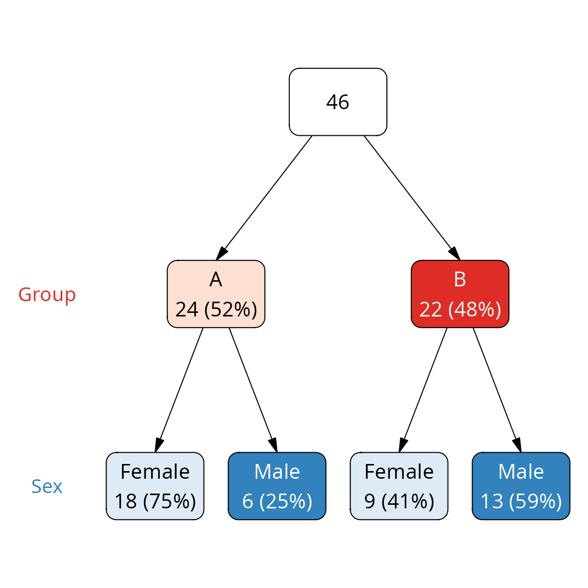

The argument `col_alias` does the same for variable names, so you can
change `Sex` to `Gender` or `Severity` to `Initial severity` and so on.

How about changing M to Male and F to Female but only for the nodes in
group A? In vtree2, you need to manipulate the node labels. You can
construct the nodes from scratch, or use substitution to clean up nodes.
One of several ways of doing that is this: you find the nodes that are
below the node “Group:A”, and then substitute M with Male and F with
Female for these nodes only. You can use
[`add_labels()`](https://january3.github.io/vtree2/reference/add_labels.md)
with the `fmt` argument and the `mask` argument specifying to apply the
new labels only to Group A:

``` r
vtree(FakeData, Group, Sex) |>
  add_labels() |>
  mark(path == "Group:A", follow_only = TRUE) |>
  add_labels(expr = ifelse(mark,
                        gsub("^F", "Female", label),
                        label)) |>
  add_labels(expr = ifelse(mark,
                        gsub("^M", "Male", label),
                        label)) |>
  plot()
```

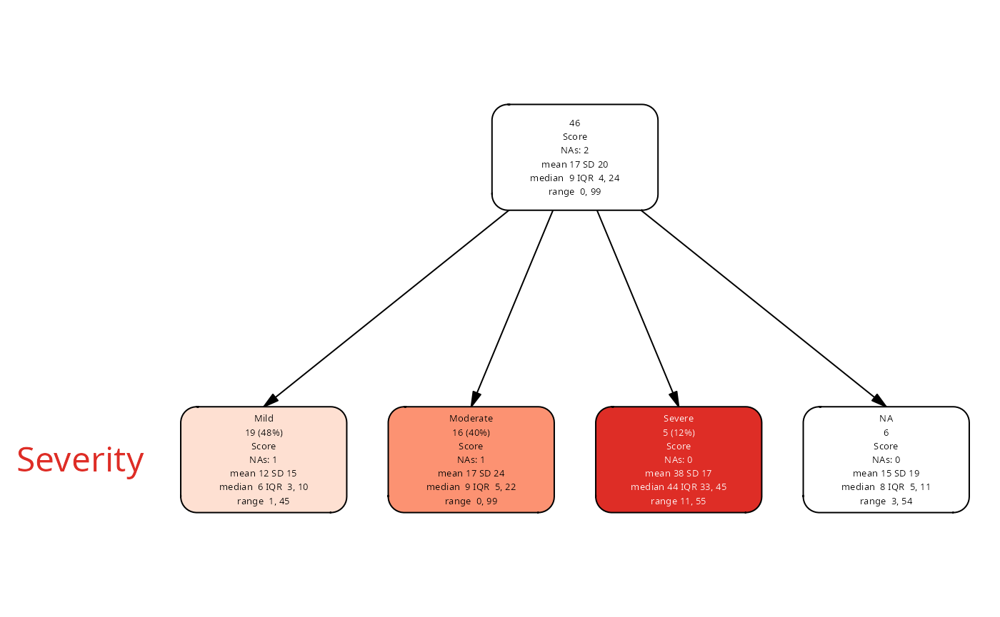

This is of course much more code, but is not only more flexible, but
also less exotic. Once you get your head around the fact that you are
using just R expressions to define conditions, it becomes quite easy.

**text**: the text argument in vtree allows to selectively add a text to
the node. In vtree2, you manipulate the labels with an expression.

``` r
# vtree(FakeData,"Group Severity",horiz=FALSE,showvarnames=FALSE,
#   text=list(Severity=c(Mild="\n*Excluding\nnew diagnoses*")))

vtree(FakeData, Group, Severity) |>
  add_labels() |>
  mark(Severity == "Mild") |>
  add_labels(expr = ifelse(mark,
                        paste0(label, "\n*Excluding\nnew diagnoses*"),
                        label)) |>
  plot(dir = "tb",
       richtext = TRUE,
       legend = FALSE)
```

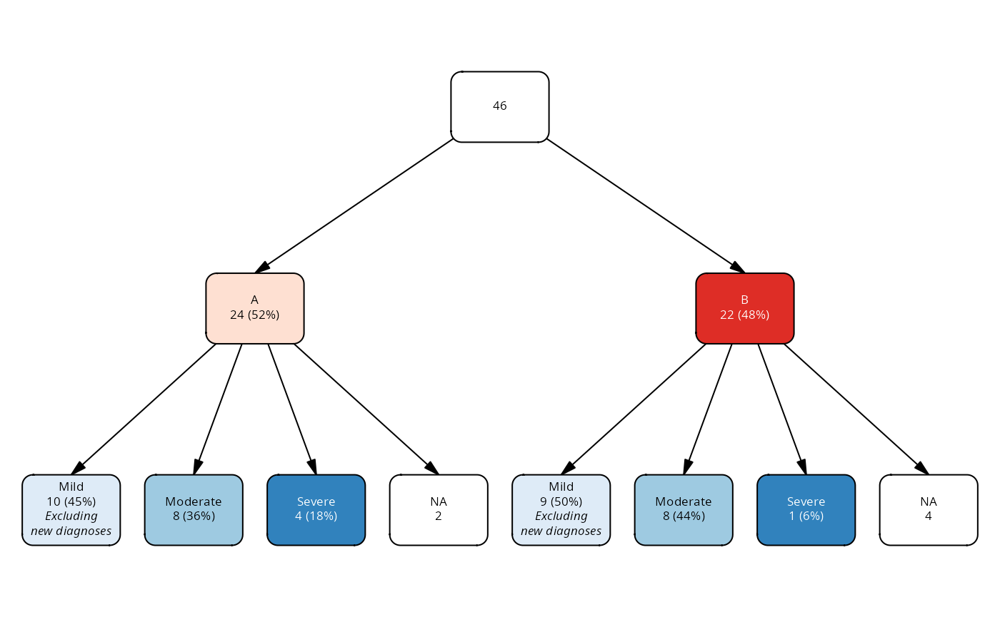

**ttext**: same as above, except you use the
`mark(path == "Group:B/Severity:Mild")` to target the node of your
choice. See next section, “Targetting nodes”.

#### Targetting nodes

Prune / keep and labelling operation might want to target certain nodes
by their path. This is achieved in vtree using `tlabelnode`. In vtree2,
each node has an `path`, a character representation of a path, and a
`path_l` column with the full path specified as list. You can use these
to target nodes for pruning, keeping, labelling or coloring. More: you
can use your prunning or keeping operation not to actually remove the
nodes, but to just select them for further operations. Thus, you can
find a node path, use prune to find all nodes that *would* be removed,
and then color them in red.

``` r
data(titanicNA)
vt <- vtree(titanicNA, Class, Sex, Survived)
vt |> retain(path == "Class:1st/Sex:NA/Survived:Yes" |
           path == "Class:2nd/Sex:NA/Survived:Yes") |>
  # btw: lheight and lwidth as fractions of the available space
  plot(lheight=.3, lwidth=.4)
```

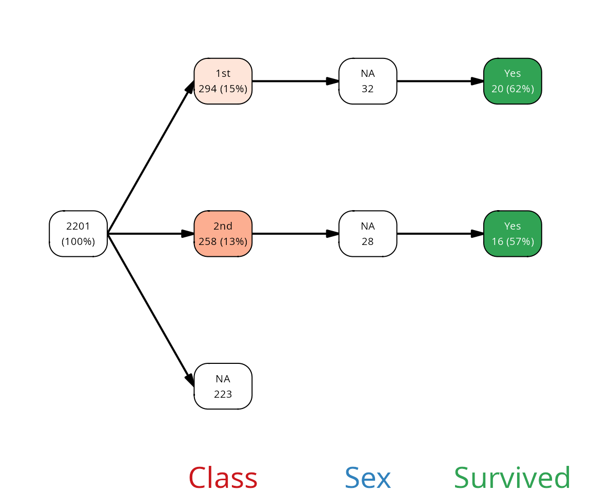

``` r
p1 <- vt |> add_labels() |>
  mutate(label = ifelse(path == "Class:1st", "First class", label)) |>
  mutate(fill = ifelse(path == "Class:1st", "red", "white")) |>
  plot()
#> ℹ palette attribute is NULL
#> legend will be black and white

# mark the nodes to prune in red
p2 <- vt |> prune(path == "Class:2nd/Sex:NA", mark_only=TRUE) |>
  mutate(fill = ifelse(!mark, "white", "red")) |>
  plot()
#> ℹ palette attribute is NULL
#> legend will be black and white
plot_grid(p1, p2)
```

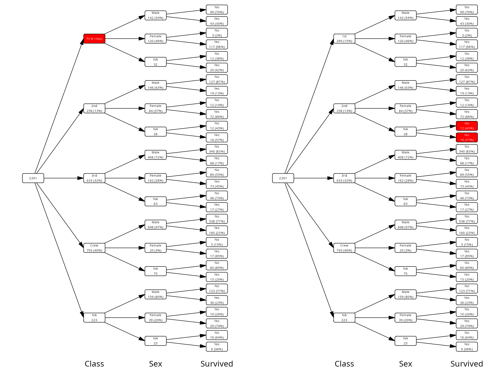

#### Summaries

More complex summaries can be achieved with
[`summarize_by_node()`](https://january3.github.io/vtree2/reference/summarize_by_node.md)
and
[`fmt_label()`](https://january3.github.io/vtree2/reference/summarize_by_node.md).
The first function takes a cases data frame and a vtree as an argument,
and returns a data frame containing a comprehensive summary of the
selected variable from the cases data frame at each node of the tree.

The
[`fmt_label()`](https://january3.github.io/vtree2/reference/summarize_by_node.md)
function turns the columns of that data frame into a character vector of
labels, optionally with a custom format.

The
[`summarize_by_node()`](https://january3.github.io/vtree2/reference/summarize_by_node.md)
takes a cases data frame as the first argument and a vtree - a vtree
object only keeps track of the variables that were assigned from start
and ignores other columns in the cases data frame. However, with
[`summarize_by_node()`](https://january3.github.io/vtree2/reference/summarize_by_node.md)
it is possible to generate summaries for any other variables. For
example:

``` r
## vtree(FakeData, "Severity", summary="Score", horiz=FALSE)

vt <- vtree(FakeData, Severity)

# first, prep the summary
sum_labs <- summarize_by_node(FakeData, vt, Score) |>
  fmt_label()

# add standard labels
vt |> add_labels() |>
  add_labels(fmt = "{label}\n{sum_labs}") |>
  plot(dir = "tb", lwidth=.8)
```


There is also a
[`summary_at_var()`](https://january3.github.io/vtree2/reference/summary_at_var.md)
function which generates per-variable summaries from a vtree, which can
also be used in a plot.

``` r
vt <- vtree(FakeData, Category)
summary_at_var(vt, "Category", as_df=TRUE)
#> # A tibble: 4 × 6
#>   node_col node_val count  freq denom label           
#>   <chr>    <chr>    <int> <dbl> <int> <chr>           
#> 1 Category single      26 0.565    46 single: 26 (57%)
#> 2 Category double       6 0.130    46 double: 6 (13%) 
#> 3 Category triple      14 0.304    46 triple: 14 (30%)
#> 4 Category NA           0 0        46 Missing: 0
```

In `vtree`, it is also possible, with a shorthand notation, to get
summaries for variables only for a given level of a variable. The
`summarize_by_node` function generates two columns containing the count
and frequency for each level of the variable, which can then be used to
generate the labels.

E.g., in the following example, the `Category` column of `FakeData`
contains levels `single`, `double` and `triple`, and we can pull out the
count and frequency of the `single` category only:

``` r
## vtree(FakeData,"Severity",summary="Category=single",horiz=FALSE)
vt <- vtree(FakeData, Severity)

library(dplyr)
#> 
#> Attaching package: 'dplyr'
#> The following objects are masked from 'package:stats':
#> 
#>     filter, lag
#> The following objects are masked from 'package:base':
#> 
#>     intersect, setdiff, setequal, union
library(purrr)

# this gives us, in the levels column, the counts
sm <- summarize_by_node(FakeData, vt, Category) |>
  fmt_label(fmt = 
            "Category=single:{single} ({100 * single_freq}%)",
            digits = 2)

vt |> add_labels() |>
  add_labels(fmt = "{label}\n{sm}") |>
  plot(dir = "tb")
```


I agree, this is longer code, but then also way more verbose. In a way
the code above, with some modifications, replaces all the other
summary-related options in `vtree`.

For example, the `vtree` mini-language has also a number of “control
codes” for selecting nodes for which summaries should be generated,
e.g. for variable manipulation, such as `%noroot%` (all nodes except for
the root), `%leafonly%`, `%var=v%`, `%node=n%`. All this can be achieved
in a rather (I think) natural way in `vtree2` using conditions passed to
functions such as
[`find_nodes()`](https://january3.github.io/vtree2/reference/prune.md)
or [`mark()`](https://january3.github.io/vtree2/reference/prune.md),
which can then be used to selectively add summaries to the nodes.

Similarly, the different summary formatting options and codes in the
vtree mini-language are replaced by use of the glue formatting string or
R expressions (with `expr` argument).

``` r
## vtree(FakeData,"Severity",summary="Score \nmean score\n%mean%",sameline=TRUE,horiz=FALSE)

vt <- vtree(FakeData, Severity)
sm <- summarize_by_node(FakeData, vt, Score) |>
  fmt_label(fmt = "mean score: {mean}", digits=1)

vt |> add_labels() |>
  add_labels(fmt = "{label}\n{sm}") |>
  plot(dir = "tb")
```

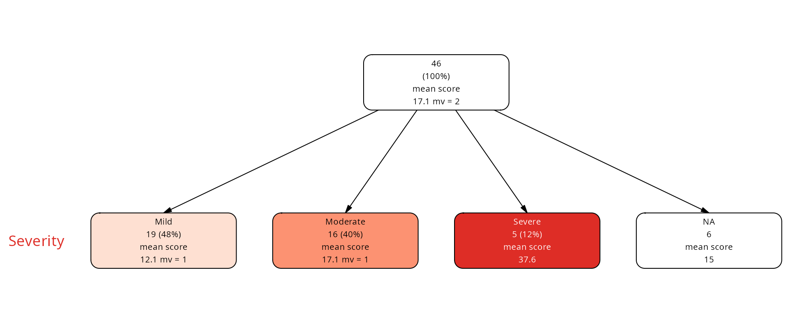

To get the missing value information as well but only if missing values
are present, we need a more complex approach. In the example below, we
will use `summarize_by_node` (returning a data frame) and the `expr`
argument to `fmt_label` which uses a conditional formatting with the
`glue` function.

``` r
library(glue)
smvt <- summarize_by_node(FakeData, vt, Score) |>
  fmt_label(expr = ifelse(missing > 0,
                    glue("mean score\n{round(mean, 1)} mv = {missing}"),
                    glue("mean score\n{round(mean, 1)}")))

vt |> add_labels() |>
  add_labels(fmt = "{label}\n{sm}") |>
  plot(dir = "tb")
```

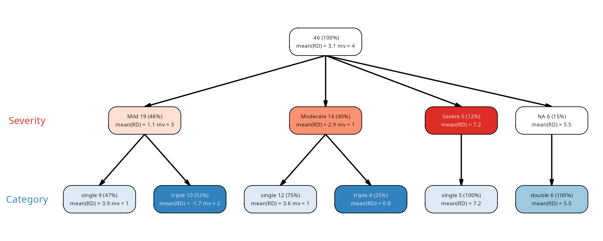

**R expressions.** In the vtree mini-language it is possible to include
some R code to make ad hoc calcuations. In `vtree2`, this stage is
separated from vtree construction - if you want an additional variable,
then by all means, create it explicitely:

``` r
## vtree(FakeData,"Severity Category",
##  summary="(Post-Pre)/Pre \nmean = %mean%",sameline=TRUE,horiz=FALSE,cdigits=1)

library(glue)

vt <- vtree(FakeData, Severity, Category)

sm <- FakeData |>
  mutate(RelDiff = (Post - Pre)/Pre) |>
  summarize_by_node(vt, RelDiff) |>
  fmt_label(expr = ifelse(missing > 0,
                    glue("mean(RD) = {round(mean, 1)} mv = {missing}"),
                    glue("mean(RD) = {round(mean, 1)}")))

vt |> 
  add_labels(fmt = "{node_val}: {n} (pct}%)") |>
  #mutate(label = gsub("\n",  ", ", label)) |>
  add_labels(fmt = "{label}\n{sm}") |> 
  plot(dir = "tb")
```

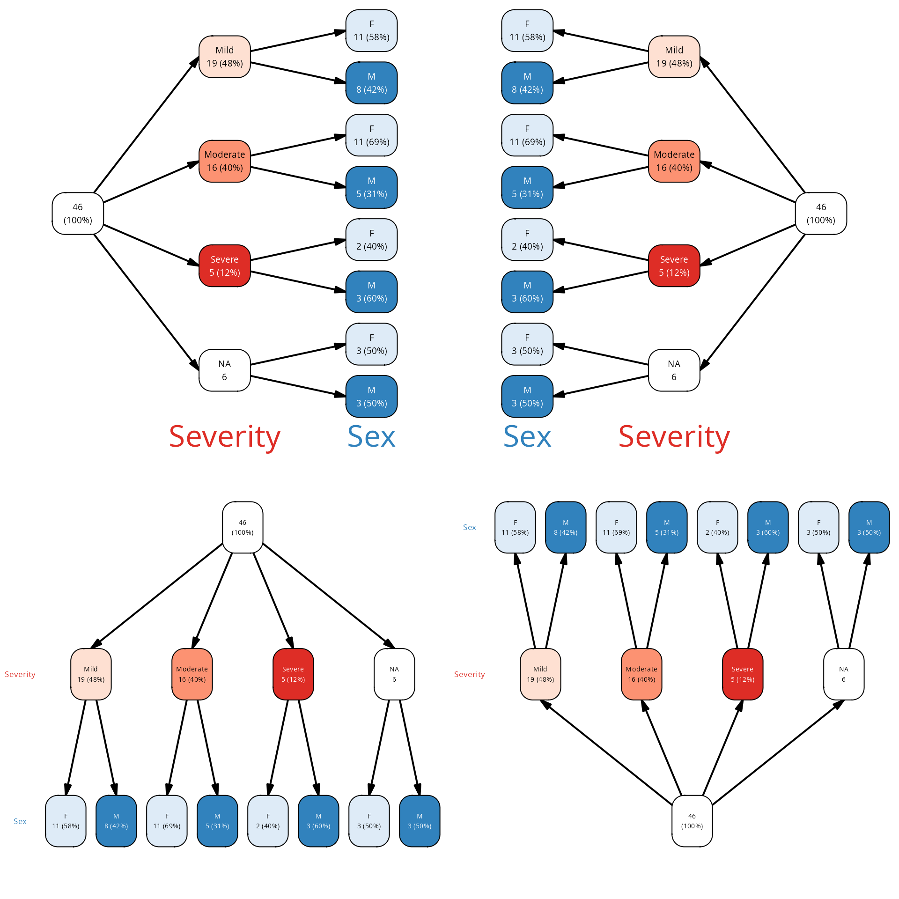

#### Plotting

The **`horiz=TRUE`** option in vtree directs whether the tree is plotted
horizontally or vertically. In vtree2, you can specify the direction of
the plot with the `dir` parameter in
[`plot()`](https://rdrr.io/r/graphics/plot.default.html). The default is
“lr” (left to right), but you can also use “tb”, “bt”, or “rl”.

``` r
vt <- vtree(FakeData, Severity, Sex)
p1 <- plot(vt)
p2 <- plot(vt, dir="rl")
p3 <- plot(vt, dir="tb")
p4 <- plot(vt, dir="bt")

plot_grid(p1, p2, p3, p4, ncol=2)
```

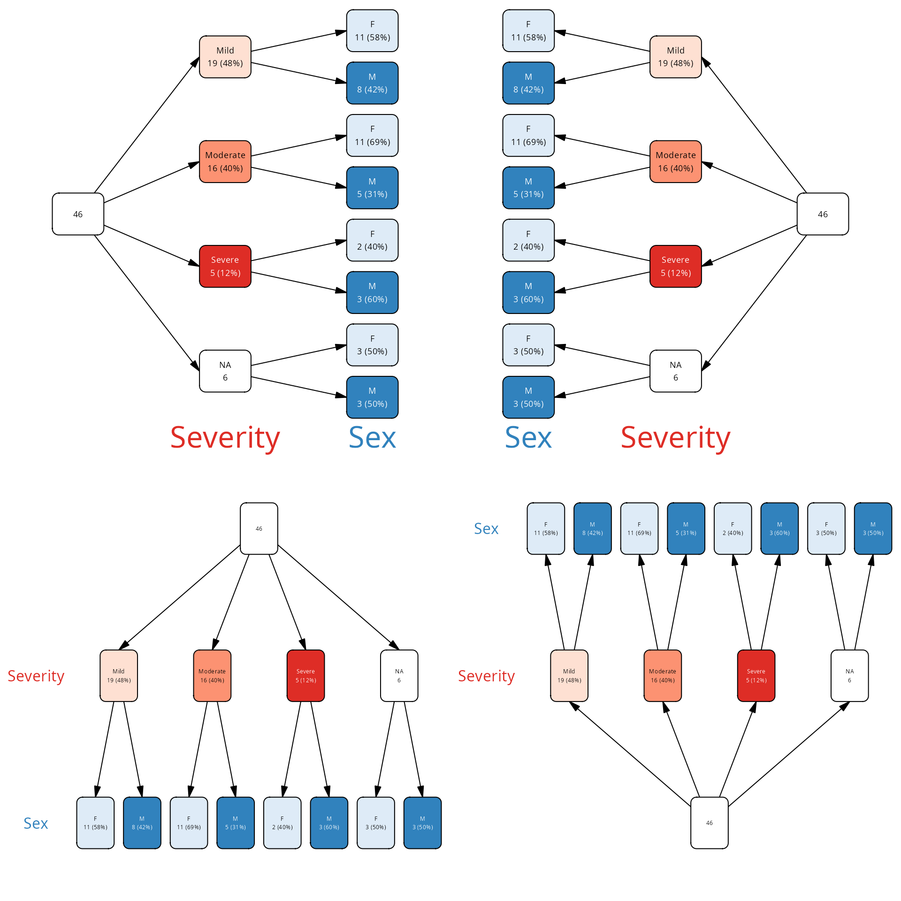

**Changing variable labels**. In vtree, you can specify alternative
variable labels with the `labelvar` parameter. In vtree2 you can use the
column labels you wish to see in the original data. If you have weird
characters (like spaces or newlines), use the backticks.

``` r
## vtree::vtree(FakeData, "Severity Sex",
##       horiz = FALSE,
##       labelvar=c(Severity="Initial severity"))
FakeData |>
  dplyr::rename(`Initial\nseverity` = Severity) |>
  vtree(`Initial\nseverity`, Sex) |>
  plot(dir = "tb", margins=c(0, 0, 0, .2))
```

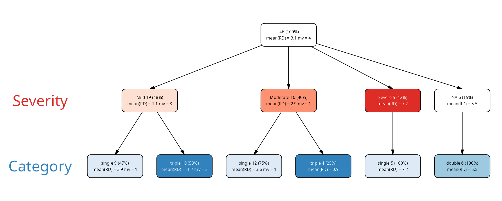

This has the advantage that if you use variable names in the node
labels, they will show correctly.

There is also another possibility: as mentioned above, with the
[`add_aliases()`](https://january3.github.io/vtree2/reference/add_aliases.md)
function you can add also alternative names for the variables:

``` r
vtree(FakeData, Severity, Sex) |>
  add_aliases(col_alias = list(Severity = "Initial\nSeverity")) |>
  plot(dir = "tb", margins=c(0, 0, 0, .2))
```

**Legends.** The `showlegend=TRUE` argument from `vtree` is
`legend=TRUE` in `vtree2`. That works both for regular and proportional
plots:

``` r
vt <- vtree_from_freqtable(Titanic)
p1 <- plot(vt, legend=TRUE)
p2 <- plot(vt, legend=TRUE, layout = "proportional")
plot_grid(p1, p2)
```

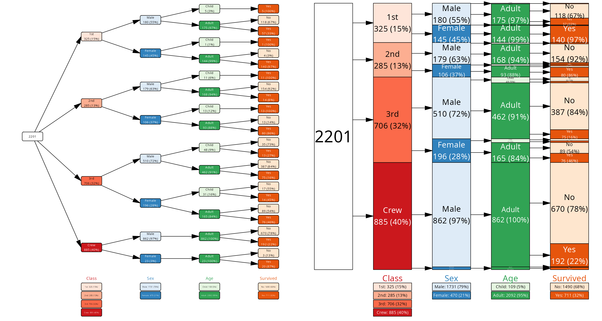

#### Patterns

The `vtree` patterns show all combinations of variable levels in the
data, one line at a time. They can be understood as all possible paths
through the tree. They are sorted by their frequency.

In `vtree2`, pattern are generated with the
[`pattern()`](https://january3.github.io/vtree2/reference/pattern.md)
function, which takes a vtree and returns a data frame (tibble) with the
`vtree_pattern` class. This data frame is not sorted, but you can sort
it yourself according to needs:

``` r
# vtree(FakeData,"Severity Sex")
# vtree(FakeData,"Severity Sex",pattern=TRUE)

library(dplyr)
vt <- vtree(FakeData, Severity, Sex)
plot(vt)

pattern(vt) |> arrange(Sex_n) |>
  plot(palettes = c("Blues", "Greens"))
```

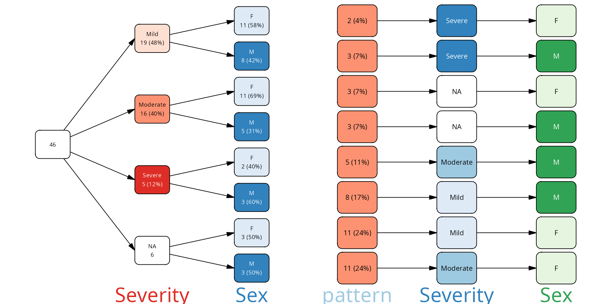

#### REDCap integration

In vtree, there is built-in functionality to read REDCap-encoded
checkboxes. The problem is that REDCap checkboxes result in a flurry of
variables with special attributes encoding levels.

``` r
dessert <- vtree::build.data.frame(
  c(   "group","IceCream___1","IceCream___2","IceCream___3"),
  list("A",     1,             0,             0,              7),
  list("A",     1,             0,             1,              2),
  list("A",     0,             0,             0,              1),
  list("A",     1,             1,             1,              1),
  list("B",     1,             0,             1,              1),
  list("B",     1,             0,             0,              2), 
  list("B",     0,             1,             1,              1),
  list("B",     0,             0,             0,              1))
attr(dessert$IceCream___1,"label") <- "Ice cream (choice=Chocolate)"
attr(dessert$IceCream___2,"label") <- "Ice cream (choice=Vanilla)"
attr(dessert$IceCream___3,"label") <- "Ice cream (choice=Strawberry)"
```

What vtree essentially does is to rename the variables from
`IceCream___1` to `Chocolate` etc. There is no vtree2 function to do
that, but it is easy enough to write one which renames the variables
based on the REDCap attributes:

``` r
rewrite_redcap <- function(df, ident) {
  cols <- startsWith(colnames(df), ident)
  fnc <- \(x) {
    nn <- attr(df[[x]], "label")
    pat <- ".* \\(choice=(.*)\\)"
    nn <- gsub(pat, "\\1", nn)
    nn
  }
  newnames <- vapply(colnames(df)[cols], fnc, character(1))
  colnames(df)[cols] <- newnames
  df
}

rewrite_redcap(dessert, "IceCream___") |>
  mutate(across(everything(), as.character)) |>
  vtree(Chocolate, Vanilla, Strawberry) |>
  plot()
```

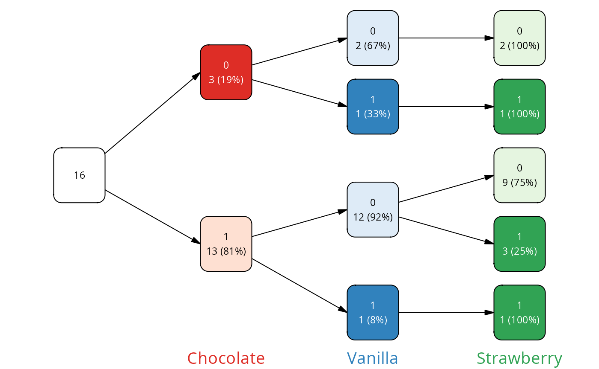

The various vtree prefixes (`rnone:`, `ri:` etc.) can be handled in a
similar way.

### Generating cases data frames with `build.data.frame()`

In general, in `vtree2` you use the
[`cases_from_freqtable()`](https://january3.github.io/vtree2/reference/cases_from_freqtable.md)
function to convert a frequency table to a cases table. The frequency
table can be built with anything that constructs a data frame. For
example, to follow the code from the dogs example in the vtree vignette,
you can do this:

``` r
# build.data.frame(
#   c("pet","breed","size"),
#   list("dog","golden retriever","large",5),
#   list("cat","tabby","small",2),
#   list("dog","Dalmation","various",101),
#   list("cat","Abyssinian","small",5),
#   list("cat","Abyssinian","large",22),
tibble::tribble( 
  ~pet, ~breed, ~size, ~Freq,
  "dog","golden retriever","large",5,
  "cat","tabby","small",2,
  "dog","Dalmation","various",101,
  "cat","Abyssinian","small",5,
  "cat","Abyssinian","large",22,
  "cat","tabby","large",86) |>
  cases_from_freqtable()
#> # A tibble: 221 × 3
#>    pet   breed            size   
#>    <chr> <chr>            <chr>  
#>  1 dog   golden retriever large  
#>  2 dog   golden retriever large  
#>  3 dog   golden retriever large  
#>  4 dog   golden retriever large  
#>  5 dog   golden retriever large  
#>  6 cat   tabby            small  
#>  7 cat   tabby            small  
#>  8 dog   Dalmation        various
#>  9 dog   Dalmation        various
#> 10 dog   Dalmation        various
#> # ℹ 211 more rows
```

#### The FakeRCT examples

``` r
# vtree(FakeRCT,"eligible randomized group followup analyzed",plain=TRUE,
#   keep=list(eligible="Eligible",randomized="Randomized",followup="Followed up"),
#   horiz=FALSE,showvarnames=FALSE,title="Assessed for eligibility")

data(FakeRCT, package="vtree")
pal <- colorRampPalette(c("white", "steelblue"))(7)

vt <- vtree(FakeRCT, eligible, randomized, group, followup, analyzed) 

vt |>
  retain(followup == "Followed up") |>
  add_labels() |>
  add_labels(fmt_root = "Assessed for\neligibility\n{label}") |>
  mutate(fill = pal[level + 2]) |>
  plot(dir = "tb", legend = FALSE, lwidth=.8, lheight=.7)
```

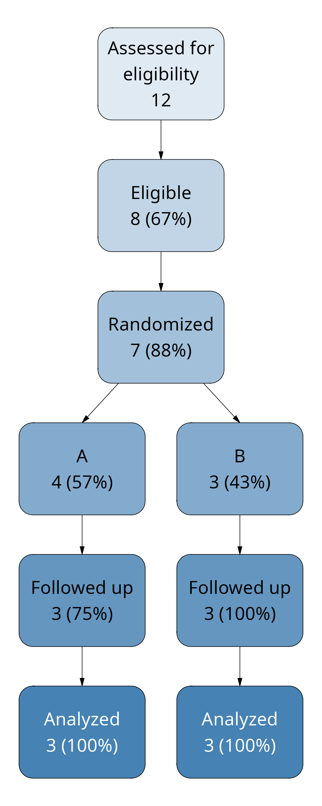

``` r
# vtree(FakeRCT,"eligible randomized group followup analyzed",plain=TRUE,
#   follow=list(eligible="Eligible",randomized="Randomized",followup="Followed up"),
#   horiz=FALSE,showvarnames=FALSE,title="Assessed for eligibility")
vt <- vtree(FakeRCT, eligible, randomized, group, followup, analyzed) 
vt |>
  prune(followup != "Followed up" |
        randomized != "Randomized" |
        eligible != "Eligible", follow_only = TRUE) |>
  add_labels() |>
  add_labels(fmt_root = "Assessed for\neligibility\n{label}") |>
  mutate(fill = pal[level + 2]) |>
  plot(dir = "tb", legend = FALSE, lwidth=.8, lheight=.7)
```


``` r
# vtree(FakeRCT,"eligible randomized group followup analyzed",plain=TRUE,
#   follow=list(eligible="Eligible",randomized="Randomized",followup="Followed up"),
#   horiz=FALSE,showvarnames=FALSE,title="Assessed for eligibility",
#   summary="id \nid: %list% %noroot%")

# #vtree:vtree() minilanguage allows to insert lists of identifiers
# #we can do that manually e.g. with that code:
#
# sumfnc <- function(df) {
#   ret <- paste("id:", paste(df$id, collapse = ", "))
#
#   # vtree::vtree() wraps text automatically, we do it explicitly
#   ret <- strwrap(ret, 20)
#
#   ret <- paste(ret, collapse = "\n")
#   ret
# }
#
# ids <- vtree_apply(FakeRCT, vt, sumfnc) |>
#                unlist()
# #but there is a built-in function for that:

ids <- label_var_levels(FakeRCT, vt, id)

vt |>
  prune(followup != "Followed up" |
        randomized != "Randomized" |
        eligible != "Eligible", follow_only = TRUE) |>
  add_labels() |>
  add_labels(
    fmt = "{node_val}\n{ids[node_key]}",
    fmt_root = "Assessed for\neligibility\n{label}") |>
  mutate(fill = pal[level + 2]) |>
  plot(dir = "tb", legend = FALSE, lwidth=.8, lheight=.7)
```


#### Other examples

``` r
# ESOPH <- esoph
# levels(ESOPH$agegp)[levels(ESOPH$agegp)=="75+"] <- "75plus"
# 
# vtree(ESOPH,"agegp=75plus",sameline=TRUE,cdigits=0,
#   summary=c("ncases \ncases=%sum%%leafonly%",
#   "ncontrols  controls=%sum%%leafonly%"))

# replace the agegp data var with a new one
ESOPH <- esoph |>
  mutate(agegp = ifelse(agegp == "75+", "75+", "< 75")) |>
  mutate(agegp = factor(agegp, levels = c("< 75", "75+")))

vt <- vtree(ESOPH, agegp)

# summary for ncases/ncontrols
ncases <- summarize_by_node(ESOPH, vt, ncases) |>
                  fmt_label(fmt="cases={n}")
ncntrls <- summarize_by_node(ESOPH, vt, ncontrols) |>
                  fmt_label(fmt="controls={n}")
sm <- paste(ncases, ncntrls)

vt <- vt |>
  add_labels(template = "sameline") |>
  add_labels(fmt = "{label}\n{sm}", fmt_root = "{n}") |>
  # shrink relative size of the root nodes
  add_layout(varspace = c(root=1, agegp=4), lwidth=.8) |>
  plot()
```

``` r
# hec <- crosstabToCases(HairEyeColor)
# vtree(hec,"Hair Eye=Green Sex",sameline=TRUE)

cases_from_freqtable(HairEyeColor) |>
  # replace the Eye data var
  mutate(Eye = ifelse(Eye == "Green",
                      "Green", "Not Green")) |>
  vtree() |>
  add_labels(template="sameline") |>
  plot(lwidth=.8)
```

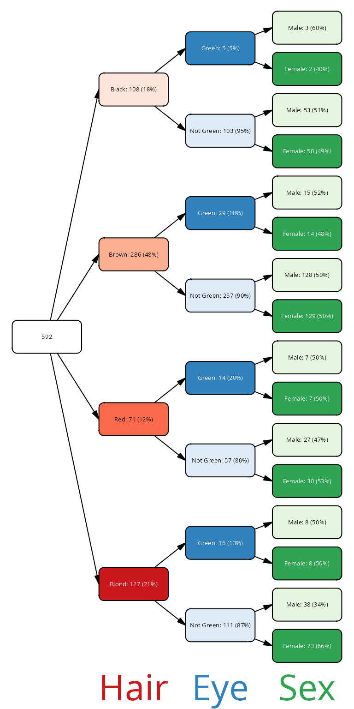

``` r
# mt <- mtcars
# mt$name <- rownames(mt)
# rownames(mt) <- NULL
#
# vtree(mt,"cyl gear carb",summary="hp \nmean (SD) HP %mean% (%SD%)")

# for vtree2, we need to convert the numeric columns to factors
mt <- mtcars |>
  mutate(across(c(cyl, gear, carb), as.factor))
vt <- vtree(mt, cyl, gear, carb)
smt <- summarize_by_node(mt, vt, hp) |>
  fmt_label(fmt="mean (SD) {mean} ({sd})", digits=1)
vt |> add_labels() |>
  add_labels(fmt="{label}\n{smt}") |>
  plot(lwidth=.8)
```

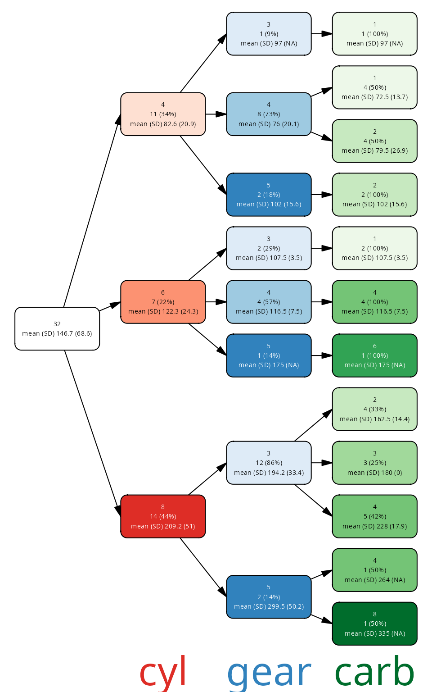

``` r

# this doesn't work for me:
# vtree(mt,"cyl gear carb",summary="hp mean (SD) HP %mean% (%SD%)",
#   cdigits=0,labelvar=c(cyl="# cylinders",gear="# gears",carb="# carburetors"),
#   ptable=TRUE)
```

``` r
# vtree(mt,"gear carb",
# summary="name \n%list%%noroot%",splitwidth=50,sameline=TRUE,
#   labelvar=c(gear="# gears",carb="# carburetors"))

mt <- mtcars |>
  mutate(across(c(cyl, gear, carb), as.factor)) |>
  tibble::rownames_to_column("name")

vt <- vtree(mt, gear, carb) |>
  add_aliases(col_alias=c(gear="# gears", carb="# carburators"))
idlist <- vtree_apply(mt, vt, \(df) {
                        ret <- paste(df$name, collapse=", ")
                        ret <- strwrap(ret, 60)
                        ret <- paste(ret, collapse = "\n")
  })

idlist <- label_var_levels(mt, vt, name)

vt |>
  add_labels(template = "sameline") |>
  add_labels(fmt = "{label}\n{idlist}", fmt_root="{n}") |>
  add_layout(lwidth=.9, varspace = c(root=1, gear=4, carb=2)) |>
  plot(fontsizes = list(nodes="adaptive"))
```

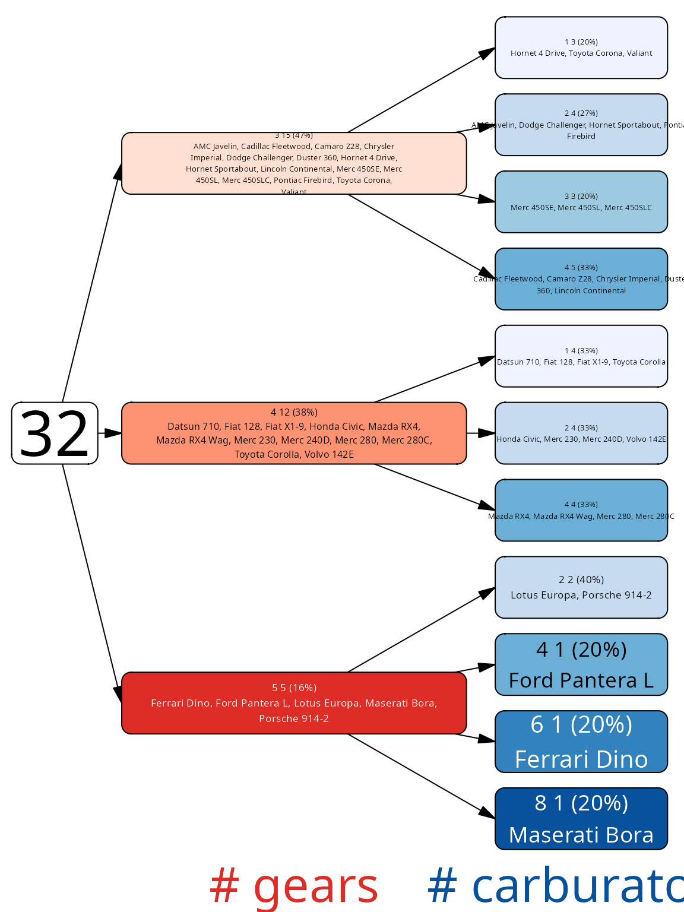

``` r
# ucb <- crosstabToCases(UCBAdmissions)
# vtree(ucb,"Dept Gender",summary="Admit=Admitted \n%pct% admitted",sameline=TRUE)

# ucb <- vtree::crosstabToCases(UCBAdmissions)
# vtree::svtree(ucb,"Dept Gender",summary="Admit=Admitted \n%pct% admitted",sameline=TRUE)

ucb <- cases_from_freqtable(UCBAdmissions)
vt <- vtree(ucb, Dept, Gender)

smt <- summarize_by_node(ucb, vt, Admit) |>
  fmt_label(fmt="{100 * Admitted_freq}% admitted", digits=2)
vt |> add_labels(template="sameline", suffix = smt) |>
  plot(lwidth=.7)
```

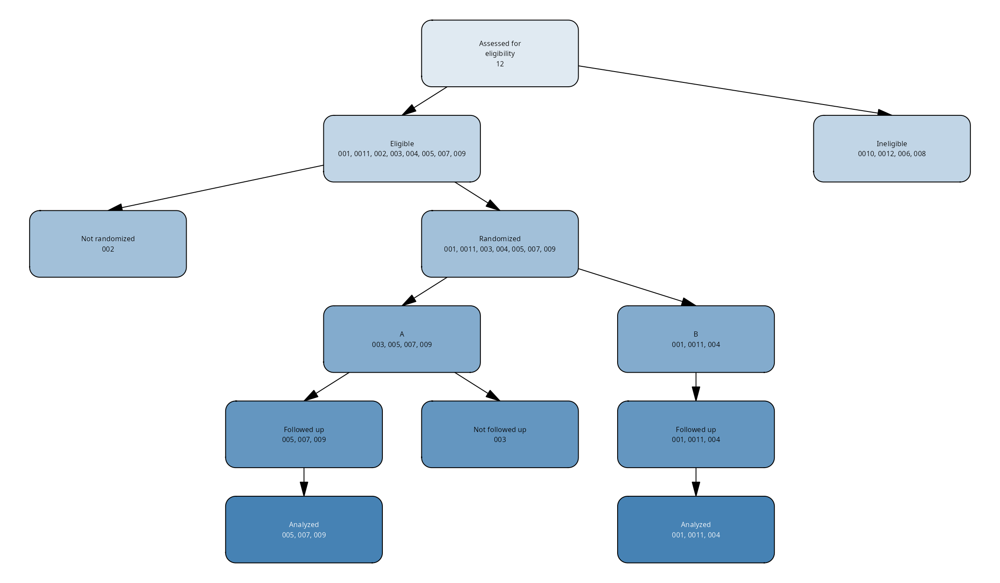

``` r
# vtree(ChickWeight,"Diet Time",
#   keep=list(Time=c("0","4")),summary="weight \nmean weight %mean%g")
# vtree::svtree(ChickWeight,"Diet Time",
#   keep=list(Time=c("0","4")),summary="weight \nmean weight %mean%g")
#
# vtree::svtree(ChickWeight,"Diet Time",keep=list(Time=c("0","4")),
#   labelnode=list(
#     Diet=c("Diet 1"="1","Diet 2"="2","Diet 3"="3","Diet 4"="4"),
#     Time=c("0 days"="0","4 days"="4")),
#   labelvar=c(Time="Days since birth"),summary="weight \nmean weight %mean%g")

# need to convert Time to a factor. Best make the Time and Diet vars
# absolutely nonambiguous
cwcases <- ChickWeight |>
  mutate(Time = paste("Time", Time)) |>
  mutate(Diet = paste("Diet", Diet))

vt <- vtree(cwcases, Diet, Time) |>
  retain(Time %in% c("Time 0", "Time 4"))

smt <- summarize_by_node(cwcases, vt, weight) |>
                  fmt_label(fmt = "mean weight {mean} g", digits=1)
vt |>
  add_aliases(col_alias=c(Time = "Days since birth")) |>
  add_labels(suffix = smt) |>
  plot(lwidth=.6)
```

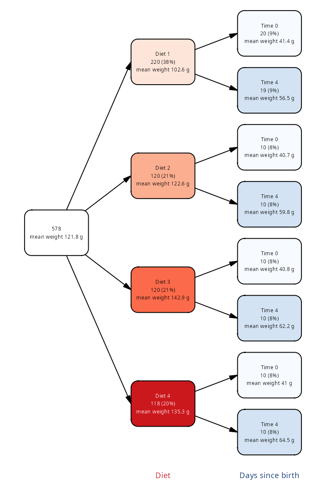

``` r
# vtree(InsectSprays,"spray",splitwidth=80,sameline=TRUE,
#   summary="count \ncounts: %list%%noroot%",cdigits=0)
# vtree::svtree(InsectSprays,"spray",splitwidth=80,sameline=TRUE,
#   summary="count \ncounts: %list%%noroot%",cdigits=0)
# use the label_var_levels shortcut function for that

vt <- vtree(InsectSprays, spray) |>
  add_labels(template="sameline")
levlab <- label_var_levels(InsectSprays, vt, "count")
vt |>
  add_labels(mask=find_nodes(vt, !path == "root"),
             template="sameline",
             suffix=paste0("counts: ", levlab)) |>
  add_layout(varspace=c(root=1,spray=4), lwidth=.8) |>
  plot()
```

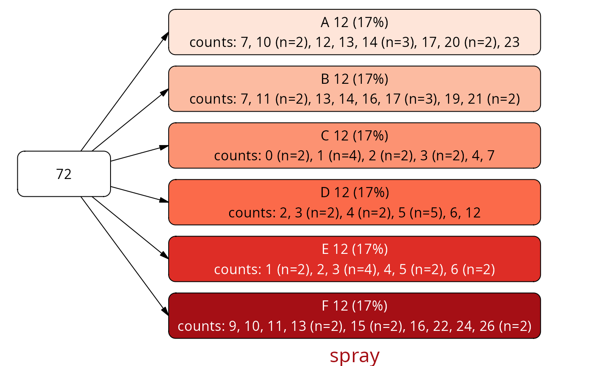

``` r
#vtree(ToothGrowth,"supp dose",summary="len>20 \n%pct% length > 20")
#vtree::svtree(ToothGrowth,"supp dose",summary="len>20 \n%pct% length > 20")
# vtree(ToothGrowth,"supp dose",summary="len>20 \n%pct% length > 20",
#   labelvar=c("supp"="Supplement type","dose"="Dose (mg/day)"),
#   labelnode=list(supp=c("Vitamin C"="VC","Orange Juice"="OJ")))
#vtree::svtree(ToothGrowth,"supp dose",summary="len>20 \n%pct% length > 20",
#  labelvar=c("supp"="Supplement type","dose"="Dose (mg/day)"),
#  labelnode=list(supp=c("Vitamin C"="VC","Orange Juice"="OJ")))

# setup the tree with aliases
tg <- mutate(ToothGrowth, dose = factor(dose))
vt <- vtree(tg, supp, dose) |>
  add_aliases(col_alias = c(supp = "Supplement type",
                            dose = "Dose (mg/day)"),
              val_alias = list(supp=c(OJ = "Orange Juice",
                            VC = "Vitamin C")))

# create the summary information
smt <- vtree_apply(tg, vt, \(df) {
                     frac_l20 <- sum(df$len > 20)/nrow(df)
                     sprintf("%.0f%% length > 20", 100 * frac_l20)
  }) |> unlist()

# add labels; add the summary as suffix
vt |> add_labels(suffix = smt) |>
  plot(lwidth=.8)
```

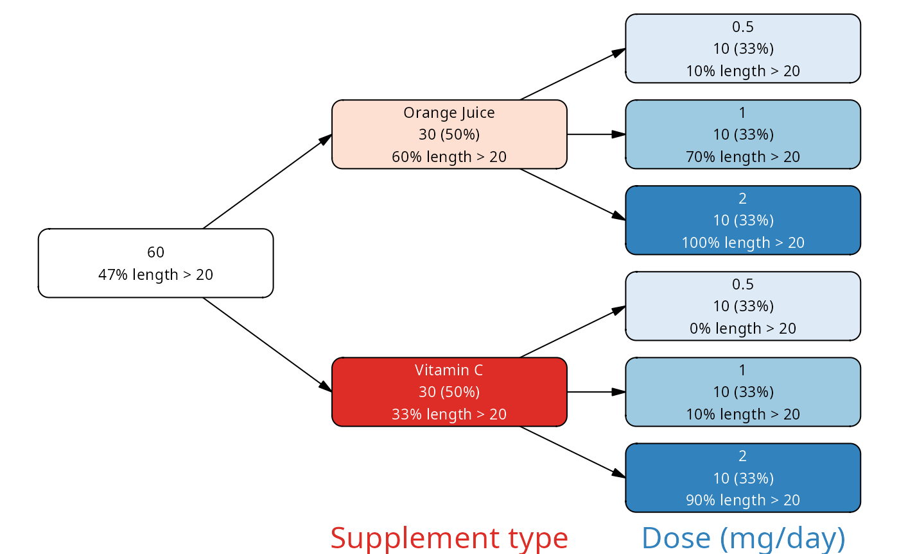

#### New functionality in vtree2 compared to vtree ~~Killer features~~

- frequency plots: where nodes are scaled by the number of observations
- inserting other graphical objects into nodes: images or ggplot2’s
- pruning or keeping nodes takes any logical expression

#### Missing functionality

The following are not yet implemented in vtree2:

- ~~font styling~~ \<- done! the richtext=TRUE parameter to plot()
- the various variable processing options, like turning a numeric
  variable into a factor with a specified number of levels - I think
  they are better left to whatever the user is most comfortable with.
- ~~a fundamental problem of vtree2 concept is that the original data is
  not kept with the vtree object (maybe I should change that?). That is
  why the legend produced by vtree2 is different when the tree is
  pruned: the legend is based on the *current*, pruned vtree and not on
  the original data. For now, I will just keep the original
  *summaries*.~~ -\> now the summaries are kept so the legend is always
  the same.
- the summary expressions in the original vtree package are very
  powerful. While most of what can be done in `vtree` can also be
  achieved in `vtree2`, it requires a few more lines of code. Maybe some
  shortcuts are in order.

### Design principles for vtree2

- separate frequency calculations, summary calculations, node selection
  and plotting
- use graphical objects for plotting which are flexible
- use tidyverse principles for data manipulation
- use tidyverse syntax for specifying variables
- vtree object inherits from tidygraph’s tbl_graph, so it can be used
  with a wide variety of plotting tools, including ggraph, ggplot2, and
  plotly

### Practical differences

- In vtree2, you first prepare the data with
  [`vtree()`](https://january3.github.io/vtree2/reference/vtree.md) and
  then plot it with
  [`plot()`](https://rdrr.io/r/graphics/plot.default.html). This means
  one more function call, but a much more flexible plotting system.
- Given that a vtree object is a tbl_graph, you are not limited to the
  built-in plotting functions. You can use ggraph, ggplot2, or plotly to
  create your own plots.
- There are some automatic summary and plotting functions, but you can
  also have a very tight control about the labels by modifying the
  `label` column in the vtree object.
- The `summarize_by_node` function can be used to calculate summary
  statistics for each node based on any additional data. It is not
  limited to using the data from which the vtree was constructed, and
  you can use the exposed statistics to shape any label you would like.
- Same goes for colors: instead of using automatic color assignments
  that mimick these of the original vtree, you can use any color scheme
  you like by assigning values to the `color` column in the vtree
  object.
- The downside of this setup is that the original vtree allows you to
  generate a beautiful plot with a single terse function call, whereas
  vtree2 is much more explicit and requires several steps. The upside is
  that you have more flexibility and more control over the final plot.
- The geometry of the plot is chosen by the original vtree plotting
  function, whereas in vtree2 the geometry depends on the device, and
  the plot is adjusted to fill the available space on the device, which
  means that the plots sometimes need fine tuning.
- The mini-language implemented in vtree is now replaced by explicit
  operations: finding nodes, labelling, selecting colors for plotting
  etc.
