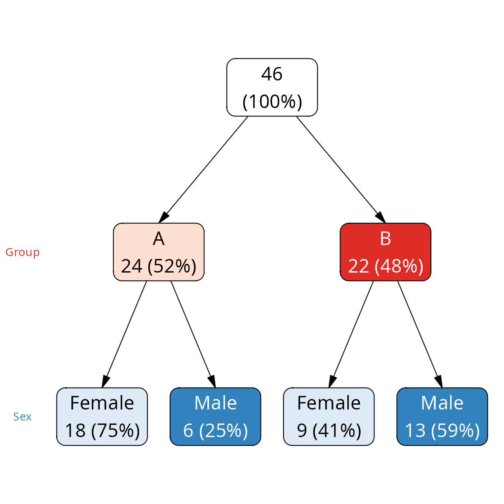
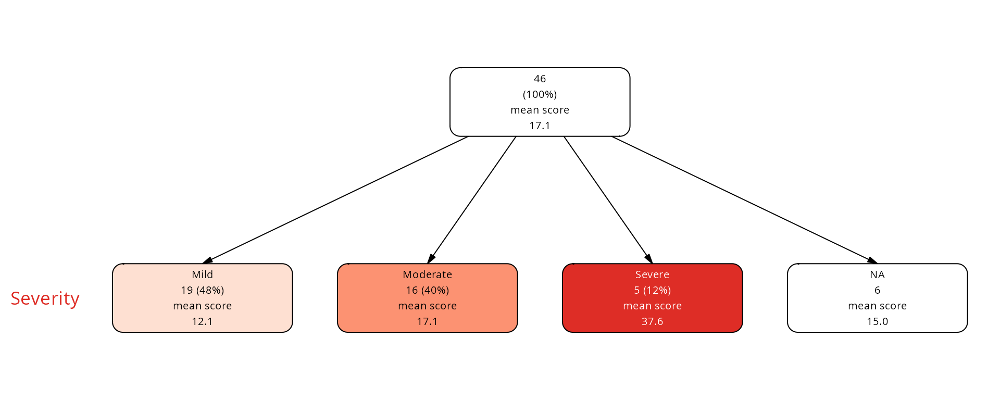
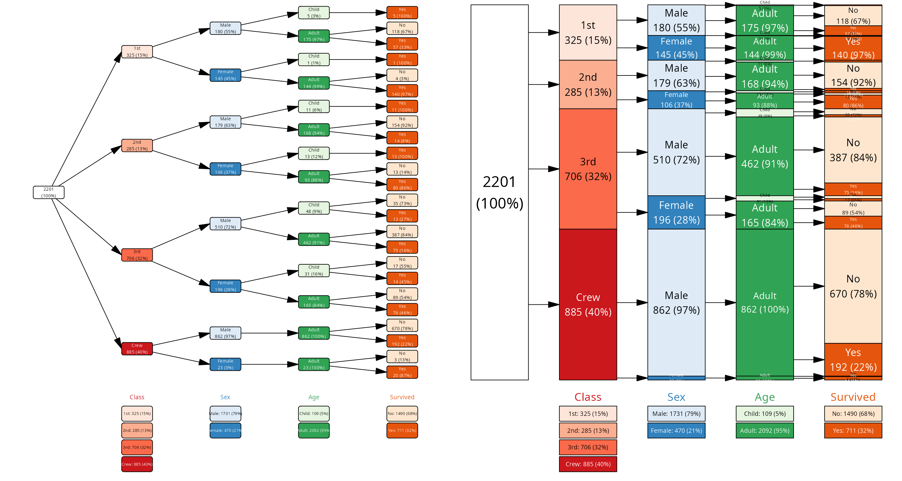

# vtree2 for vtree users

``` r
library(vtree2)
```

## Differences between vtree2 and the original vtree

### Motivation

The original vtree package implements most of its functionality in a
single function
[`vtree()`](https://january3.github.io/vtree2/reference/vtree.md) with
more than a hundred options and producing a plot. The function
implements its own mini-language for specifying formats of labels,
variables, conditions to select nodes and so on. This allows for simple
and terse function calls.

However, this limits the flexibility of the package. It is not possible
to fully customize the labels, inspect the interim data, use the various
summaries for other purposes (e.g. to produce simple tables). `vtree2`
separates data preparation, label construction, node selection and
plotting into four separate steps. This comes at the cost of more
verbose function calls.

Some other advantages of vtree2:

- plotting produces a grid graphics object - that means it works out of
  the box for most devices and can be used in connection with packages
  like `cowplot` or `patchwork` to produce complex figures.
- proportional plots allow to graphically represent the number of
  samples in the different levels.

Disadvantages of vtree2:

- No HTML-like formatting of the labels
- no RedCap integration
- several of the straightforward vtree options require some thinking in
  vtree2

### Quick HOWTO for vtree users

vtree2 is meant to be natural for tidyverse users. You split the
operations by their domain - i.e, you don’t mix calculations, topology
manipulation and plotting, but build the plot in stages: first prepare
the data, then pass it on to prune / find / select nodes, then you add
labels and colors, add a layout and finally you plot it.

However, to make it more concise, if you do not add labels / colors /
layouts yourself, the plot function will do it for you. The important
part is that you can manipulate them in stages. The following two plots
are based on the same data set - titanicNA, which is the same as the
Titanic data set, but with some values in the columns Class, Age and Sex
replaced by NAs.

``` r
library(vtree2)

# minimal code
vtree(titanicNA) |> plot()

vt <- vtree(titanicNA) 

# extra statistics
stats <- summary_vt(titanicNA, vt, Age)

vt |>
  # prune returns a pruned vtree which we
  # then pass down the pipeline
  prune(freq < .2) |>
  # adds labels, returns a vtree
  add_labels(template = "long") |>
  # leaf is a column in the node data frame
  # TRUE for a leaf node
  mutate(label = ifelse(leaf,
                        paste0(label, "\n",
                               stats),
                        label)) |>
  # adds palettes, returns a vtree
  add_palette(palettes = c("Oranges", "Greys", "BuGn", "Purples")) |>
  # and, finally, a plot
  plot(lwidth = .7)
```


### How do you…

#### Data pre-processing

Several options of the original vtree are actually for pre-processing of
the data. For example, the variable specification ‘variable\>value’ in
the vtree mini-language is used to split a numeric variable into two
levels.

I think that explicing splitting of the data before constructing the
vtree is more fittin. It is easy, and for complex cases there are many
specialized tools and packages dealing with that. For most cases, a
simple [`cut()`](https://rdrr.io/r/base/cut.html) or
[`ifelse()`](https://rdrr.io/r/base/ifelse.html) is enough.

``` r
iris |>
  mutate(Sepal.Length = ifelse(Sepal.Length > 5.5, "long", "short")) |>
  mutate(Sepal.Width = cut(Sepal.Width, breaks = c(2, 3, 4, 5))) |>
  vtree(Sepal.Length, Sepal.Width, Species) |>
  plot()
```


**crosstabToCases**. This `vtree` function converts frequency tables to
cases tables. The relevant `vtree2` function is `cases_from_freqtable`.
Compare:

``` r
# this is frequency table; the Freq column informs how many samples
# correspond to the given combination of levels
head(data.frame(Titanic))
#>   Class    Sex   Age Survived Freq
#> 1   1st   Male Child       No    0
#> 2   2nd   Male Child       No    0
#> 3   3rd   Male Child       No   35
#> 4  Crew   Male Child       No    0
#> 5   1st Female Child       No    0
#> 6   2nd Female Child       No    0
nrow(data.frame(Titanic))
#> [1] 32

# this is cases: one row per sample
head(cases_from_freqtable(Titanic))
#> # A tibble: 6 × 4
#>   Class Sex   Age   Survived
#>   <fct> <fct> <fct> <fct>   
#> 1 3rd   Male  Child No      
#> 2 3rd   Male  Child No      
#> 3 3rd   Male  Child No      
#> 4 3rd   Male  Child No      
#> 5 3rd   Male  Child No      
#> 6 3rd   Male  Child No
nrow(cases_from_freqtable(Titanic))
#> [1] 2201

vt <- cases_from_freqtable(Titanic) |>
        vtree(Class, Sex, Survived)
```

There is a second function that combines `cases_from_freqtable` and
`vtree`:

``` r
vtree_from_freqtable(Titanic, Class, Sex, Survived) |>
  plot()
```


#### Pruning, keeping, finding, conditional operations

**Pruning.** In vtree2, you can prune the tree with the
[`prune()`](https://january3.github.io/vtree2/reference/prune.md)
function. It takes a logical vector of length equal to the number of
nodes in the vtree object. You can use the variables in from the vtree
node data frame to construct the logical vector. For example, to prune
all nodes with frequency less than 0.15 or number of cases less than
150, you can do `prune(vt, n < 150 | freq < .15)`. The result is always
a vtree which you can then plot.

The expression you pass to the prune() function, like
`n < 150 | freq < .15`, is evaluated in the context of the vtree node
data frame with added virtual columns for each of the variables in the
vtree. Each row of the context data frame corresponds to a node in the
vtree, so you can select all nodes which fullfill a certain condition.

However, that also sometimes causes problems: if you specify that you
want to prune all nodes where “Sex” is NA, you will have a problem. The
virtual column “Sex” has a value for each node, also for nodes that
correspond to “Class” or “Survived” - and that value is NA. Therefore,
you have to use a more complex expression which involves checking
whether a node corresponds to the variable “Sex”:
`node_col == "Sex" & is.na(Sex)`. That works.

I am still thinking how to solve it in a better way.

``` r
data(FakeData, package="vtree")
library(cowplot)

# vtree::vtree(FakeData, "Severity Sex")
p1 <- vtree(FakeData, Severity, Sex) |> plot()

#vtree::vtree(FakeData,"Severity Sex",
#      prune=list(Severity=c("Mild","Moderate")))
p2 <- vtree(FakeData, Severity, Sex) |>
  prune(Severity %in% c("Mild", "Moderate")) |>
  plot()
plot_grid(p1, p2)
```


**`prunebelow`**

``` r
#vtree::vtree(FakeData, "Severity Sex",
#        prunebelow=list(Severity=c("Mild","Moderate")))
vtree(FakeData, Severity, Sex) |>
  prune(Severity %in% c("Mild", "Moderate"),
        follow_only=TRUE) |>
  plot()
```


**`follow`**

The way that prune() in vtree2 works, this requires a bit of thinking.
We want to prune all branches below the severity levels *except* for the
Mild and Moderate nodes. One could think that this is the way to do it:
`!Severity %in% c("Mild", "Moderate")`. Unfortunately, prune() matches
the condition against a vector which contains the “Severity” values for
other nodes - this doesn’t make sense, so the value is NA. Which is not
Mild or Moderate, and thus the condition prunes absolutely all nodes and
we get an error.

What one needs to do is to specify that we are looking only at nodes at
the Severity variable:

``` r
#vtree::vtree(FakeData, "Severity Sex",
#        follow=list(Severity=c("Mild","Moderate")))

vtree(FakeData, Severity, Sex) |>
  prune(node_col == "Severity" & !Severity %in% c("Mild", "Moderate"),
        follow_only = TRUE) |>
  plot()
```


**Targetted pruning.** Since vtree2 accepts any expression creating a
logical vector for pruning, specifying a targetted pruning is easy.
Also, each node is associated with a path which is constructed from the
path to the node, so this works:

``` r
vtree(FakeData, Severity, Sex) |>
  prune(path == "Severity:Moderate/Sex:F") |>
  plot()
```


**Keeping.** The keep parameter in vtree is a bit peculiar, because it
silently keeps also the nodes which are NA *if* the valid percentages
are used. Also, both the *children* and the *parents* of the selected
nodes are kept. In vtree2, the function is called
[`retain()`](https://january3.github.io/vtree2/reference/prune.md) to
avoid clashes with
[`purrr::keep()`](https://purrr.tidyverse.org/reference/keep.html).

``` r
#vtree::vtree(FakeData, "Severity Sex",
#             keep=list(Severity=c("Moderate")))

p1 <- vtree(FakeData, Severity, Sex) |>
  retain(Severity == "Moderate") |>
  plot(lheight=.2, lwidth=.4)
p2 <- vtree(FakeData, Severity, Sex) |>
  retain(Severity == "Moderate", keep_follow = FALSE) |>
  plot(lheight=.2, lwidth=.4)
plot_grid(p1, p2)
```


**`prunesmaller`** This is for selecting nodes based on the number of
observations. In vtree2, you can use any column from the node data
frame - including `n`, the number of observations in the node, `freq`,
the calculated proportion, `denominator` etc etc.

``` r
#vtree::vtree(FakeData, "Severity Sex Age Category", prunesmaller = 3)
p1 <- FakeData |> mutate(Age = as.character(Age)) |>
  vtree(Severity, Sex, Age, Category) |>
  plot()
p2 <- FakeData |> mutate(Age = as.character(Age)) |>
  vtree(Severity, Sex, Age, Category) |>
  prune(n < 3) |>
  plot()
plot_grid(p1, p2)
```


#### Formatting labels

In vtree2, there are some functions that construct automatic labels, but
for any more complex case you can use standard R functions to construct
your own labels.

By default,
[`add_labels()`](https://january3.github.io/vtree2/reference/add_labels.md)
construct the labels implicitly when you call plot() on a vtree object.
However, you can add the labels yourself either with
[`add_labels()`](https://january3.github.io/vtree2/reference/add_labels.md)
(which is quite flexible) or by directly modifying the `label` column in
the vtree.
[`plot.vtree()`](https://january3.github.io/vtree2/reference/plot.vtree.md)
will not overwrite labels if they already exist.

For example, to mimick the `sameline` option in vtree, you can first
generate the standard automatic labels and then replace the newline
character with a space:

``` r
## vtree::vtree(FakeData, "Severity Sex", sameline = TRUE)
vtree(FakeData, Severity, Sex) |>
  add_labels() |>
  mutate(label = gsub("\n", " ", label)) |>
  plot(lwidth = .9)
```


Arguably, that is way more code than just adding `sameline = TRUE` to
the vtree() call, but it is also way more flexible.

**`labelnode`**. This is used in vtree to replace a variable level with
a custom label. In vtree2, you can simply replace the variable levels
*in the data* before constructing the vtree.

``` r
## vtree::vtree(FakeData,"Group Sex",horiz=FALSE,
##        labelnode=list(Sex=c(Male="M",Female="F")))
FakeData |>
  mutate(Sex = dplyr::recode(Sex, M = "Male", F = "Female")) |>
  vtree(Group, Sex) |>
  plot(dir = "tb")
```



How about changing M to Male and F to Female but only for the nodes in
group A? In vtree2, you need to manipulate the node labels. You can
construct the nodes from scratch, or use substitution to clean up nodes.
One of several ways of doing that is this: you find the nodes that are
below the node “Group:A”, and then substitute M with Male and F with
Female for these nodes only:

``` r
vtree(FakeData, Group, Sex) |>
  add_labels() |>
  mark(path == "Group:A", follow_only = TRUE) |>
  mutate(label = ifelse(mark,
                        gsub("^F", "Female", label),
                        label)) |>
  mutate(label = ifelse(mark,
                        gsub("^M", "Male", label),
                        label)) |>
  plot()
```


This is of course much more code, but is not only more flexible, but
also less exotic. Once you get your head around the fact that you are
using just R expressions to define conditions, it becomes quite easy.

#### Targetting nodes

Prune / keep and labelling operation might want to target certain nodes
by their path. This is achieved in vtree using `tlabelnode`. In vtree2,
each node has an `path`, a character representation of a path, and a
`path_l` column with the full path specified as list. You can use these
to target nodes for pruning, keeping, labelling or coloring. More: you
can use your prunning or keeping operation not to actually remove the
nodes, but to just select them for further operations. Thus, you can
find a node path, use prune to find all nodes that *would* be removed,
and then color them in red.

``` r
data(titanicNA)
vt <- vtree(titanicNA, Class, Sex, Survived)
vt |> retain(path == "Class:1st/Sex:NA/Survived:Yes" |
           path == "Class:2nd/Sex:NA/Survived:Yes") |>
  # btw: lheight and lwidth as fractions of the available space
  plot(lheight=.3, lwidth=.4)
```


``` r
p1 <- vt |> add_labels() |>
  mutate(label = ifelse(path == "Class:1st", "First class", label)) |>
  mutate(fill = ifelse(path == "Class:1st", "red", "white")) |>
  plot()

# mark the nodes to prune in red
p2 <- vt |> prune(path == "Class:2nd/Sex:NA", mark_only=TRUE) |>
  mutate(fill = ifelse(!mark, "white", "red")) |>
  plot()
plot_grid(p1, p2)
```


#### Summaries

More complex summaries can be achieved with
[`summary_vt()`](https://january3.github.io/vtree2/reference/summary_vt.md).
This function takes a cases data frame as the first argument and a
vtree - a vtree object only keeps track of the variables that were
assigned from start and ignores other columns in the cases data frame.
However, with
[`summary_vt()`](https://january3.github.io/vtree2/reference/summary_vt.md)
it is possible to generate summaries for any other variables. For
example:

``` r
## vtree(FakeData, "Severity", summary="Score", horiz=FALSE)

vt <- vtree(FakeData, Severity)

# first, prep the summary
sum_labs <- summary_vt(FakeData, vt, Score)

# add standard labels
vt |> add_labels() |>
  mutate(label = paste0(label, "\n", sum_labs)) |>
  plot(dir = "tb", lwidth=.8)
```


There is also a
[`summary_at_var()`](https://january3.github.io/vtree2/reference/summary_at_var.md)
function which generates per-variable summaries from a vtree, which can
also be used in a plot.

``` r
vt <- vtree(FakeData, Category)
summary_at_var(vt, "Category", as_df=TRUE)
#> # A tibble: 4 × 6
#>   node_col node_val count  freq denom label           
#>   <chr>    <chr>    <int> <dbl> <int> <chr>           
#> 1 Category single      26 0.565    46 single: 26 (57%)
#> 2 Category double       6 0.130    46 double: 6 (13%) 
#> 3 Category triple      14 0.304    46 triple: 14 (30%)
#> 4 Category NA           0 0        46 Missing: 0
```

In `vtree`, it is also possible, with a shorthand notation, to get
summaries for variables only for a given category. In `vtree2`, it is
possible, but requires a bit of coding:

``` r
## vtree(FakeData,"Severity",summary="Category=single",horiz=FALSE)
vt <- vtree(FakeData, Severity)

library(dplyr)
#> 
#> Attaching package: 'dplyr'
#> The following objects are masked from 'package:stats':
#> 
#>     filter, lag
#> The following objects are masked from 'package:base':
#> 
#>     intersect, setdiff, setequal, union
library(purrr)

# this gives us, in the levels column, the counts
smvt <- summary_vt_df(FakeData, vt, Category) |>
  mutate(single = map_int(levels, ~ .x["single"])) |>
  mutate(single_freq = single / n) |>
  mutate(label = sprintf("Category=single: %d (%.0f%%)",
                         single, 100 * single_freq))

vt |> add_labels() |>
  mutate(label = paste0(label, "\n", smvt$label)) |>
  plot(dir = "tb")
```


I agree, this is way more complicated, but then also way more verbose.
In a way the code above, with some modifications, replaces all the other
summary-related options in `vtree`.

For example, the `vtree` mini-language has also a number of “control
codes” for selecting nodes for which summaries should be generated,
e.g. for variable manipulation, such as `%noroot%` (all nodes except for
the root), `%leafonly%`, `%var=v%`, `%node=n%`. All this can be achieved
in a rather (I think) natural way in `vtree2` using conditions passed to
functions such as
[`find_nodes()`](https://january3.github.io/vtree2/reference/prune.md)
or [`mark()`](https://january3.github.io/vtree2/reference/prune.md),
which can then be used to selectively add summaries to the nodes.

Similarly, the different summary formatting options and codes in the
vtree mini-language are replaced directly by R expressions.

``` r
## vtree(FakeData,"Severity",summary="Score \nmean score\n%mean%",sameline=TRUE,horiz=FALSE)

vt <- vtree(FakeData, Severity)
smvt <- summary_vt(FakeData, vt, Score, fmt = sprintf("mean score\n%.1f",
                                                      mean))
vt |> add_labels() |>
  mutate(label = paste0(label, "\n", smvt)) |>
  plot(dir = "tb")
```



To get the missing value information as well but only if missing values
are present, we need a more complex approach. In the example below, I
will use `summary_vt_df` (returning a data frame) and `glue` instead of
`sprintf`:

``` r
library(glue)
smvt <- summary_vt_df(FakeData, vt, Score) |>
  mutate(label = ifelse(missing > 0,
                    glue("mean score\n{round(mean, 1)} mv = {missing}"),
                    glue("mean score\n{round(mean, 1)}")))

vt |> add_labels() |>
  mutate(label = paste0(label, "\n", smvt$label)) |>
  plot(dir = "tb")
```


**R expressions.** In the vtree mini-language it is possible to include
some R code to make ad hoc calcuations. In `vtree2`, this stage is
separated from vtree construction - if you want an additional variable,
then by all means, create it explicitely:

``` r
## vtree(FakeData,"Severity Category",
##  summary="(Post-Pre)/Pre \nmean = %mean%",sameline=TRUE,horiz=FALSE,cdigits=1)

library(glue)

vt <- vtree(FakeData, Severity, Category)

smvt <- FakeData |>
  mutate(RelDiff = (Post - Pre)/Pre) |>
  summary_vt_df(vt, RelDiff) |>
  mutate(label = ifelse(missing > 0,
                    glue("mean(RD) = {round(mean, 1)} mv = {missing}"),
                    glue("mean(RD) = {round(mean, 1)}")))

vt |> 
  add_labels(fmt = glue("{node_val} {n} ({round(100 * freq)}%)")) |>
  #mutate(label = gsub("\n",  ", ", label)) |>
  mutate(label = paste0(label, "\n", smvt$label)) |>
  plot(dir = "tb")
```


#### Plotting

The **`horiz=TRUE`** option in vtree directs whether the tree is plotted
horizontally or vertically. In vtree2, you can specify the direction of
the plot with the `dir` parameter in
[`plot()`](https://rdrr.io/r/graphics/plot.default.html). The default is
“lr” (left to right), but you can also use “tb”, “bt”, or “rl”.

``` r
vt <- vtree(FakeData, Severity, Sex)
p1 <- plot(vt)
p2 <- plot(vt, dir="rl")
p3 <- plot(vt, dir="tb")
p4 <- plot(vt, dir="bt")

plot_grid(p1, p2, p3, p4, ncol=2)
```


**Changing variable labels**. In vtree, you can specify alternative
variable labels with the `labelvar` parameter. In vtree2 you can use the
column labels you wish to see in the original data. If you have weird
characters (like spaces or newlines), use the backticks.

``` r
## vtree::vtree(FakeData, "Severity Sex",
##       horiz = FALSE,
##       labelvar=c(Severity="Initial severity"))
FakeData |>
  dplyr::rename(`Initial\nseverity` = Severity) |>
  vtree(`Initial\nseverity`, Sex) |>
  plot(dir = "tb", margins=c(0, 0, 0, .2))
```


This has the advantage that if you use variable names in the node
labels, they will show correctly.

There is also another possibility, if you only want to change the margin
labels:

``` r
FakeData |>
  vtree(Severity, Sex) |>
  plot(dir = "tb", margins=c(0, 0, 0, .2),
     var_labels = c(Severity = "Initial\nSeverity"))
```

**Legends.** The `showlegend=TRUE` argument from `vtree` is
`legend=TRUE` in `vtree2`. That works both for regular and proportional
plots:

``` r
vt <- vtree_from_freqtable(Titanic)
p1 <- plot(vt, legend=TRUE)
p2 <- plot(vt, legend=TRUE, layout = "proportional")
plot_grid(p1, p2)
```



#### Patterns

The `vtree` patterns show all combinations of variable levels in the
data, one line at a time. They can be understood as all possible paths
through the tree. They are sorted by their frequency.

In `vtree2`, pattern are generated with the
[`pattern()`](https://january3.github.io/vtree2/reference/pattern.md)
function, which takes a vtree and returns a data frame (tibble) with the
`vtree_pattern` class. This data frame is not sorted, but you can sort
it yourself according to needs:

``` r
# vtree(FakeData,"Severity Sex")
# vtree(FakeData,"Severity Sex",pattern=TRUE)

library(dplyr)
vt <- vtree(FakeData, Severity, Sex)
plot(vt)

pattern(vt) |> arrange(Sex_n) |>
  plot(palettes = c("Blues", "Greens"))
```


#### Missing functionality

The following are not yet implemented in vtree2:

- font styling
- the various variable processing options, like turning a numeric
  variable into a factor with a specified number of levels - I think
  they are better left to whatever the user is most comfortable with.
- ~~a fundamental problem of vtree2 concept is that the original data is
  not kept with the vtree object (maybe I should change that?). That is
  why the legend produced by vtree2 is different when the tree is
  pruned: the legend is based on the *current*, pruned vtree and not on
  the original data. For now, I will just keep the original
  *summaries*.~~ -\> now the summaries are kept so the legend is always
  the same.
- the summary expressions in the original vtree package are very
  powerful. While most of what can be done in `vtree` can also be
  achieved in `vtree2`, it requires a few more lines of code. Maybe some
  shortcuts are in order.

### Design principles for vtree2

- separate frequency calculations, summary calculations, node selection
  and plotting
- use graphical objects for plotting which are flexible
- use tidyverse principles for data manipulation
- use tidyverse syntax for specifying variables
- vtree object inherits from tidygraph’s tbl_graph, so it can be used
  with a wide variety of plotting tools, including ggraph, ggplot2, and
  plotly

### Practical differences

- In vtree2, you first prepare the data with
  [`vtree()`](https://january3.github.io/vtree2/reference/vtree.md) and
  then plot it with
  [`plot()`](https://rdrr.io/r/graphics/plot.default.html). This means
  one more function call, but a much more flexible plotting system.
- Given that a vtree object is a tbl_graph, you are not limited to the
  built-in plotting functions. You can use ggraph, ggplot2, or plotly to
  create your own plots.
- There are some automatic summary and plotting functions, but you can
  also have a very tight control about the labels by modifying the
  `label` column in the vtree object.
- The summary_vt function can be used to calculate summary statistics
  for each node based on any additional data. It is not limited to using
  the data from which the vtree was constructed, and you can use the
  exposed statistics to shape any label you would like.
- Same goes for colors: instead of using automatic color assignments
  that mimick these of the original vtree, you can use any color scheme
  you like by assigning values to the `color` column in the vtree
  object.
- The downside of this setup is that the original vtree allows you to
  generate a beautiful plot with a single terse function call, whereas
  vtree2 is much more explicit and requires several steps. The upside is
  that you have more flexibility and more control over the final plot.
- The geometry of the plot is chosen by the original vtree plotting
  function, whereas in vtree2 the geometry depends on the device, and
  the plot is adjusted to fill the available space on the device, which
  means that the plots sometimes need fine tuning.
- The mini-language implemented in vtree is now replaced by explicit
  operations: finding nodes, labelling, selecting colors for plotting
  etc.
