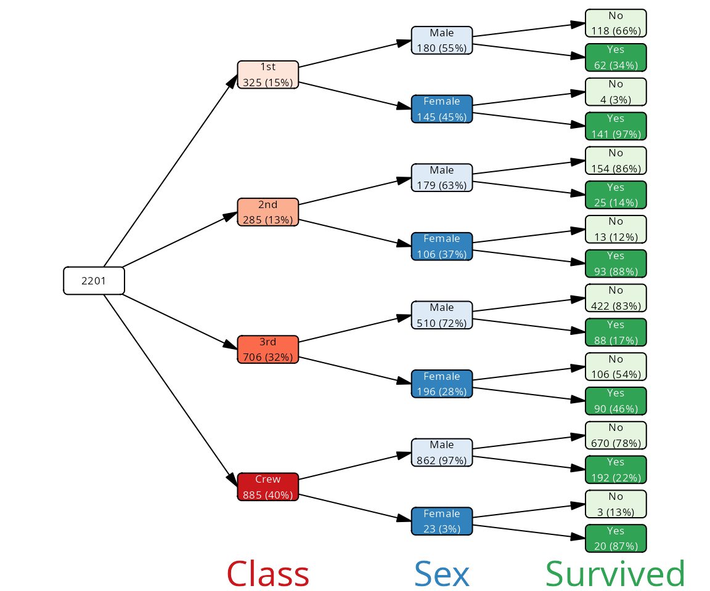
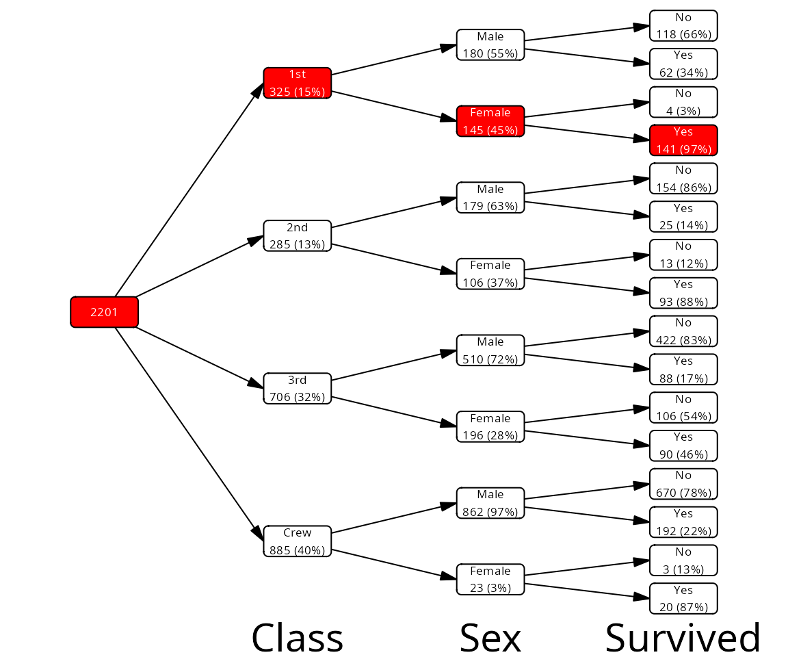
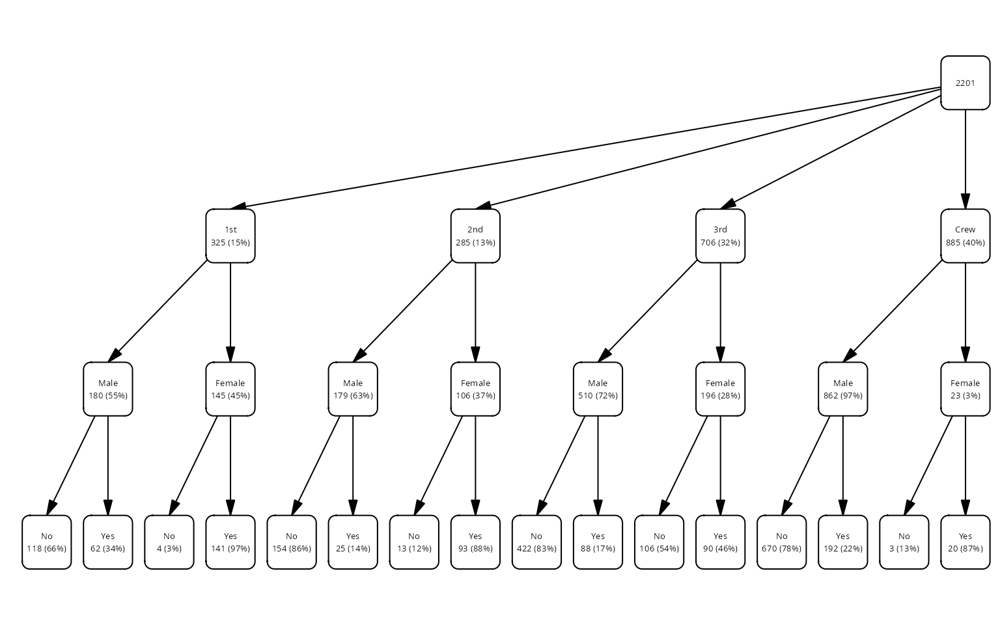
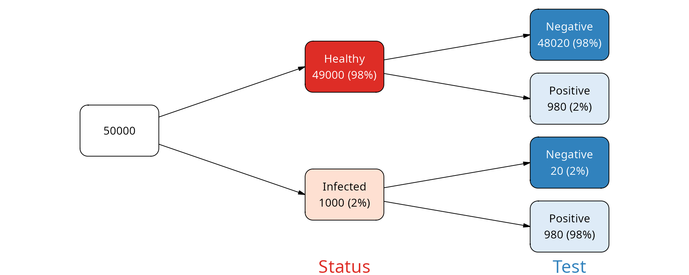
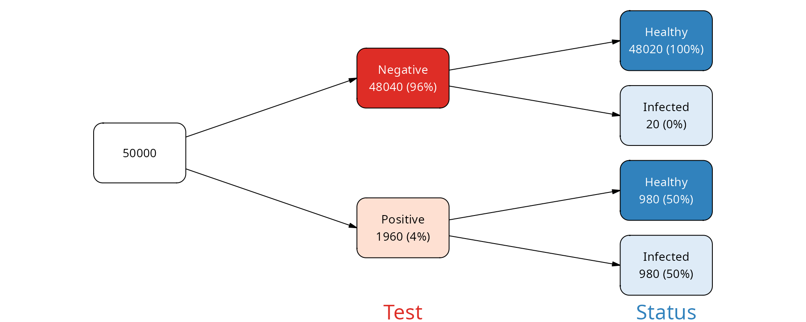
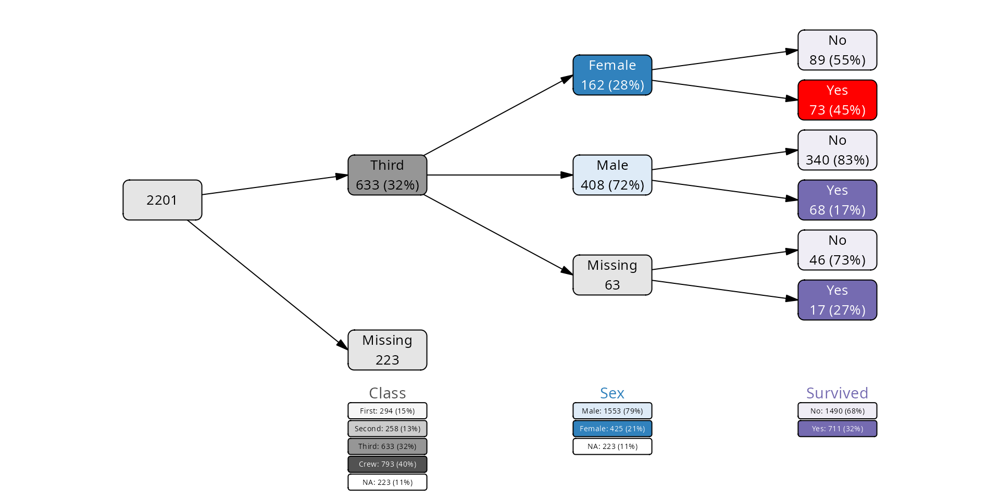

# What are vtrees?

## Vtrees as representations of categorical data

The main purpose of vtrees is to understand and visualize hierarchical,
categorical data. A vtree is a tree diagram that shows how the data is
split by the levels of categorical variables.

In the example most frequently used in the vtree package, the Titanic
data set, we have several categorical variables, such as `Class`
(passenger class), `Sex` (gender) and `Survived` (whether a passenger
survived the sinking of the Titanic). You may ask, for example, how many
female passengers who were traveling in the first class survived? What
was their percentage among all first class female passengers?

``` r
cases <- cases_from_freqtable(Titanic)
head(cases)
#> # A tibble: 6 × 4
#>   Class Sex   Age   Survived
#>   <fct> <fct> <fct> <fct>   
#> 1 3rd   Male  Child No      
#> 2 3rd   Male  Child No      
#> 3 3rd   Male  Child No      
#> 4 3rd   Male  Child No      
#> 5 3rd   Male  Child No      
#> 6 3rd   Male  Child No

# female 1st class survivors
sum(cases$Class == "1st" & cases$Sex == "Female" & cases$Survived == "Yes")
#> [1] 141

# percentage
sum(cases$Class == "1st" & cases$Sex == "Female" & cases$Survived == "Yes") /
  sum(cases$Class == "1st" & cases$Sex == "Female") * 100
#> [1] 97.24138
```

Rather than calculating these numbers manually, we can visualize all
that in one go on a vtree:

``` r
vt <- vtree(cases, Class, Sex, Survived)

plot(vt)
```



If you follow the path from the root node on the left, to the first
class, to the female passengers, and then to the survivors, you will
notice the percentage of survivors among the first class is what we
calculated above:

``` r
vt |>
  mark(path %in% c("root", "Class:1st", "Class:1st/Sex:Female",
                   "Class:1st/Sex:Female/Survived:Yes")) |>
  mutate(fill = ifelse(mark, "red", "white")) |>
  plot()
```



In a way, this is reminding of a consort diagram. We can style the above
plot so it looks a bit more like a consort diagram:

``` r
vt |>
  mutate(fill = "white") |>
  plot(dir="tb", layout="flushed_right", legend_tiny = FALSE)
```



## FP / NPV example

The following example may convince you of the use vtree representation
can have for your data.

Imagine a disease and a test that we have for that disease. How good is
the test?

We can consider how often the test makes an error for an infected
subject, incorrectly giving the negative result. This is called a false
negative (FN). The probability of this error is called false negative
rate (FNR), and its compliment the sensitivity: the more sensitive our
test is, the less likely that a test result will be negative if the
person is sick. Let’s assume that our test is highly sensitive, for
example that the FNR is 2% (making sensitivity 98%).

Another type of the error is if we have a healthy subject, but the test
is showing as positive. This value is the number of false positives (FP)
divided by the total number of healthy people, also known as FPR - false
positive rate. The complement of this value ($`1 - FPR`$) is called
specificity. Say, we have an outstanding test and the specificity is
98%, so the false positive rate is 2%.

OK, but there is more to the story. Whether a positive test result
corresponds to a real patient or a false positive depends on how likely
is that the person is actually healthy in reality. This is disease
prevalence, how often the disease is encountered when people are tested.
Say, that the disease is quite common, and the prevalence is 2%.

From this, assuming we performed screening tests on 5^{4} persons in a
population, we get the following table:

| Status   | Test     |     N |
|:---------|:---------|------:|
| Infected | Positive |   980 |
| Infected | Negative |    20 |
| Healthy  | Positive |   980 |
| Healthy  | Negative | 48020 |

Here is how we can build our data:

``` r
FPR <- .02 # p that healthy is positive
FNR <- .02 # p that infected is negative
prevalence <- 1/50 
N <- 50000

data <- tribble(
 ~ Status, ~ Test, ~ N,
 "Infected", "Positive", round(prevalence * N * (1-FNR)),
 "Infected", "Negative", round(prevalence * N * FNR),
 "Healthy",  "Positive", round((1 - prevalence) * N * FNR), 
 "Healthy",  "Negative", round((1 - prevalence) * N * (1 - FNR))
 )
```

We can visualize this table as a vtree. Since it is a frequency table,
we need to use the
[`vtree_from_freqtable()`](https://january3.github.io/vtree2/reference/vtree.md)
function[^1]. For starters, we will show the Status first, and then the
Test result. This will show us how many of the healthy persons were
incorrectly classified as positive, and how many of the infected persons
were incorrectly classified as negative.

``` r
vt <- vtree_from_freqtable(data,
                           Status, Test,
                           .freq_col = "N")
plot(vt)
```



As you can see, the percentages on the leaf nodes (right side of the
plot) correspond to our FPR and FNR values. The percentages on the
internal nodes correspond to the disease prevalence.

What if we were to inverse this question? What is the fraction of
healthy people among those who tested positive, and vice versa - what is
the fraction of infected people among those who tested negative?

``` r
vt2 <- vtree_from_freqtable(data,
                           Test, Status,
                           .freq_col = "N")
plot(vt2)
```



We see that among those who were tested negative, the large majority
(practically 100%) were indeed healthy. This is the negative predictive
value (NPV) of the test.

However, among those who were tested positive, only 50% were actually
infected. This is the positive predictive value (PPV) of the test and it
shows that despite the test being very specific and sensitive, when a
person has a positive test result, there is more than a 50% chance that
the person is actually healthy.

### Vtree workflow

In `vtree2`, the workflow is split into several steps:

- Prepare the data (outside of `vtree2`)
- Build the vtree object with
  [`vtree()`](https://january3.github.io/vtree2/reference/vtree.md) or
  [`vtree_from_freqtable()`](https://january3.github.io/vtree2/reference/vtree.md)
- (Optional) Prune, retain or select nodes with
  [`prune()`](https://january3.github.io/vtree2/reference/prune.md),
  [`retain()`](https://january3.github.io/vtree2/reference/prune.md) and
  friends.
- (Optional) Create summaries with
  [`summary_vt()`](https://january3.github.io/vtree2/reference/summary_vt.md).
- (Optional) Add aliases for variable names and values with
  [`add_aliases()`](https://january3.github.io/vtree2/reference/add_aliases.md).
- (Optional) Add or modify labels with
  [`add_labels()`](https://january3.github.io/vtree2/reference/add_labels.md)
  and [`mutate()`](https://dplyr.tidyverse.org/reference/mutate.html).
- (Optional) Add or modify colors with
  [`add_palette()`](https://january3.github.io/vtree2/reference/vtree_palette.md)
  and [`mutate()`](https://dplyr.tidyverse.org/reference/mutate.html).
- Plot the vtree with
  [`plot()`](https://rdrr.io/r/graphics/plot.default.html).

Here is an example demonstrating all these steps based on the
`titanicNA` data set. This data set is the same as the Titanic data set,
but with some missing values randomly added for demonstration purposes.

``` r
data(titanicNA)

vtree(titanicNA, Class, Sex, Survived) |>
  # only retain the third class passengers
  retain(path == "Class:3rd") |>
  # change how variables are displayed
  add_aliases(val_alias = list(Class = c("1st" = "First",
                                    "2nd" = "Second",
                                    "3rd" = "Third"))) |>
  # add default labels, built from aliases
  add_labels() |>
  # change the labels for the missing values
  mutate(label = gsub("NA", "Missing", label)) |>
  # add colors
  add_palette(palettes = c("Greys", "Blues", "Purples"),
              na_fill = "grey90") |>
  # change the color for Females who survived
  # mark() is a helper function that returns TRUE for the nodes that
  # match the given condition
  mark(path == "Class:3rd/Sex:Female/Survived:Yes") |>
  mutate(fill = ifelse(mark, "red", fill)) |>
  mutate(color = ifelse(mark, "white", color)) |>
  # plotting with legend and custom margins
  plot(legend = TRUE,
       margins = c(0.05, 0.05, 0.25, 0.05))
```



[^1]: [`vtree()`](https://january3.github.io/vtree2/reference/vtree.md)
    works with cases data frames, where each row is a single
    observation. Here we have a frequency table, in which each row is a
    group of observations with the same levels of variables.
