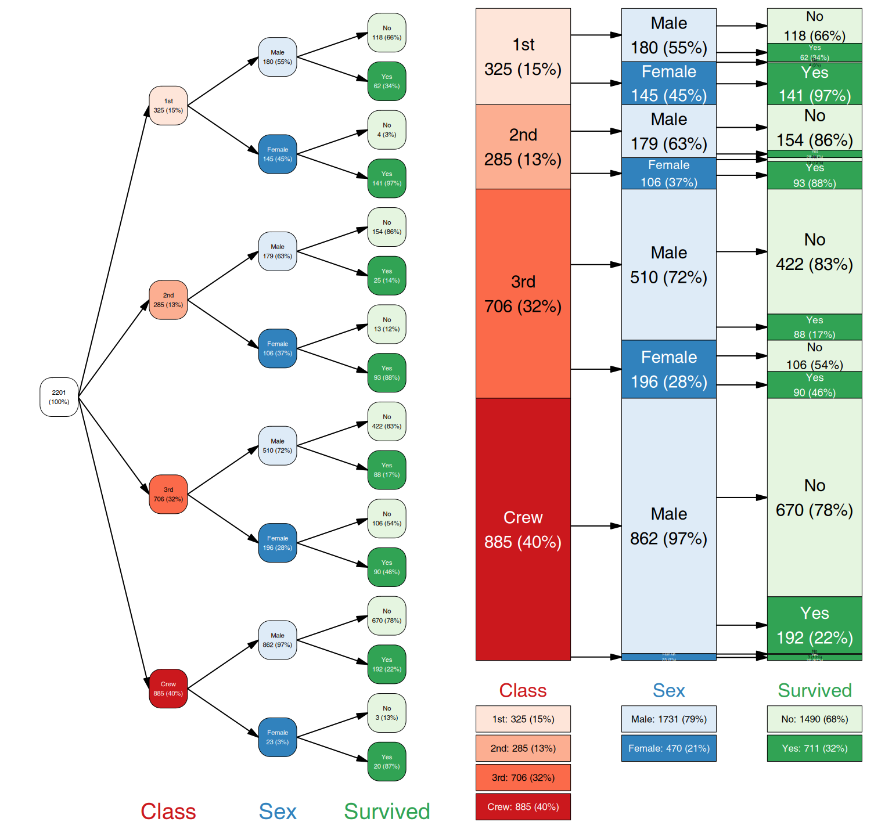
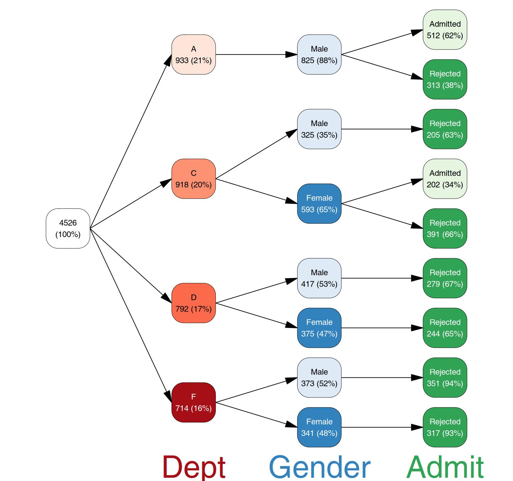
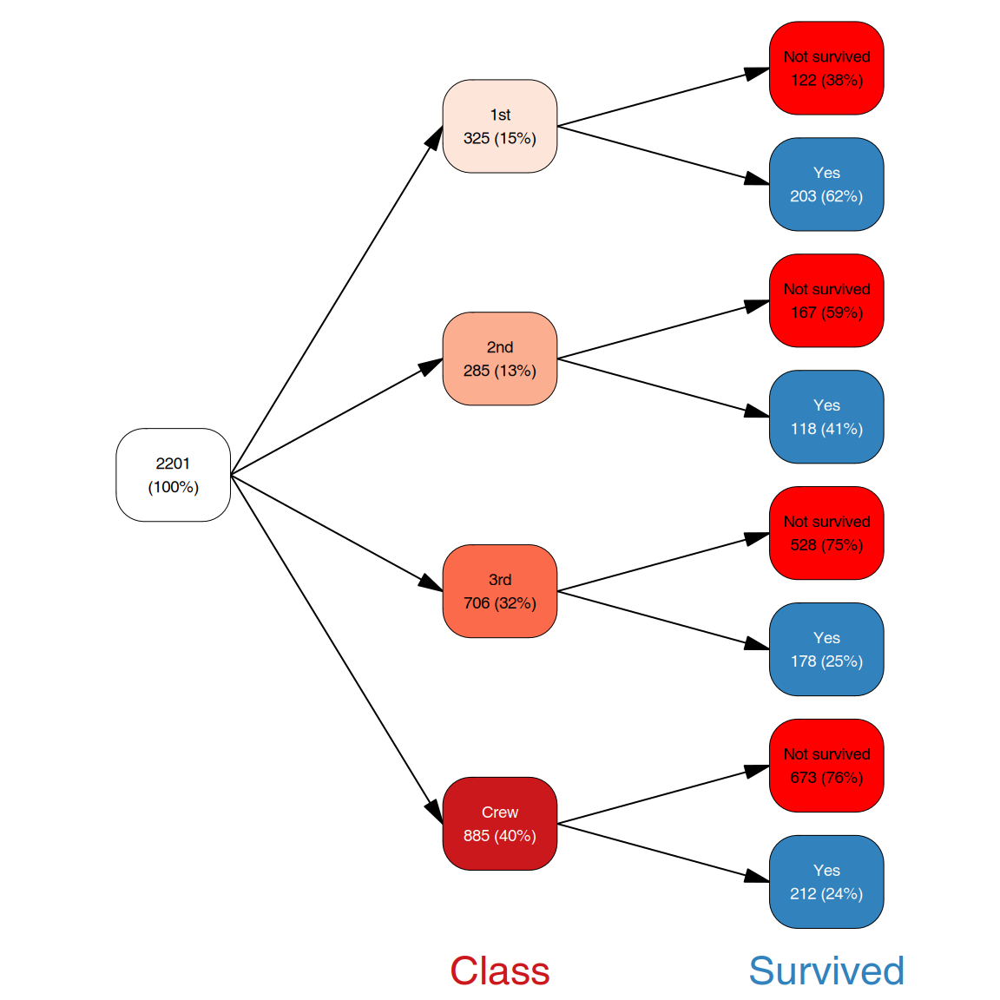
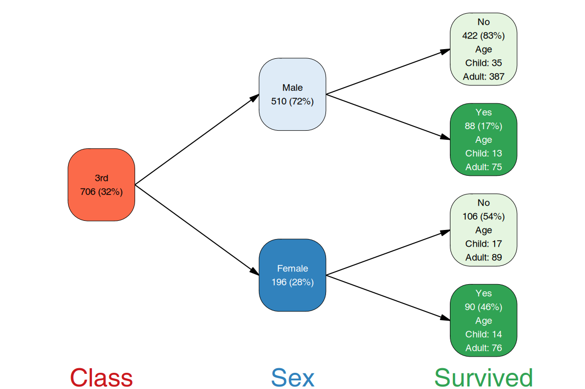

# vtree2

Tree diagrams for categorical data, based on the [original vtree
package](https://github.com/nbarrowman/vtree) by Nick Barrowman.

## Installation

You can install the development version of vtree2 like so:

``` r
pak::pak("january3/vtree2")
```

## Quick start

### What is a vtree?

### vtree2 workflow

1.  Prepare the data with
    [`vtree()`](https://january3.github.io/vtree2/reference/vtree.md) or
    [`vtree_from_freqtable()`](https://january3.github.io/vtree2/reference/vtree.md).
    After this step, the data is immutable, frequencies and counts
    calculated will not change any more.
2.  Prune the tree for visualization with
    [`prune()`](https://january3.github.io/vtree2/reference/prune.md) or
    [`keep()`](https://january3.github.io/vtree2/reference/prune.md).
3.  Add labels and colors with
    [`add_labels()`](https://january3.github.io/vtree2/reference/add_labels.md)
    and
    [`add_palette()`](https://january3.github.io/vtree2/reference/vtree_palette.md)
    or by directly manipulating the `label`, `color` and `fill` columns
    of the vtree object.
    [`find_nodes()`](https://january3.github.io/vtree2/reference/prune.md)
    and `prune(..., mark_only = TRUE)` can be used to select nodes for
    coloring or labeling. The
    [`summary_vt()`](https://january3.github.io/vtree2/reference/summary_vt.md)
    function can be used to produce additional per-node summaries which
    can be used for labeling or coloring.
4.  plot the tree with
    [`plot()`](https://rdrr.io/r/graphics/plot.default.html).

### Basic plots

You can construct a vtree roughly from two types of data:

- a data frame with one row per case (cases data frame)
- a data frame with one row per combination of factor levels, and a
  frequency column (frequency table)

While the former ones are common in the wild, the builtin R examples are
often the latter. The following example shows how to construct a vtree
from a frequency table and plot it with `vtree2`.

``` r
library(vtree2)
tdf <- cases_from_freqtable(Titanic)
vt <- vtree(tdf, Class, Sex, Survived)
vt
#> vtree object with 3 variables and 2201 observations
#> Variables: Class, Sex, Survived 
#> Overview:
#> # Tibble (class tbl_df) 6 x 29:
#> # (Showing rows 1 - 20 out of 29)
#>   │path                             │n    │freq │tot_n│missing│denom
#>  1│root                             │ 2201│1.000│ 2201│     NA│ 2201
#>  2│Class:1st                        │  325│0.148│ 2201│      0│ 2201
#>  3│Class:2nd                        │  285│0.129│ 2201│      0│ 2201
#>  4│Class:3rd                        │  706│0.321│ 2201│      0│ 2201
#>  5│Class:Crew                       │  885│0.402│ 2201│      0│ 2201
#>  6│Class:1st/Sex:Male               │  180│0.554│  325│      0│  325
#>  7│Class:1st/Sex:Female             │  145│0.446│  325│      0│  325
#>  8│Class:2nd/Sex:Male               │  179│0.628│  285│      0│  285
#>  9│Class:2nd/Sex:Female             │  106│0.372│  285│      0│  285
#> 10│Class:3rd/Sex:Male               │  510│0.722│  706│      0│  706
#> 11│Class:3rd/Sex:Female             │  196│0.278│  706│      0│  706
#> 12│Class:Crew/Sex:Male              │  862│0.974│  885│      0│  885
#> 13│Class:Crew/Sex:Female            │   23│0.026│  885│      0│  885
#> 14│Class:1st/Sex:Male/Survived:No   │  118│0.656│  180│      0│  180
#> 15│Class:1st/Sex:Male/Survived:Yes  │   62│0.344│  180│      0│  180
#> 16│Class:1st/Sex:Female/Survived:No │    4│0.028│  145│      0│  145
#> 17│Class:1st/Sex:Female/Survived:Yes│  141│0.972│  145│      0│  145
#> 18│Class:2nd/Sex:Male/Survived:No   │  154│0.860│  179│      0│  179
#> 19│Class:2nd/Sex:Male/Survived:Yes  │   25│0.140│  179│      0│  179
#> 20│Class:2nd/Sex:Female/Survived:No │   13│0.123│  106│      0│  106
```

`vt` is now an object of class `vtree`, which is basically `tidygraph`’s
`tbl_graph` with some extra attributes. You can plot it with
[`plot()`](https://rdrr.io/r/graphics/plot.default.html):

``` r
plot(vt)
plot(vt, layout = "proportional", legend=TRUE, show_root=FALSE)
```



**There is more:** trees can be oriented vertically or horizontally, top
to bottom, bottom to top, left to right, right to left; labels and
colors can be freely customized, trees can be pruned for display.

### Vtree pruning

With the
[`prune()`](https://january3.github.io/vtree2/reference/prune.md)
function, you can find nodes which fullfill a certain condition and
remove them (along with their children) from the vtree:

``` r
ucb <- cases_from_freqtable(UCBAdmissions)
vt <- vtree(ucb, Dept, Gender, Admit) |>
  prune(n < 150 | freq < .15)
plot(vt)
```



**There is more:** with
[`find_nodes()`](https://january3.github.io/vtree2/reference/prune.md)
you can find nodes which fullfill a certain condition. The produced mask
(a simple logical vector) can be used to select nodes for changing
labels or colors. With
[`keep()`](https://january3.github.io/vtree2/reference/prune.md), you
can select the nodes you want to keep and remove other nodes.

### Labelling and colors

While colors and labels can be generated automatically, it is possible
to customize them by modifying the `label` and `fill` columns of the
vtree object:

``` r
vt <- vtree(tdf, Class, Survived)
vt <- vt |> add_labels() |> # add default labels
  add_palette() |>
  mutate(label = gsub("No", "Not survived", label)) |>
  mutate(fill = ifelse(node_col == "Survived" & node_val == "No",
                       "red", fill))

plot(vt)
```



**There is more:**
[`add_labels()`](https://january3.github.io/vtree2/reference/add_labels.md)
is highly customizable and you can produce complex labels with a simple
R expression using [`sprintf()`](https://rdrr.io/r/base/sprintf.html) or
`glue()`.

### Summaries

The tree can be used to produce per-node summaries of any data. For
example, if you have an additional variable for your cases, you can add
summary of the values as labels to the nodes. We select here only one
node (1st Class), just to zoom in on that part of the graph. You can
also select the nodes for which you want to manipulate the label, for
example with
[`mark()`](https://january3.github.io/vtree2/reference/prune.md):

``` r
vt <- vtree(tdf, Class, Sex, Survived)
                                         
sm_txt <- summary_vt(tdf, vt, Age)
vt |> 
  add_labels() |>
  # only for the leaf nodes. leaf is a column in the vt nodes data frame
  # which contains TRUE for leafs and FALSE for other nodes
  mutate(label = ifelse(leaf,
                        paste0(label, "\n", sm_txt),
                        label)) |>
  keep(path == "Class:3rd") |>
  plot(show_root = FALSE)
```



**There is more:**
[`summary_vt()`](https://january3.github.io/vtree2/reference/summary_vt.md)
can be used to calculate any summary of categorical or continuous
variables as a character vector which can be then used as labels for the
nodes.
[`summary_vt_df()`](https://january3.github.io/vtree2/reference/summary_vt.md)
produces a data frame with per-node summary statistics (different for
categorical and continuous variables) which can be used for further
analysis.

## AI disclosure

I have not used LLMs directly in writing the code or documentation.
However, I did use an LLM based chat to discuss some of the design
issues (e.g. to compare existing packages for graph representation).
Also, for code review / bug finding.

## Documentation

More docs available [here](https://january3.github.io/vtree2/).

## TODO

- write a manual in the main vignette
- root node should not show percentages on default labels
- add prefix and suffix parameters to add_labels, to make the handling
  easier
- ~~plotting function for patterns~~
- make sure that node_name is used for displaying variable names
- how is vtree actually handling the palettes?
- ~~add the keep_children parameter to the keep() function~~, ~~and also
  keep_na. - this is harder; because not all the NA nodes are kept, but
  only these which are on the same level as a node that is kept.
  Generally make keep behave the same as in vtree.~~
- ~~legends~~
- ~~should the vtree() function take cases or samples? Maybe instead of
  vtree_from_freqtable, we can just use vtree(…, .freq_col=“Freq”) or
  something like this.~~ nah, better make it explicit.
- maybe gridtext for the labels so we can use some basic formatting
- faster processing of cases into trees
- questions to N:
  - which NA nodes are kept when vp=TRUE, only the sisters or all on the
    same level?

## BUGS

- legend titles sometimes overlap with the legend
- ~~if some variables disappear from the plot, the legend throws an
  error~~
- ~~prune(!Severity %in% c(“Mild”, “Moderate”), follow_only = TRUE) does
  not work~~
- na.rm handling in prune() is not consistent, at least not with vtree’s
  behavior
- ~~layout=“proportional” stopped working~~
